<div align="center">


<br/>

# 🚀 **MAKİNE ÖĞRENMESİ - DERS 01** 
## 🧠 Veriden Karara: Stratejik Bir Giriş

<br/>

[](https://www.python.org/)
[](https://scikit-learn.org/)
[](https://pandas.pydata.org/)
[](https://numpy.org/)

[](https://www.tensorflow.org/)
[](https://www.anaconda.com/)
[](https://jupyter.org/)
[](https://www.databricks.com/)

[](https://matplotlib.org/)
[](https://seaborn.pydata.org/)
[]()
[]()

<br/>

### 💎 **Ders 01 Özellikleri**

<table>
  <tr>
    <td align="center">
      <br/>
      <b>Kavramsal Temel</b>
    </td>
    <td align="center">
      <br/>
      <b>İş Odaklı Yaklaşım</b>
    </td>
    <td align="center">
      <br/>
      <b>Sistematik Çerçeve</b>
    </td>
    <td align="center">
      <br/>
      <b>Stratejik Düşünce</b>
    </td>
  </tr>
</table>

<br/>

### **🌟 Neden Bu Ders Özel?**

<div align="center">

| 🎯 Özellik | 📝 Açıklama |
|:-----------|:-----------|
| ✨ **YBS Perspektifi** | Teknik değil, stratejik düşünce odaklı içerik |
| 🎯 **Problem Çözme Odaklı** | Algoritmalar değil, iş problemlerini çözme yaklaşımı |
| 💼 **Gerçek Dünya Senaryoları** | CEO soruları, yönetici toplantıları, iş kararları |
| 🏆 **CRISP-DM Metodolojisi** | Endüstri standardı proje yönetim çerçevesi |
| 📊 **Kavramsal Hiyerarşi** | AI ⊃ ML ⊃ DL ilişkisinin net anlaşılması |
| 🔥 **Sezgiden Öngörüye** | Veri odaklı karar verme transformasyonu |

</div>

<br/>

---

</div>

---

## 📑 İÇİNDEKİLER

<details open>
<summary><b>🔍 Tıklayarak Genişlet/Daralt</b></summary>

1. [🎯 Genel Bakış](#-genel-bakış)
2. [🎬 Dersin Açılışı: CEO'nun Sorusu](#-dersin-açılışı-ceonun-sorusu)
3. [🧠 Sezgiden Öngörüye Geçiş](#-sezgiden-öngörüye-geçiş)
4. [🧩 Kavramsal Hiyerarşi: AI ⊃ ML ⊃ DL](#-kavramsal-hiyerarşi-ai--ml--dl)
5. [🧱 Stratejik Cevabın 3 Temel Taşı](#-stratejik-cevabın-3-temel-taşı)
6. [📺 Gerçek Dünya Örneği: Netflix](#-gerçek-dünya-örneği-netflix)
7. [🔍 Makine Öğrenmesi Türleri](#-makine-öğrenmesi-türleri)
8. [🤖 Kod Bir Amaç Değildir](#-kod-bir-amaç-değildir)
9. [🧭 CRISP-DM: YBS'cinin Yol Haritası](#-crisp-dm-ybscinin-yol-haritası)
10. [📚 Veri Nerede? Kaggle ve UCI](#-veri-nerede-kaggle-ve-uci)
11. [🎓 Ders Bilgileri ve Akademisyenler](#-ders-bilgileri-ve-akademisyenler)
12. [✨ Kapanış ve Öğrenme Çıktıları](#-kapanış-ve-öğrenme-çıktıları)

</details>

---

##  **İçerik Navigasyonu**

<div align="center">

| 📌 Bölüm | 🎯 İçerik |
|:--------:|:----------|
| **[🎯 Genel Bakış](#-genel-bakış)** | Dersin Özü ve Temel Yaklaşım |
| **[🎬 CEO'nun Sorusu](#-dersin-açılışı-ceonun-sorusu)** | İş Odaklı Giriş Senaryosu |
| **[🧠 Sezgiden Öngörüye](#-sezgiden-öngörüye-geçiş)** | Karar Verme Paradigma Değişimi |
| **[🧩 Kavramsal Hiyerarşi](#-kavramsal-hiyerarşi-ai--ml--dl)** | AI ⊃ ML ⊃ DL İlişkisi |
| **[🧱 Stratejik Cevap](#-stratejik-cevabın-3-temel-taşı)** | 3 Temel Taş Yaklaşımı |
| **[📺 Netflix Örneği](#-gerçek-dünya-örneği-netflix)** | Gerçek Dünya Uygulaması |
| **[🔍 ML Türleri](#-makine-öğrenmesi-türleri)** | Denetimli, Denetimsiz, Pekiştirmeli |
| **[🤖 Kod Felsefesi](#-kod-bir-amaç-değildir)** | Araç vs. Amaç Farkındalığı |
| **[🧭 CRISP-DM](#-crisp-dm-ybscinin-yol-haritası)** | Metodoloji ve Yol Haritası |
| **[📚 Veri Kaynakları](#-veri-nerede-kaggle-ve-uci)** | Kaggle, UCI ve Diğerleri |
| **[🎓 Ders Bilgileri](#-ders-bilgileri-ve-akademisyenler)** | Ders Ekibi ve İletişim |
| **[✨ Öğrenme Çıktıları](#-kapanış-ve-öğrenme-çıktıları)** | Dersin Kazanımları |

</div>

---

## 🎯 GENEL BAKIŞ

### 🌟 **Dersin Özü: Bir Paradigma Değişimi**

Bu ders, makine öğrenmesine **giriş dersi** değildir.  

Bu ders, makine öğrenmesine **bakış açısı değişimi** dersidir.

<div align="center">

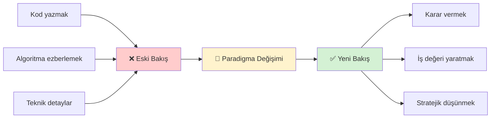

</div>


</div>

### 🎯 **Dersin Temel Sorusu**

Bu ders boyunca sürekli olarak şu soruya cevap aradık:

<div align="center">

```
┌────────────────────────────────────────────────────────────────┐
│                                                                │
│   "Bir YBS uzmanı olarak,                                      │
│    makine öğrenmesi bana NE KAZANDIRIR?"                       │
│                                                                │
│   Cevap:                                                       │
│   ✓ Güvenilir öngörü                                          │
│   ✓ Veriye dayalı karar                                       │
│   ✓ Rekabet avantajı                                          │
│   ✓ Risk azaltma                                              │
│   ✓ Operasyonel mükemmellik                                   │
│                                                                │
└────────────────────────────────────────────────────────────────┘
```

</div>

### 📊 **YBS Perspektifi: Neden Bu Ders Farklı?**

<div align="center">

| Geleneksel ML Eğitimi | Bu Dersin Yaklaşımı |
|----------------------|---------------------|
| 🤖 "Şu algoritmayı öğrenin" | 💼 "Şu iş problemini çözün" |
| 📐 "Matematik yapın" | 📊 "Değer yaratın" |
| 💻 "Kod yazın" | 🎯 "Karar verin" |
| 🔬 "Model eğitin" | 🏢 "Strateji geliştirin" |
| 📚 "Teori öğrenin" | 🌍 "Gerçek dünyayı anlayın" |

</div>

### 🎓 **Öğrenme Hedefleri**

Bu dersin sonunda öğrenciler:

| # | Yetkinlik | Açıklama |
|---|-----------|----------|
| 1️⃣ | **Stratejik Perspektif** | ML'i iş stratejisi aracı olarak konumlandırma |
| 2️⃣ | **Karar Odaklılık** | Teknolojiyi iş kararına dönüştürme |
| 3️⃣ | **Kavramsal Çerçeve** | AI-ML-DL ilişkisini anlama |
| 4️⃣ | **Makine Öğrenmesi Yöntemleri Bilgisi** | Denetimli/Denetimsiz öğrenmeyi ayırt etme |
| 5️⃣ | **Metodoloji Farkındalığı** | CRISP-DM ile proje yönetimi |
| 6️⃣ | **Gerçek Dünya Bağlantısı** | Endüstri örnekleriyle ilişkilendirme |
| 7️⃣ | **YBS Kimliği** | Teknik uygulayıcı değil, strateji mimarı olma |

### 💡 **Dersin DNA'sı: 3 Temel Sütun**

<div align="center">

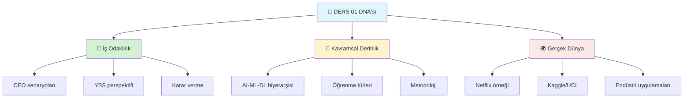

</div>

<br/>

<div align="center">

### 📖 **Dersin Felsefesi**

*Bu derste makine öğrenmesini **algoritmalar üzerinden değil**, **problem çözme perspektifi** üzerinden ele alıyoruz.*  
*Veriden değere, algoritmadan anlama geçişi yapıyoruz. Matematiksel temelleri anlıyor,*  
*ardından bunları gerçek dünya problemlerine uyguluyoruz.*

**🎓 CRISP-DM Metodolojisi** ile iş problemi tanımından model dağıtımına kadar tüm süreci kapsıyoruz.

</div>

---

<br/>

## ✨ **Premium Özellikler ve Avantajlar**

<div align="center">

### 💎 **Endüstri Standardında Eğitim Deneyimi**

</div>

<br/>

<div align="center">

| 🏆 **Özellik** | 📊 **Değer** | 💡 **Açıklama** |
|:---------------|:-------------|:----------------|
| **📅 Ders Konumu** | `Hafta 1` | Makine öğrenmesinin kavramsal temelleri |
| **🎯 Kapsanan Kavram** | `15+ Konsept` | AI, ML, DL, CRISP-DM, Öğrenme türleri |
| **📦 Gerçek Senaryolar** | `CEO Toplantısı` | E-ticaret, müşteri kaybı, karar verme senaryoları |
| **📚 Metodoloji** | `CRISP-DM` | Endüstri standardı proje yönetim çerçevesi |
| **💼 İş Odaklı Yaklaşım** | `YBS Perspektifi` | Stratejik düşünce ve iş değeri yaratma |
| **🎨 Görsel Öğrenme** | `Mermaid Diagramları` | Kavramsal ilişkileri görselleştirme |
| **📈 Gerçek Dünya Örnekleri** | `Netflix, Amazon` | Endüstri liderlerinden case study'ler |
| **🔬 Öğrenme Paradigmaları** | `3 Tür` | Denetimli, Denetimsiz, Pekiştirmeli öğrenme |
| **🗄️ Veri Kaynakları** | `Kaggle & UCI` | Profesyonel veri setlerine erişim rehberi |
| **📊 Karşılaştırmalı Analiz** | `Tablo & Grafikler` | Sezgi vs. Veri karşılaştırmaları |

</div>

<br/>

<div align="center">

### 🎯 **Bu Dersin Öğrenme Yaklaşımı**

</div>

<table>
<tr>
<td width="33%" align="center">

### 📖 **1. Kavramsal Temel**

İş dünyasından başlayarak  
ML'nin stratejik değerini  
anlamak

**→ Neden ML'e ihtiyacım var?**

</td>
<td width="33%" align="center">

### 💡 **2. Metodolojik Çerçeve**

CRISP-DM ile sistematik  
proje yönetimi ve  
problem çözme

**→ Nasıl başlayacağım?**

</td>
<td width="33%" align="center">

### 🌍 **3. Gerçek Dünya Örnekleri**

Netflix, Amazon gibi  
şirketlerin ML  
uygulamaları

**→ Kimler ne yapıyor?**

</td>
</tr>
</table>

---

## 🎬 DERSİN AÇILIŞI: CEO'NUN SORUSU

### 🏢 **Senaryo: Yönetici Toplantısı**

<div align="center">

```
╔══════════════════════════════════════════════════════════════════╗
║                                                                  ║
║   📍 YER:  Üst Düzey Yönetim Toplantı Odası                     ║
║   ⏰ SAAT: 09:00 - Pazartesi Sabahı                             ║
║   👥 KİM:  CEO, CFO, CMO, CTO ve Siz (YBS Uzmanı)              ║
║   📊 KONU: Q3 Satış Düşüşü ve Acil Eylem Planı                 ║
║                                                                  ║
╚══════════════════════════════════════════════════════════════════╝
```

</div>

### 📉 **Mevcut Durum: İş Probleminin Anatomisi**

Orta ölçekli bir e-ticaret şirketinde **YBS yöneticisisiniz**.  
CEO, sunumuna başlıyor:

<div align="center">

| Metrik | Geçen Çeyrek | Bu Çeyrek | Değişim |
|--------|--------------|-----------|---------|
| **Toplam Satış** | $2.5M | $2.1M | 📉 -16% |
| **Aktif Müşteri** | 45,000 | 38,000 | 📉 -15.5% |
| **Sepet Terk Oranı** | %65 | %72 | 📉 -7 puan |
| **Müşteri Şikayeti** | 230 | 410 | 📉 +78% |
| **Geri Dönüş Oranı** | %8 | %14 | 📉 +75% |

</div>

### 💬 **CEO'nun Konuşması**

> **CEO:** "Arkadaşlar, rakamlar ortada. 3 çeyrektir ilk kez satışlar düşüyor. Müşterilerimiz bizden uzaklaşıyor. Rakiplerimiz agresif kampanyalar yapıyor."
>
> *[Ekrandaki grafiğe bakarak]*
>
> **CEO:** "Ama asıl korkutucu olan şu: **Hangi müşterileri kaybedeceğimizi bilmiyoruz.** Kampanya yapıyoruz, ama kime? İndirim veriyoruz, ama neye? Email gönderiyoruz, ama neden?"
>
> *[Masaya yumruk vurarak]*
>
> **CEO:** "Artık tahmine dayalı hareket edemeyiz. Bize **GÜVENİLİR ÖNGÖRÜ** lazım!"

### 🎯 **Kritik Dönüş Noktası**

CEO şimdi size dönüyor:

> **CEO:** "YBS Uzmanı olarak sen ne öneriyorsun? Satışlar düşüyor. Müşteri kaybı artıyor. **Ne yapacağız?**"

<div align="center">

```
┌───────────────────────────────────────────────────────────┐
│                                                           │
│   Bu noktada FARKLILIK ortaya çıkıyor:                   │
│                                                           │
│   ❌ İÇGÜDÜSEL CEVAP:                                     │
│      "Daha fazla kampanya yapalım"                        │
│      "Müşteri hizmetlerini artıralım"                     │
│      "Fiyatları düşürelim"                                │
│                                                           │
│   ✅ VERİYE DAYALI CEVAP:                                 │
│      "Hangi müşteri segmenti risk altında?"               │
│      "Terk eden müşterilerin ortak özellikleri ne?"       │
│      "En değerli müşterilerimizi nasıl koruruz?"          │
│                                                           │
└───────────────────────────────────────────────────────────┘
```

</div>

### 🧠 **İçgüdü vs. Veri: Karşılaştırmalı Analiz**

<div align="center">

| Boyut | İçgüdüye Dayalı Karar | Veriye Dayalı Karar (ML) |
|-------|----------------------|--------------------------|
| **Kaynak** | Tecrübe, his, tahmin | Geçmiş veri, örüntüler |
| **Güvenilirlik** | Subjektif, tutarsız | Objektif, tekrarlanabilir |
| **Ölçeklenebilirlik** | Sınırlı (insani kapasite) | Yüksek (tüm müşteri tabanı) |
| **Hız** | Yavaş (insan analizi) | Hızlı (algoritmik işlem) |
| **Maliyet** | Yüksek (hatalı karar bedeli) | Düşük (önleyici aksiyon) |
| **Görünmez Örüntü** | Kaçırılabilir | Tespit edilebilir |
| **Önyargı** | Yüksek | Minimize edilebilir |

</div>

### 💡 **YBS'cinin Stratejik Cevabı**

Siz şöyle yanıt veriyorsunuz:

> **Siz:** "CEO'um, bu soruya **makine öğrenmesi** perspektifinden cevap vermek istiyorum."
>
> *[Beyaz tahtaya çizim yaparak]*
>
> **Siz:** "Şu anda 3 yıllık müşteri verisi var:
> - 120,000 müşteri kaydı
> - Satın alma geçmişleri
> - İletişim logları
> - Şikayet kayıtları
> - Web davranışları"
>
> **Siz:** "Bu veri setinde **gizli örüntüler** var. Terk eden müşteriler, terketmeden **3 hafta önce** benzer davranışlar sergiliyor olabilir."
>
> *[CEO'ya bakarak]*
>
> **Siz:** "Makine öğrenmesi modeli bu örüntüleri bulabilir ve bize şunu söyler:
> - ⚠️ **Riskli Müşteriler:** Önümüzdeki 30 gün içinde kaybedebileceğimiz 2,500 müşteri
> - 🎯 **Aksiyon Önerisi:** Her segmente özel müdahale stratejisi
> - 💰 **ROI Tahmini:** Yatırım karşılığı hesaplaması"


### 🔄 **Dersin Temel Dönüşümü**

Bu sahne ile öğrenci zihninde şu dönüşüm hedeflendi:

<div align="center">

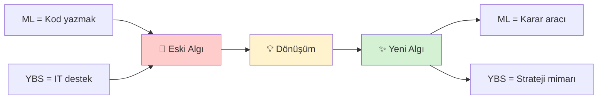

</div>

---

## 🧠 SEZGİDEN ÖNGÖRÜYE GEÇİŞ

### 🔮 **Eski Dünya: Sezgi ve Tecrübe**

İş dünyası tarih boyunca **sezgiye dayalı karar verme** üzerine kurulmuştur.

<div align="center">

```
📊 Geleneksel Karar Verme Süreci (Eski Model)
═══════════════════════════════════════════════════════════

    Tecrübe
       ↓
    Sezgi
       ↓
    Karar
       ↓
    Uygulama
       ↓
    Sonuç (belirsiz)
```

</div>

### 💼 **Örnek: Geleneksel Yaklaşım**

**Senaryo:** Bir perakende mağaza zincirinde stok yöneticisisiniz.

> **Yönetici (Sezgi Bazlı):** "Yazın her zaman bikini satışı artar. Bu yıl da 10,000 adet sipariş edelim."
>
> **Gerçeklik:** 
> - 🌦️ Yaz yağışlı geçti
> - 🏖️ Sahil turizmi %40 düştü
> - 📦 6,000 adet iade edildi
> - 💸 $180,000 zarar

**Problem:** Sezgi, değişen koşulları yakalayamadı.

### 🔬 **Yeni Dünya: Veri ve Örüntü**

Modern iş dünyasında **veri patlaması** yaşanıyor:

<div align="center">

| Veri Kaynağı | Günlük Üretilen Veri | Örnek |
|--------------|---------------------|-------|
| **E-ticaret** | 2.5 milyar işlem | Her tıklama, sepet, satın alma |
| **Sosyal Medya** | 500 milyon tweet | Müşteri duyguları, trendler |
| **IoT Cihazları** | 1 trilyon sensor okuma | Konum, sıcaklık, kullanım |
| **CRM Sistemleri** | 100 milyon etkileşim | Çağrı, email, şikayet |
| **Web Analitiği** | 5 milyar sayfa görüntüleme | Davranış, tercih, zaman |

</div>

### 🌊 **Veri Okyanusu Problemi**

Bu kadar veri varken, problem şu hale geliyor:

<div align="center">

```
┌──────────────────────────────────────────────────────┐
│                                                      │
│   İNSAN GÖZÜ:                                        │
│   ❌ Milyonlarca satır veriyi okuyamaz               │
│   ❌ Çok boyutlu ilişkileri göremez                  │
│   ❌ Gizli örüntüleri fark edemez                    │
│   ❌ Önyargıdan kaçınamaz                            │
│                                                      │
│   MAKİNE ÖĞRENMESİ:                                  │
│   ✅ Sınırsız veriyi işler                           │
│   ✅ 100+ değişken arasında ilişki bulur             │
│   ✅ Görünmez pattern'ları ortaya çıkarır            │
│   ✅ Matematiksel nesnellik                          │
│                                                      │
└──────────────────────────────────────────────────────┘
```

</div>

### 🎯 **ML'in Rolü: Örüntü Tanıma Motoru**

Makine öğrenmesi şu soruya cevap verir:

> "Bu verilerde, başarılı/başarısız sonuçları birbirinden ayıran **tekrarlayan örüntüler** var mı?"

<div align="center">

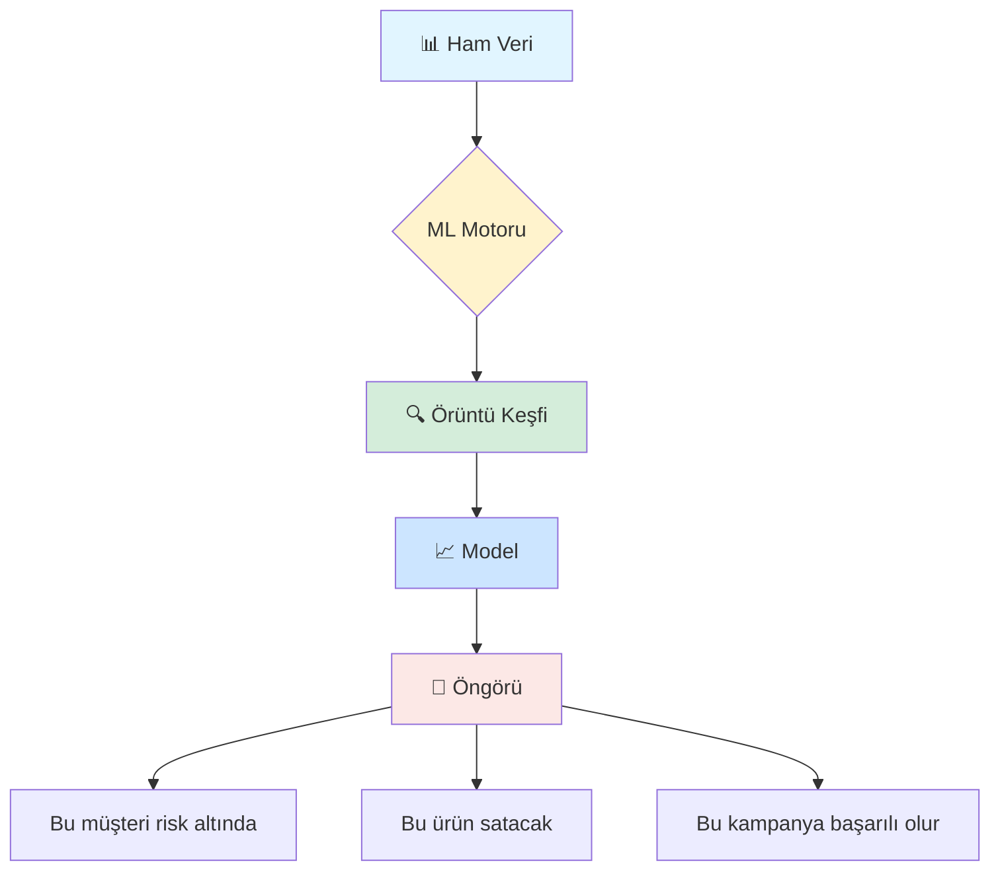

</div>

### 💡 **Somut Örnek: Müşteri Terk Öngörüsü**

**ML Öncesi (Sezgi):**
> "Şikayeti olan müşteriler muhtemelen ayrılır."

**ML Sonrası (Örüntü):**
> "Şu 7 davranışı gösteren müşteriler, %87 olasılıkla 30 gün içinde ayrılıyor:
> 1. Son 45 günde 0 satın alma
> 2. Destek çağrısı sayısı > 3
> 3. Email açma oranı < %10
> 4. Mobil uygulama girişi yok
> 5. Sosyal medya etkileşimi kesik
> 6. Fatura itirazı var
> 7. Rakip siteleri ziyaret ediyor"

**Fark:** İlki his, ikincisi veri.

### 📊 **Karşılaştırma: Sezgi vs. ML**

<div align="center">

| Kriter | Sezgi Bazlı | ML Bazlı |
|--------|-------------|----------|
| **Doğruluk** | %60-70 | %85-95 |
| **Tutarlılık** | Kişiye bağlı | Her zaman aynı |
| **Hız** | Günler/haftalar | Saniyeler |
| **Ölçek** | Yüzler | Milyonlar |
| **Açıklanabilirlik** | "Hissettim" | "Veri gösteriyor" |
| **Güncelleme** | Manuel | Otomatik |
| **Bias (Önyargı)** | Yüksek | Kontrol edilebilir |

</div>

### 🌟 **Altın Nokta: Hibrit Yaklaşım**

En etkili model: **İnsan + Makine**

<div align="center">

```
┌─────────────────────────────────────────────────────┐
│                                                     │
│   🤖 MAKİNE:                                        │
│   "Bu 2,500 müşteri risk altında"                  │
│                                                     │
│   ↓                                                 │
│                                                     │
│   👤 İNSAN (YBS):                                   │
│   "Premium segmentine özel kampanya"                │
│   "Orta segmente sadakat programı"                  │
│   "Düşük segmente anket + indirim"                  │
│                                                     │
│   = AKSIYON                                         │
│                                                     │
└─────────────────────────────────────────────────────┘
```

</div>

### 🔥 **Kritik Vurgu**

Bu bölümün ana mesajı:

> **"Sezgi hala değerlidir.**  
> **Ama artık tek başına YETERLİ değildir.**  
>  
> **ML, sezgiyi ortadan kaldırmaz.**  
> **Sezgiyi VERİYLE DESTEKLEMİŞ hale getirir."**

### **Paradigma Kayması**

<div align="center">

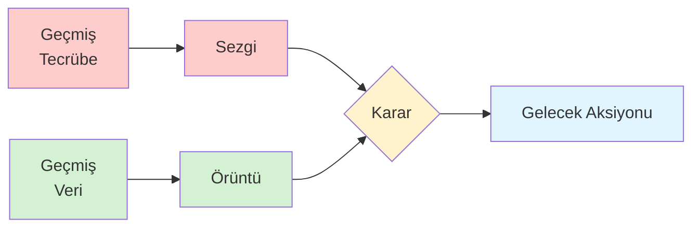

</div>

---

## 🧩 KAVRAMSAL HİYERARŞİ: AI ⊃ ML ⊃ DL

### 🎯 **Temel Soru: Bunlar Farklı mı, Aynı mı?**

Öğrenciler sıkça karıştırır:
- Yapay Zeka (AI)
- Makine Öğrenmesi (ML)
- Derin Öğrenme (DL)

**Cevap:** Farklıdır ama **iç içe geçmiş** kavramlardır.

### 🪆 **Matruşka Bebek Modeli**

<div align="center">

```
╔═══════════════════════════════════════════════════════╗
║                                                       ║
║   🌍 YAPAY ZEKÂ (AI) - En Geniş Şemsiye             ║
║   ┌─────────────────────────────────────────┐       ║
║   │                                         │       ║
║   │  🧠 MAKİNE ÖĞRENMESİ (ML)               │       ║
║   │  ┌───────────────────────────────┐     │       ║
║   │  │                               │     │       ║
║   │  │  🔥 DERİN ÖĞRENME (DL)        │     │       ║
║   │  │                               │     │       ║
║   │  └───────────────────────────────┘     │       ║
║   │                                         │       ║
║   └─────────────────────────────────────────┘       ║
║                                                       ║
╚═══════════════════════════════════════════════════════╝
```

</div>

### 🌟 **1. Yapay Zeka (AI) - Artificial Intelligence**

**Tanım:**  
İnsan zekasını taklit eden veya insan benzeri davranışlar sergileyen tüm sistemler.

**Kapsam:**  
En geniş terim. ML ve DL'yi de içerir.

<div align="center">

| Özellik | Açıklama | Örnek |
|---------|----------|-------|
| **Hedef** | İnsan gibi düşünme/davranma | Satranç oynayan program |
| **Yöntem** | Çeşitli (kural bazlı, öğrenme bazlı) | IF-THEN kuralları, ML |
| **Tarih** | 1950'lerden beri | Turing Testi (1950) |
| **Alt Alanlar** | ML, Uzman Sistemler, Robotik | Chatbot'lar, Oyun AI |

</div>

**Örnekler:**
- 🎮 **Oyun AI'ları:** Rakip karakterler
- 💬 **Chatbot'lar:** Müşteri destek botları
- 🤖 **Uzman Sistemler:** Kural bazlı tıbbi tanı
- 🚗 **Otonom Araçlar:** Sürücüsüz otomobiller

### 🧠 **2. Makine Öğrenmesi (ML) - Machine Learning**

**Tanım:**  
Açıkça programlanmadan, **veriden öğrenen** sistemler.

**Kapsam:**  
AI'nın bir alt dalı. Veri + Algoritma = Öğrenme

<div align="center">

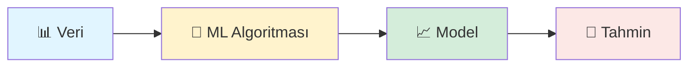

</div>

**Ayırıcı Özellik:**  
> "Geleneksel programlama: İnsan kuralları yazar.  
> Makine öğrenmesi: Sistem kuralları veriden öğrenir."

<div align="center">

| Boyut | Geleneksel Programlama | Makine Öğrenmesi |
|-------|------------------------|------------------|
| **Kural Kaynağı** | İnsan yazar | Veri'den öğrenir |
| **Esneklik** | Sabit | Adapte olur |
| **Karmaşıklık** | Basit problemler | Karmaşık örüntüler |
| **Örnek** | Hesap makinesi | Spam filtresi |

</div>

**ML Örnekleri:**
- 📧 **Email Spam Filtresi:** Spam/değil sınıflandırması
- 🏠 **Ev Fiyat Tahmini:** Regresyon modeli
- 🛒 **Ürün Önerisi:** Öneri sistemleri
- 🔍 **Müşteri Segmentasyonu:** Kümeleme

### 🔥 **3. Derin Öğrenme (DL) - Deep Learning**

**Tanım:**  
**Çok katmanlı yapay sinir ağları** kullanan ML alt dalı.

**Kapsam:**  
ML'in özel bir türü. Karmaşık, yapılandırılmamış veri için.

<div align="center">

```
🧠 Sinir Ağı Yapısı (Basitleştirilmiş)

Input Layer     Hidden Layers        Output Layer
    ●               ● ● ●                  ●
    ●        →     ● ● ●      →          ●
    ●               ● ● ●                  ●
    ●
    
   Veri          Öğrenme             Sonuç
```

</div>

**Ayırıcı Özellik:**  
> "Geleneksel ML: İnsan özellik mühendisliği yapar.  
> Derin Öğrenme: Sistem otomatik özellik çıkarır."

**DL'nin Güçlü Olduğu Alanlar:**

<div align="center">

| Alan | Neden DL? | Örnek Uygulama |
|------|-----------|----------------|
| 🖼️ **Görüntü** | Piksel seviyesi analiz | Yüz tanıma, kanser tespiti |
| 🎤 **Ses** | Dalga formu analizi | Siri, Alexa, Google Assistant |
| 📝 **Metin** | Kelime ilişkileri | ChatGPT, çeviri, özetleme |
| 🎥 **Video** | Temporal örüntüler | Hareket tespiti, video analiz |

</div>

### 📊 **Üçlü Karşılaştırma Tablosu**

<div align="center">

| Özellik | AI | ML | DL |
|---------|----|----|-----|
| **Kapsam** | En geniş | AI'nın alt dalı | ML'in alt dalı |
| **Veri İhtiyacı** | Değişken | Orta-Yüksek | Çok yüksek |
| **İnsan Müdahalesi** | Yüksek | Orta | Düşük (özellik çıkarma) |
| **Hesaplama Gücü** | Düşük-Orta | Orta | Çok yüksek (GPU) |
| **Açıklanabilirlik** | Yüksek | Orta | Düşük (kara kutu) |
| **Örnek Kullanım** | Chatbot | Satış tahmini | Görüntü tanıma |
| **Popüler Olduğu Dönem** | 1950+ | 1990+ | 2010+ |

</div>

### 🎯 **YBS Perspektifi: Hangi Probleme Hangi Çözüm?**

<div align="center">

```
┌────────────────────────────────────────────────────────┐
│                                                        │
│  📊 Tablo Verisi + Sayısal/Kategorik                   │
│     → Klasik ML (Random Forest, XGBoost)              │
│                                                        │
│  🖼️ Görüntü + Video                                   │
│     → Derin Öğrenme (CNN)                             │
│                                                        │
│  📝 Metin + Dil                                        │
│     → Derin Öğrenme (Transformers, GPT)               │
│                                                        │
│  🎤 Ses + Konuşma                                      │
│     → Derin Öğrenme (RNN, LSTM)                       │
│                                                        │
└────────────────────────────────────────────────────────┘
```

</div>

### 💼 **İş Dünyası Örnekleri**

**Senaryo 1: E-ticaret Satış Tahmini**
- **Problem:** Gelecek ay kaç ürün satılacak?
- **Veri:** Tablo (tarih, fiyat, kampanya, stok)
- **Çözüm:** **Klasik ML** (Linear Regression, XGBoost)
- **Neden ML?** Tablo verisi, yeterince iyi performans

**Senaryo 2: Ürün Kalite Kontrolü (Görüntü)**
- **Problem:** Üretim bandındaki hatalı ürünleri tespit et
- **Veri:** Kamera görüntüleri (milyon piksel)
- **Çözüm:** **Derin Öğrenme** (CNN - Convolutional Neural Network)
- **Neden DL?** Görüntü verisi, karmaşık örüntüler

**Senaryo 3: Müşteri Destek Chatbot**
- **Problem:** Müşteri sorularını otomatik yanıtla
- **Veri:** Metin (sorular + cevaplar)
- **Çözüm:** **Derin Öğrenme** (GPT, BERT gibi dil modelleri)
- **Neden DL?** Doğal dil anlama, bağlam kavrama

### 🔍 **Kritik Ayrım**

Bu derste vurgulanmış kritik nokta:

> **"Bir probleme DL uygulamak,**  
> **her zaman en iyi seçim değildir.**  
>  
> **Bazen basit bir ML modeli:**  
> ✅ Daha hızlıdır  
> ✅ Daha az veri ister  
> ✅ Daha açıklanabilirdir  
> ✅ Daha az maliyet gerektirir"**

### 📈 **Tarihsel Evrim**

<div align="center">

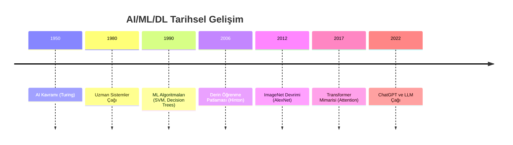

</div>

---

## 🧱 STRATEJİK CEVABIN 3 TEMEL TAŞI

### 🎯 **Giriş: ML Projesi = 3 Ayaklı Taburet**

Bir makine öğrenmesi projesi, **3 temel unsurun** dengesi üzerine kuruludur:

<div align="center">

```
              🎯 İŞ KARARI
                    ▲
                    │
                    │
         ┌──────────┼──────────┐
         │                     │
         │                     │
    📊 VERİ              🤖 MODEL
         │                     │
         └─────────────────────┘
              
   Bu 3 unsur dengesizse, proje çöker!
```

</div>

### 🔥 **Kritik Anlayış**

> **"Model tek başına hiçbir değer yaratmaz.**  
> **Veri tek başına anlamsızdır.**  
> **Karar tek başına spekülasyondur.**  
>  
> **Değer, bu üçünün ENTEGRASYONUNDAN doğar."**

---

### 📊 **1. VERİ - Kararın Yakıtı**

#### 🎯 **Tanım**

Veri, makine öğrenmesinin **hammaddesidir**. Modelin öğrendiği, örüntü bulduğu temeldir.

#### 💡 **"Çöp Girerse, Çöp Çıkar" (Garbage In, Garbage Out)**

En sofistike model bile kötü veriyle başarısız olur.

<div align="center">

| Veri Kalitesi | Model Performansı | İş Sonucu |
|---------------|-------------------|-----------|
| ⭐⭐⭐⭐⭐ Mükemmel | %95 doğruluk | ROI pozitif |
| ⭐⭐⭐ Orta | %70 doğruluk | Kararsız |
| ⭐ Kötü | %45 doğruluk | Yatırım kaybı |

</div>

#### 📋 **Veri Kalitesinin 6 Boyutu**

<div align="center">

| Boyut | Açıklama | Örnek Problem | Çözüm |
|-------|----------|---------------|-------|
| **Doğruluk** | Veriler gerçeği yansıtıyor mu? | Müşteri yaşı -5 | Validasyon kuralları |
| **Tamlık** | Eksik veri var mı? | %40 kayıtta telefon yok | Veri toplama iyileştirmesi |
| **Tutarlılık** | Çelişkiler var mı? | Aynı kişi için 3 farklı adres | Veri entegrasyonu |
| **Güncellik** | Veri güncel mi? | 2018'den kalma kampanya verisi | Periyodik güncelleme |
| **İlgililik** | İş problemine uygun mu? | Satış tahmini için hava durumu | Feature selection |
| **Yeterlilik** | Yeterli miktarda mı? | 50 satır veriyle tahmin | Daha fazla veri toplama |

</div>

#### 🔍 **Gerçek Dünya Senaryosu: E-ticaret Müşteri Terk Projesi**

**Durum:**
- **Hedef:** Hangi müşteriler 30 gün içinde terkedecek?
- **Veri:** 3 yıllık işlem geçmişi (120,000 müşteri)

**Veri Envanteri:**

<div align="center">

```
📊 Mevcut Veri Kaynakları

┌────────────────────────────────────────────┐
│  ✅ İşlem Geçmişi (SQL)                    │
│     - Satın alma tarihi/tutarı             │
│     - Ürün kategorileri                    │
│     - İndirim kullanımı                    │
│                                            │
│  ✅ Müşteri Profili (CRM)                  │
│     - Demografik bilgiler                  │
│     - Kayıt tarihi                         │
│     - Segment bilgisi                      │
│                                            │
│  ✅ İletişim Logları (Email/SMS)           │
│     - Gönderim tarihi                      │
│     - Açma/tıklama oranları                │
│                                            │
│  ✅ Destek Kayıtları (Ticket)              │
│     - Şikayet sayısı/türü                  │
│     - Çözüm süresi                         │
│                                            │
│  ⚠️ Web Davranış Verisi (Eksik)            │
│     - Sadece son 6 ay mevcut               │
│     - %30 kayıt yok (cookie reddi)         │
└────────────────────────────────────────────┘
```

</div>

**Veri Hazırlık Süreci:**

<div align="center">

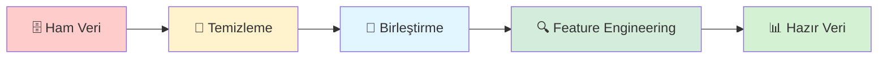

</div>

#### 💼 **YBS Perspektifi: Veri Stratejisi**

YBS uzmanı şu soruları sorar:

1. **"Hangi veriyi saklıyoruz?"** → Veri altyapısı
2. **"Hangi veriyi saklamıyoruz ama saklamalıyız?"** → Veri toplama stratejisi
3. **"Verinin kalitesi nasıl kontrol edilir?"** → Veri yönetişimi
4. **"Verideki önyargılar neler?"** → Etik ve adillik
5. **"Veri güvenliği nasıl sağlanır?"** → KVKK/GDPR uyumu

---

### 🤖 **2. MODEL - Örüntüyü Çıkaran Motor**

#### 🎯 **Tanım**

Model, veriden **öğrenen** ve **öngörü yapan** matematiksel yapıdır.

#### 🧠 **Model Ne YAPAR ve Ne YAPMAZ?**

<div align="center">

| ✅ MODEL YAPAR | ❌ MODEL YAPMAZ |
|----------------|-----------------|
| Örüntü tanır | Düşünmez |
| Tahmin üretir | Karar vermez |
| İstatistiksel çıkarım | Neden-sonuç ilişkisi kurmaz |
| Matematiksel optimizasyon | Yaratıcı fikir üretmez |
| Sınıflandırma/regresyon | Etik yargı yapmaz |

</div>

#### 📈 **Model Türleri ve İş Senaryoları**

<div align="center">

| Problem Türü | Model Ailesi | İş Örneği |
|--------------|--------------|-----------|
| **Sınıflandırma** | Logistic Regression, Random Forest, XGBoost | Müşteri terk/kalmaz |
| **Regresyon** | Linear Regression, Gradient Boosting | Satış tutarı tahmini |
| **Kümeleme** | K-Means, DBSCAN | Müşteri segmentasyonu |
| **Öneri** | Collaborative Filtering, Matrix Factorization | Ürün önerisi |
| **Anomali Tespiti** | Isolation Forest, Autoencoder | Kredi kartı dolandırıcılığı |

</div>

#### ⚖️ **Model Seçimi: Ödünleşimler (Trade-offs)**

Her model seçimi bir **ödünleşim** içerir:

<div align="center">

```
📊 Model Performans Kriterleri

        Doğruluk
           ↑
           │         ● Derin Öğrenme
           │          
           │    ● XGBoost
           │   ● Random Forest
           │  ● Logistic Regression
           │
           └──────────────────────→ Hız
           
        Açıklanabilirlik
           ↑
           │ ● Karar Ağacı
           │  ● Linear Regression
           │   
           │     ● Random Forest
           │       
           │          ● Sinir Ağları
           │
           └──────────────────────→ Karmaşıklık
```

</div>

#### 🎯 **YBS Perspektifi: Model Değerlendirmesi**

YBS uzmanı teknik metrikten fazlasını sorgular:

<div align="center">

| Soru | Açıklama |
|------|----------|
| **"Bu model hangi iş kararını destekliyor?"** | İş uyumu |
| **"Yanlış tahmin bedeli nedir?"** | Risk analizi |
| **"Model açıklanabilir mi?"** | Regülasyon uyumu |
| **"Operasyonel maliyeti nedir?"** | TCO analizi |
| **"Kullanıcı güvenebilir mi?"** | Kabul edilebilirlik |

</div>

#### 💡 **Gerçek Örnek: Kredi Onay Modeli**

**Senaryo:** Banka kredi başvurularını otomatik değerlendiriyor.

**Model A: Derin Öğrenme**
- ✅ %96 doğruluk
- ❌ Kara kutu (neden red? açıklanamaz)
- ❌ Regülatör onayı zor

**Model B: Lojistik Regresyon**
- ✅ %91 doğruluk
- ✅ Açıklanabilir (hangi faktör önemli?)
- ✅ Regülatör uyumlu

**YBS Kararı:** Model B seçildi.  
**Neden?** İş bağlamında %5 doğruluk farkı, açıklanabilirlik kaybını haklı çıkarmıyor.

---

### 🎯 **3. İŞ KARARI - Direksiyon**

#### 🔥 **En Kritik Unsur**

> **"Model 'ne' olacağını söyler.**  
> **YBS uzmanı 'ne YAPACAĞIZ' kararını verir."**

Model bir **araç**tır. Karar bir **STRATEJİ**dir.

#### 🧭 **Model Çıktısından İş Aksiyonuna**

<div align="center">

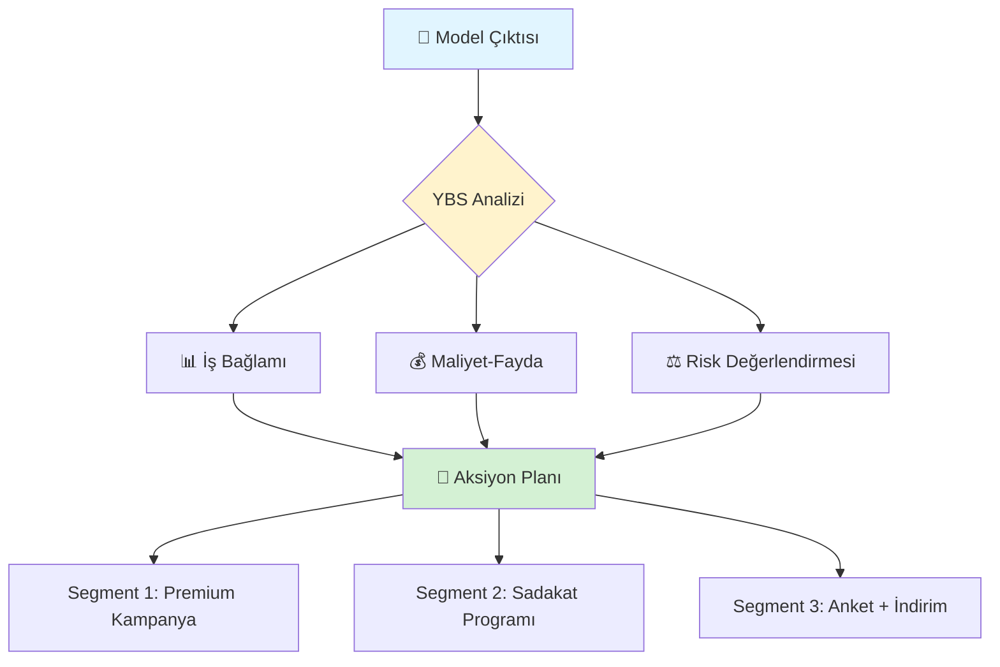

</div>

#### 💼 **Müşteri Terk Örneği: Model → Karar Dönüşümü**

**Model Çıktısı:**
```
2,500 müşteri risk altında (30 gün içinde terk riski >%70)
```

**Basit (Yanlış) Yaklaşım:**
> "Hepsine %20 indirim kupon gönderelim!"

**YBS Stratejik Yaklaşımı:**

<div align="center">

| Segment | Müşteri Sayısı | CLV (Müşteri Yaşam Boyu Değeri) | Strateji | Bütçe | Beklenen ROI |
|---------|----------------|--------------------------------|----------|-------|--------------|
| **Premium** | 200 | $5,000 | Özel hesap yöneticisi + VIP etkinlik | $50k | 8x |
| **Orta** | 1,000 | $1,200 | Sadakat puanı + ücretsiz kargo | $30k | 4x |
| **Düşük** | 1,300 | $300 | Anket + %10 indirim | $15k | 2x |

</div>

**Sonuç:**
- ❌ **Tek tip yaklaşım:** $125k harcama, 1.5x ROI
- ✅ **Segmentli strateji:** $95k harcama, 4.2x ROI

#### 🔍 **Karar Çerçevesi: 5W1H**

YBS uzmanı her model çıktısı için şunu sorar:

<div align="center">

| Soru | Açıklama | Örnek |
|------|----------|-------|
| **What?** | Model ne diyor? | 2,500 riskli müşteri |
| **Why?** | Neden bu sonuç? | Düşük engagement + yüksek şikayet |
| **Who?** | Kim etkileniyor? | Premium: 200, Orta: 1000, Düşük: 1300 |
| **When?** | Ne zaman aksiyon? | 7 gün içinde başla |
| **Where?** | Hangi kanal? | Email, SMS, App bildirimi |
| **How?** | Nasıl uygula? | Segmente özel kampanya |

</div>

#### 🎭 **Gerçek Dünya Senaryosu: Netflix**

**Model Çıktısı:**
> "Bu kullanıcı %85 olasılıkla X dizisini izleyecek"

**Basit Yaklaşım:**
- Ana sayfada X dizisini göster

**Netflix'in Stratejik Yaklaşımı:**
- Kullanıcının izleme zamanı? → Akşam
- Cihaz tercihi? → TV
- Sosyal bağlam? → Arkadaşları da izliyor
- **Aksiyon:** X dizisini akşam TV ana sayfasında + "Arkadaşların da izliyor" etiketi

**Sonuç:** Sadece önerme değil, **contextualized recommendation**.

---

### 🔗 **3 Taşın Entegrasyonu: Başarı Formülü**

#### 💡 **Başarılı ML Projesi Denklemi**

<div align="center">

```
╔═══════════════════════════════════════════════════════╗
║                                                       ║
║   🏆 Başarı =                                         ║
║                                                       ║
║   (Kaliteli Veri × Uygun Model × Aksiyon Planı)      ║
║   ────────────────────────────────────────────        ║
║         Organizasyonel Hazırlık                       ║
║                                                       ║
╚═══════════════════════════════════════════════════════╝
```

</div>

#### ⚖️ **Denge Analizi**

<div align="center">

| Senaryo | Sonuç |
|---------|-------|
| 🟢 **Veri ✅ Model ✅ Karar ✅** | **BAŞARI** → ROI pozitif |
| 🟡 **Veri ✅ Model ✅ Karar ❌** | Model çekmecede kalır |
| 🟡 **Veri ✅ Model ❌ Karar ✅** | Yanlış öngörü → Kötü karar |
| 🟡 **Veri ❌ Model ✅ Karar ✅** | Güvenilmez tahmin |
| 🔴 **İkisi veya üçü eksik** | Proje başarısız |

</div>

#### 🎯 **YBS'cinin Orkestrasyonu**

YBS uzmanı, bu üç unsurun **orkestra şefi**dir:

<div align="center">

```
          🎼 YBS UZMANI (Şef)
                  │
        ┌─────────┼─────────┐
        │         │         │
    📊 Veri   🤖 Model   🎯 Karar
    Ekibi     Ekibi      Ekibi
        │         │         │
        └─────────┼─────────┘
                  │
           🏢 İŞ DEĞERİ
```

</div>

### 🔥 **Bölüm Özeti**

<div align="center">

| Taş | Rolü | YBS Sorusu |
|-----|------|------------|
| **📊 Veri** | Yakıt | "Hangi veriyi topluyoruz?" |
| **🤖 Model** | Motor | "Bu model iş problemini çözüyor mu?" |
| **🎯 Karar** | Direksiyon | "Bu bilgiyle ne yapacağız?" |

</div>

> **"Makine öğrenmesi üçgen bir taburet gibidir.**  
> **Üç ayağı da dengeli olmazsa,**  
> **proje devrenir."**

---

## 📺 GERÇEK DÜNYA ÖRNEĞİ: NETFLİX

### 🎬 **Giriş: Bir Başarı Hikayesi**

Netflix, makine öğrenmesinin **iş değerine** dönüştürülmesinin en çarpıcı örneklerinden biridir.

<div align="center">

```
📊 Netflix İstatistikleri (2024)
═══════════════════════════════════════════════════

👥 260 Milyon+ Abone
💰 $33 Milyar+ Yıllık Gelir
🎬 18,000+ İçerik Başlığı
🌍 190+ Ülke
⏱️ Günlük 1 Milyar+ Saat İzlenme
🤖 %80 İzlenme → ML Önerileri
```

</div>

### 🔍 **Temel Soru: Netflix'in Rekabet Avantajı Nedir?**

Birçok kişi der ki: **"İçerik"**

Ama gerçek cevap: **"Doğru içeriği, doğru kişiye, doğru zamanda gösterme yeteneği"**

<div align="center">

```
┌────────────────────────────────────────────────────┐
│                                                    │
│   🎥 İçerik (Disney+, HBO da var)                  │
│        ↓                                           │
│   🤖 Makine Öğrenmesi (Fark buradan başlıyor)     │
│        ↓                                           │
│   🎯 Kişiselleştirilmiş Deneyim                    │
│        ↓                                           │
│   ⏱️ Platformda Kalma Süresi Artışı               │
│        ↓                                           │
│   💰 Abonelik Devam Oranı Yükselir                │
│        ↓                                           │
│   📈 İŞ DEĞERİ                                     │
│                                                    │
└────────────────────────────────────────────────────┘
```

</div>

---

### 🎯 **Netflix'in ML Kullanım Alanları**

#### 1️⃣ **Öneri Sistemi (Recommendation Engine)**

**İş Problemi:**
> "260 milyon kullanıcı, 18,000 içerik. Her kullanıcıya ne gösterelim?"

**Geleneksel Yaklaşım:**
- En popüler içeriği herkese göster
- Kategori bazlı filtreleme (aksiyon, komedi, drama)

**Netflix'in ML Yaklaşımı:**

<div align="center">

| Veri Kaynağı | Ne Öğreniyor? |
|--------------|---------------|
| **İzleme Geçmişi** | Hangi tür içerikleri seviyor? |
| **Derecelendirmeler** | Hangi içeriklere yüksek puan veriyor? |
| **İzleme Zamanı** | Ne zaman izliyor? (hafta sonu/hafta içi) |
| **Cihaz Bilgisi** | Nereden izliyor? (TV/telefon/tablet) |
| **Tıklama Davranışı** | Hangi thumbnail'e tıklıyor? |
| **Arama Sorguları** | Ne arıyor? |
| **Duraklatma/İleri Sarma** | Hangi sahnelerde ilgisi azalıyor? |
| **Bırakma Noktası** | Hangi içerikleri yarıda bırakıyor? |
| **Sosyal Bağlam** | Arkadaşları ne izliyor? (aynı hane) |

</div>

**Sonuç:**
> Netflix'te gördüğünüz her satır, sizin için özel olarak tasarlanmıştır.

<div align="center">

```
Ana Sayfa Örneği:

Kullanıcı A (25, kadın, aksiyon sever):
─────────────────────────────────────
🎬 Sizin İçin Seçtiklerimiz
   [Aksiyon filmleri]
🔥 Trend Olanlar
   [Popüler aksiyon içerikler]
   
Kullanıcı B (45, erkek, belgesel sever):
─────────────────────────────────────
📚 Sizin İçin Seçtiklerimiz
   [Belgesel seriler]
🌍 Keşfetmeye Değer
   [Doğa belgeselleri]
```

</div>

#### 2️⃣ **Thumbnail Kişiselleştirme**

**Şaşırtıcı Gerçek:**  
Aynı içerik için farklı kullanıcılara **farklı afişler** gösterilir!

**Örnek: "Stranger Things"**

<div align="center">

| Kullanıcı Profili | Gösterilen Thumbnail | Neden? |
|-------------------|---------------------|--------|
| **Aksiyon Sever** | Aksiyon sahnesi (canavar) | Heyecan vurgusu |
| **Drama Sever** | Karakterler arası ilişki | Duygusal bağ |
| **Korku Sever** | Karanlık, gerilimli sahne | Korku öğesi |
| **Çocuk İçerikleri İzleyen** | Gençler odaklı sahne | Genç karakterler |

</div>

**ML Süreci:**

<div align="center">

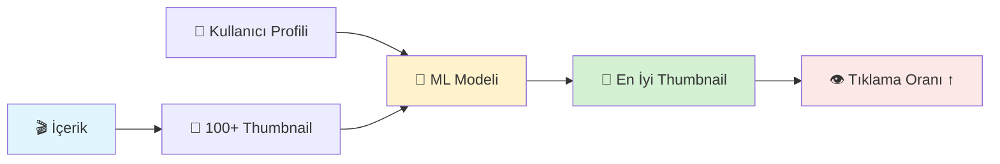

</div>

**İş Etkisi:**
- Tıklama oranında **%20-30 artış**
- İçerik keşfi artışı

#### 3️⃣ **İçerik Üretim Kararları**

**Soru:**  
> "Hangi diziye/filme yatırım yapalım?"

**Geleneksel Yaklaşım:**
- Prodüktör sezgisi
- Pilot bölüm testi
- Pazar araştırması

**Netflix'in ML Yaklaşımı:**

**Örnek: "House of Cards" ($100M yatırım)**

Netflix analiz etti:
- ✅ Kevin Spacey içerikleri yüksek izlenme
- ✅ David Fincher yönetmenliği sever kullanıcılar
- ✅ Politik dramalar popüler
- ✅ BBC orijinal versiyonu başarılı

**Karar:** 2 sezon garanti ile $100M yatırım → Büyük başarı

<div align="center">

```
📊 İçerik Yatırım Karar Matrisi

        Talep Potansiyeli
              ↑
              │
    Yüksek    │    🎯 YATIR
              │    (House of Cards)
              │
              │    ⚠️ ARAŞTIR
    Orta      │    (Daha fazla veri)
              │
              │    ❌ YAPMA
    Düşük     │
              │
              └──────────────────────→
            Düşük   Orta   Yüksek
                 Üretim Maliyeti
```

</div>

#### 4️⃣ **Churn Prevention (Abonelik İptali Önleme)**

**İş Problemi:**
> "Hangi kullanıcılar iptal edecek?"

**Risk Sinyalleri (ML ile tespit):**

<div align="center">

| Sinyal | Açıklama | Risk Skoru |
|--------|----------|------------|
| 📉 **İzleme Azalması** | Son 30 günde %70 düşüş | 🔴 Yüksek |
| ⏸️ **Yarım Bırakma** | 5 içerikten 4'ü yarıda | 🔴 Yüksek |
| 🔍 **Arama Başarısızlığı** | Aradığını bulamıyor | 🟡 Orta |
| 🚫 **Hata Mesajları** | Teknik sorun yaşıyor | 🟡 Orta |
| 📱 **Uygulama Açmıyor** | 14 gündür giriş yok | 🔴 Yüksek |
| 💳 **Ödeme Sorunları** | Kart reddedildi | 🔴 Kritik |

</div>

**Önleyici Aksiyonlar:**

<div align="center">

```
🎯 Riskli Kullanıcı Tespit Edildi
         ↓
    
Aksiyon 1: Kişiselleştirilmiş Email
"Sizin için yeni içerikler geldi!"

Aksiyon 2: Push Bildirimi
"İzlediğiniz dizinin yeni bölümü yayında!"

Aksiyon 3: Özel İndirim
"İlk 3 ay %20 indirim"

Aksiyon 4: İçerik Önerisi
Ana sayfada ilgisini çekecek içerikler
```

</div>

**Sonuç:**
- Churn oranında **%25 azalma**
- Müşteri yaşam boyu değeri artışı

---

### 🔥 **Netflix'in Başarı Formülü**

<div align="center">

```
╔═══════════════════════════════════════════════════╗
║                                                   ║
║   📊 VERİ:                                        ║
║      Milyarlarca izlenme kaydı                    ║
║                                                   ║
║   🤖 MODEL:                                       ║
║      Collaborative Filtering                      ║
║      Deep Neural Networks                         ║
║      Reinforcement Learning                       ║
║                                                   ║
║   🎯 KARAR:                                       ║
║      • Hangi içeriği göster?                      ║
║      • Hangi thumbnail kullan?                    ║
║      • Hangi içeriği üret?                        ║
║      • Kimi koru?                                 ║
║                                                   ║
║   = 💰 $33 Milyar Gelir                           ║
║                                                   ║
╚═══════════════════════════════════════════════════╝
```

</div>

### 📊 **Rakiplerle Karşılaştırma**

<div align="center">

| Platform | İçerik | ML Yatırımı | Kişiselleştirme | Sonuç |
|----------|--------|-------------|-----------------|-------|
| **Netflix** | ⭐⭐⭐⭐ | ⭐⭐⭐⭐⭐ | ⭐⭐⭐⭐⭐ | Lider |
| **Disney+** | ⭐⭐⭐⭐⭐ | ⭐⭐⭐ | ⭐⭐⭐ | Güçlü |
| **Amazon Prime** | ⭐⭐⭐ | ⭐⭐⭐⭐ | ⭐⭐⭐⭐ | Rakip |
| **HBO Max** | ⭐⭐⭐⭐ | ⭐⭐ | ⭐⭐ | Geride |

</div>

**Kritik Fark:**  
Disney+ daha iyi içeriğe sahip olabilir, ama Netflix daha iyi **kullanıcı deneyimi** sunar.

### 🎓 **Ders Çıkarımı**

Netflix örneği şunu gösterir:

> **"Makine öğrenmesi sadece bir teknoloji değildir.**  
> **İş modelinin ÇEKİRDEĞİDİR."**

Netflix için ML:
- ✅ Bir "nice to have" değil
- ✅ Stratejik rekabet avantajı
- ✅ Gelir motorunun kalbi
- ✅ Kullanıcı deneyiminin temeli

### 💡 **YBS Öğrencisine Mesaj**

<div align="center">

```
┌───────────────────────────────────────────────────┐
│                                                   │
│   "Netflix mühendisleri sadece kod yazmıyor.      │
│    İş stratejisi tasarlıyorlar."                  │
│                                                   │
│   "Sizin işiniz de bu olacak:                     │
│    Teknolojiyi iş değerine dönüştürmek."          │
│                                                   │
└───────────────────────────────────────────────────┘
```

</div>

### 🔗 **İleri Okuma**

Netflix'in teknik blogları (YBS bakış açısıyla okunmalı):
- 📚 **Netflix Tech Blog:** netflixtechblog.com
- 📊 **Case Study:** "How Netflix uses ML"
- 🎯 **A/B Testing at Scale:** Netflix experimentation

---

## 🔍 MAKİNE ÖĞRENMESİ TÜRLERİ

### 🎯 **Giriş: Soru Önce, Yöntem Sonra**

Makine öğrenmesinde en önemli adım: **Doğru soruyu sormak**.

<div align="center">

```
❌ Yanlış Yaklaşım:
   "Hangi algoritmayı kullanayım?"
   
✅ Doğru Yaklaşım:
   "Ne tür bir soru soruyorum?"
```

</div>

### 🧭 **ML Türleri: Karar Ağacı**

<div align="center">

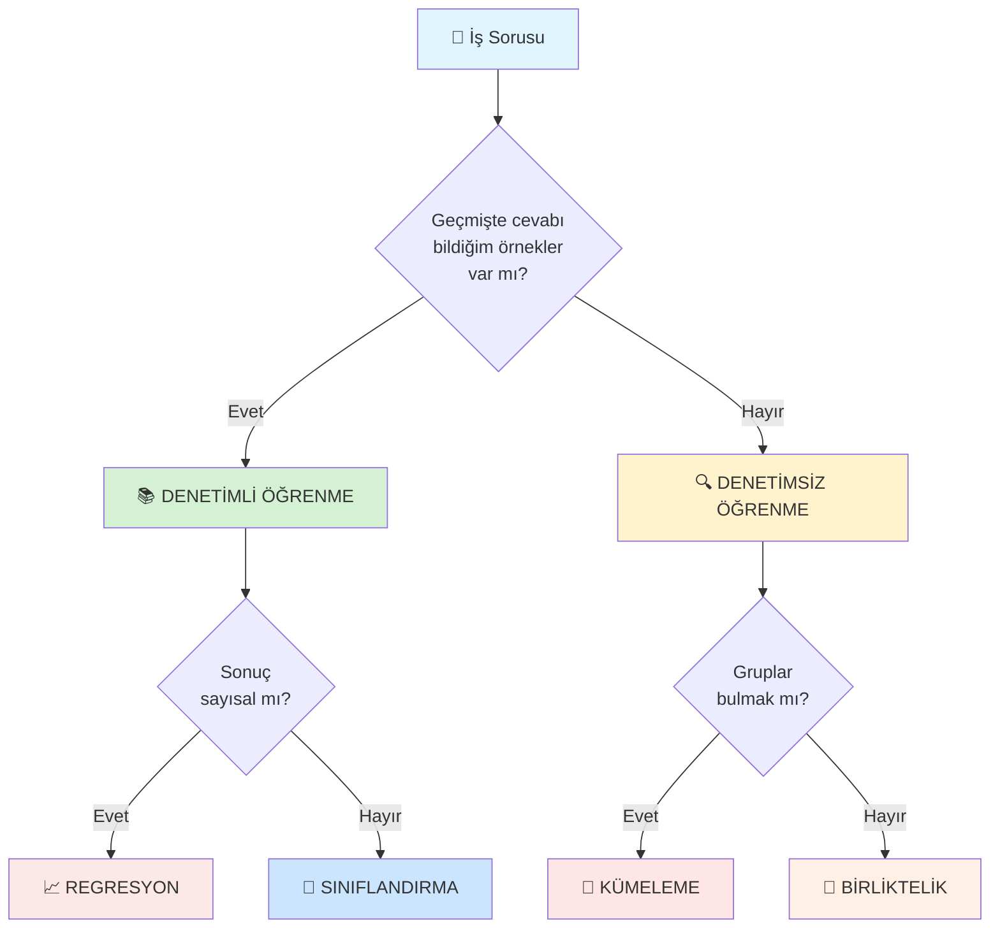

</div>

---

## 📚 1. DENETİMLİ ÖĞRENME (Supervised Learning)

### 🎯 **Tanım**

Geçmişte **cevabı bildiğimiz** örneklerle öğretiyoruz.

<div align="center">

```
Model:  "Bu özelliklere sahip müşteri terk etti mi?"
Biz:    "Evet, terk etti." (etiket)
Model:  "Tamam, öğrendim. Başka örnek?"
```

</div>

### 🔑 **Anahtar Kavram: Etiketli Veri**

<div align="center">

| Özellikler (X) | Etiket (Y) |
|----------------|------------|
| Yaş: 35, Gelir: $50k, Son alışveriş: 90 gün | ✅ Terk etti |
| Yaş: 28, Gelir: $75k, Son alışveriş: 5 gün | ❌ Aktif |
| Yaş: 42, Gelir: $60k, Son alışveriş: 60 gün | ✅ Terk etti |

</div>

**Kritik:** Her örnekte **cevabı biliyoruz** (Terk etti/Etmedi)

### 📊 **İki Alt Kategori**

---

### 📈 **A) REGRESYON - Sayısal Tahmin**

#### 🎯 **Ne Zaman Kullanılır?**

Cevap bir **sayı** ise:
- Fiyat tahmini
- Satış miktarı
- Sıcaklık
- Mesafe
- Süre

#### 💼 **İş Örnekleri**

<div align="center">

| Sektör | Problem | Hedef Değişken | Model Örneği |
|--------|---------|----------------|--------------|
| **Emlak** | Ev fiyatı tahmini | Fiyat ($) | Linear Regression |
| **E-ticaret** | Sipariş değeri tahmini | Tutar ($) | XGBoost |
| **Lojistik** | Teslimat süresi | Saat | Random Forest |
| **Finans** | Kredi risk skoru | Skor (0-100) | Gradient Boosting |
| **Enerji** | Elektrik tüketimi | kWh | Time Series Model |

</div>

#### 🏠 **Detaylı Örnek: Ev Fiyat Tahmini**

**İş Problemi:**
> "Yeni listelenecek evin fiyatı ne olmalı?"

**Özellikler (Input):**

<div align="center">

| Özellik | Örnek Değer | Açıklama |
|---------|-------------|----------|
| Alan (m²) | 120 | Kullanılabilir alan |
| Oda Sayısı | 3 | Yatak odası |
| Kat | 5 | Bulunduğu kat |
| Yaş | 15 | Bina yaşı |
| Lokasyon | Merkez | Bölge |
| Asansör | Var | Boolean |
| Balkon | 1 | Adet |

</div>

**Hedef (Output):**
- **Fiyat:** $350,000

**Model Öğreniyor:**
```
Daha büyük alan → Daha yüksek fiyat
Merkez lokasyon → Daha yüksek fiyat
Yeni bina → Daha yüksek fiyat
```

**YBS Değeri:**
- ✅ Tutarlı fiyatlama stratejisi
- ✅ Rekabetçi analiz
- ✅ Dinamik fiyat optimizasyonu

---

### 🎯 **B) SINIFLANDIRMA - Kategori Tahmini**

#### 🎯 **Ne Zaman Kullanılır?**

Cevap bir **kategori** ise:
- Evet/Hayır
- Onaylı/Reddedildi
- Düşük/Orta/Yüksek
- Sınıf A/B/C
- Kategori etiketleri

#### 💼 **İş Örnekleri**

<div align="center">

| Sektör | Problem | Kategoriler | Model Örneği |
|--------|---------|-------------|--------------|
| **Bankacılık** | Kredi onayı | Onayla/Reddet | Logistic Regression |
| **E-ticaret** | Müşteri terk | Terk eder/Etmez | XGBoost |
| **Sağlık** | Hastalık teşhisi | Hasta/Sağlıklı | Random Forest |
| **Telekomünikasyon** | Spam tespiti | Spam/Normal | Naive Bayes |
| **Sigorta** | Fraud detection | Sahte/Gerçek | Neural Network |

</div>

#### 📧 **Detaylı Örnek: Email Spam Filtresi**

**İş Problemi:**
> "Bu email spam mi, normal mi?"

**Özellikler (Input):**

<div align="center">

| Özellik | Spam Email | Normal Email |
|---------|------------|--------------|
| "Ücretsiz" kelimesi | ✅ Çok | ❌ Az |
| "Tıkla" kelimesi | ✅ Çok | ❌ Az |
| Büyük harf oranı | ✅ Yüksek | ❌ Düşük |
| Link sayısı | ✅ Çok | ❌ Az |
| Gönderen domain | ❌ Bilinmiyor | ✅ Tanıdık |
| Ünlem işareti | ✅ Çok (!!!) | ❌ Normal |

</div>

**Hedef (Output):**
- **Spam** veya **Normal**

**Model Öğreniyor:**
```
"Ücretsiz" + Çok link + Büyük harf = %95 Spam
Tanıdık gönderen + Az link = %98 Normal
```

**YBS Değeri:**
- ✅ Kullanıcı deneyimi iyileştirme
- ✅ Güvenlik artışı
- ✅ Operasyonel verimlilik

#### 🏥 **İkili vs. Çoklu Sınıflandırma**

<div align="center">

| Tür | Sınıf Sayısı | Örnek |
|-----|--------------|-------|
| **Binary** | 2 | Hasta/Sağlıklı, Spam/Normal |
| **Multi-Class** | 3+ | Risk seviyesi (Düşük/Orta/Yüksek) |
| **Multi-Label** | Birden fazla etiket | Email: [İş + Önemli + Okunmadı] |

</div>

---

### 🔥 **Denetimli Öğrenme: Kritik Noktalar**

<div align="center">

| Avantaj | Dezavantaj |
|---------|------------|
| ✅ Yüksek doğruluk | ❌ Etiketli veri gerekli (pahalı) |
| ✅ Ölçülebilir performans | ❌ Geçmişe bağımlı |
| ✅ İş değeri net | ❌ Önyargı riski (bias) |
| ✅ Açıklanabilir | ❌ Yeni durumlarda zayıf |

</div>

### 💡 **YBS Perspektifi**

> **"Denetimli öğrenme, geçmişten öğrenip geleceği tahmin eder.**  
> **Ama dikkat: Geçmiş her zaman geleceği yansıtmaz!"**

**Örnek Tuzak:**
- 2019 verisiyle eğitilen model, 2020 pandemi dönemini tahmin edemedi
- Önyargılı geçmiş veri → Önyargılı model

---

## 🔍 2. DENETİMSİZ ÖĞRENME (Unsupervised Learning)

### 🎯 **Tanım**

Geçmişte **cevabı bilmiyoruz**. Model kendi başına örüntü buluyor.

<div align="center">

```
Model:  "Bu müşterilerde benzer gruplar görebiliyor musun?"
Biz:    "Sen karar ver, ben etiket vermedim."
Model:  "Tamam, 4 grup buldum!"
```

</div>

### 🔑 **Anahtar Kavram: Etiketsiz Veri**

<div align="center">

| Özellikler (X) | Etiket (Y) |
|----------------|------------|
| Yaş: 35, Gelir: $50k, Harcama: $200 | ❓ (yok) |
| Yaş: 28, Gelir: $75k, Harcama: $800 | ❓ (yok) |
| Yaş: 42, Gelir: $60k, Harcama: $300 | ❓ (yok) |

</div>

**Model, benzer özelliklere sahip müşterileri grupluyor.**

### 📊 **İki Alt Kategori**

---

### 🧩 **A) KÜMELEME (Clustering) - Grup Keşfi**

#### 🎯 **Ne Zaman Kullanılır?**

Benzer öğeleri **gruplamak** istediğimizde:
- Müşteri segmentasyonu
- Ürün kategorilendirme
- Anomali tespiti
- Pazar bölümlendirme

#### 💼 **İş Örnekleri**

<div align="center">

| Sektör | Problem | Sonuç | İş Değeri |
|--------|---------|-------|-----------|
| **Perakende** | Müşteri segmentasyonu | 5 segment | Hedefli pazarlama |
| **Telekomünikasyon** | Kullanım profilleri | 3 profil | Paket önerileri |
| **Sigorta** | Risk grupları | 4 risk grubu | Prim fiyatlandırma |
| **Sağlık** | Hasta tipleri | 6 hasta tipi | Tedavi özelleştirme |
| **E-ticaret** | Ürün grupları | 10 kategori | Envanter yönetimi |

</div>

#### 🛒 **Detaylı Örnek: Müşteri Segmentasyonu**

**İş Problemi:**
> "Müşterilerimizi kaç gruba ayırabiliriz ve her gruba nasıl yaklaşmalıyız?"

**Özellikler:**

<div align="center">

| Müşteri | Gelir | Harcama | Ziyaret Sıklığı | Ortalama Sepet |
|---------|-------|---------|-----------------|----------------|
| A | $40k | $150/ay | Haftada 2 | $35 |
| B | $80k | $800/ay | Haftada 4 | $95 |
| C | $45k | $180/ay | Haftada 2 | $40 |
| D | $95k | $1200/ay | Günlük | $150 |

</div>

**Model Sonucu (K-Means ile 4 Cluster):**

<div align="center">

```
📊 Segment Haritası

    Harcama
       ↑
       │
Yüksek │     🎯 VIP            💎 Premium
       │     (Segment 1)       (Segment 2)
       │     • Yüksek gelir     • En yüksek harcama
       │     • Sık ziyaret      • Sadık müşteri
       │
 Orta  │     💼 Profesyonel    🏃 Aktif
       │     (Segment 3)       (Segment 4)
       │     • Orta gelir       • Genç
       │     • Düzenli          • Fırsat odaklı
       │
Düşük  │
       └──────────────────────────────────→
            Düşük              Yüksek
                   Gelir
```

</div>

**YBS Stratejisi:**

<div align="center">

| Segment | Boyut | Strateji | Bütçe | Beklenen ROI |
|---------|-------|----------|-------|--------------|
| **🎯 VIP** | %10 | Özel hizmet + VIP program | $100k | 12x |
| **💎 Premium** | %5 | Lüks ürün koleksiyonu | $80k | 15x |
| **💼 Profesyonel** | %35 | Sadakat programı | $60k | 5x |
| **🏃 Aktif** | %50 | İndirim kampanyaları | $40k | 3x |

</div>

**İş Etkisi:**
- Pazarlama verimliliği **%40 artış**
- Müşteri memnuniyeti **%25 artış**
- ROI **%300 iyileşme**

#### 🔬 **Popüler Kümeleme Algoritmaları**

<div align="center">

| Algoritma | Ne Zaman? | Avantaj | Dezavantaj |
|-----------|-----------|---------|------------|
| **K-Means** | Sık kullanılan, hızlı | Basit, hızlı | K sayısı elle verilmeli |
| **Hierarchical** | Küme hiyerarşisi | Dendogram görsel | Yavaş |
| **DBSCAN** | Gürültülü veri | Outlier tespiti | Parametre hassas |

</div>

---

### 🔗 **B) BİRLİKTELİK (Association) - İlişki Keşfi**

#### 🎯 **Ne Zaman Kullanılır?**

**"Birlikte"** olan şeyleri bulmak:
- Sepet analizi
- Çapraz satış
- Öneri sistemleri
- Davranış pattern'leri

#### 💼 **İş Örnekleri**

<div align="center">

| Sektör | Problem | Bulunan İlişki | Aksiyon |
|--------|---------|----------------|---------|
| **Süpermarket** | Sepet analizi | Ekmek → Süt (%70) | Yan yana raf |
| **E-ticaret** | Ürün önerisi | Laptop → Mouse (%85) | Bundle indirim |
| **Streaming** | İçerik önerisi | Dizi A → Dizi B (%60) | Otomatik öneri |
| **Kitap Satış** | Çapraz satış | Kitap X → Kitap Y (%50) | "Bunları da beğenebilirsiniz" |

</div>

#### 🛒 **Detaylı Örnek: Market Sepet Analizi**

**İş Problemi:**
> "Hangi ürünler birlikte satın alınıyor?"

**Veri Örneği:**

<div align="center">

| İşlem ID | Ürünler |
|----------|---------|
| 001 | Ekmek, Süt, Yumurta |
| 002 | Ekmek, Süt, Peynir |
| 003 | Süt, Yumurta, Tereyağı |
| 004 | Ekmek, Süt, Yumurta, Peynir |
| 005 | Bebek bezi, Bebek maması |

</div>

**Bulunan Kurallar (Association Rules):**

<div align="center">

| Kural | Destek | Güven | Lift | Yorum |
|-------|--------|-------|------|-------|
| Ekmek → Süt | %70 | %85 | 2.1 | 🔥 Güçlü ilişki |
| Süt → Yumurta | %60 | %75 | 1.8 | ✅ İyi ilişki |
| Bebek bezi → Bebek maması | %80 | %95 | 3.5 | 🔥 Çok güçlü |

</div>

**Metrik Açıklamaları:**
- **Destek:** Ne kadar sık birlikte? (Ekmek+Süt işlemlerin %70'inde)
- **Güven:** Ne kadar emin? (Ekmek alanların %85'i süt de alıyor)
- **Lift:** Rastlantı mı? (2.1 = Rastlantıdan 2.1x daha güçlü)

**YBS Stratejileri:**

<div align="center">

```
📦 Strateji 1: Raf Düzenleme
   Ekmek ← 2m → Süt (yakın yerleştir)
   
🎁 Strateji 2: Bundle Teklifi
   "Ekmek + Süt" paketi %10 indirimle
   
📧 Strateji 3: Kişiselleştirilmiş Kupon
   Ekmek alana → Süt kuponu gönder
   
🏪 Strateji 4: Mağaza Tasarımı
   Bebek ürünleri aynı koridor
```

</div>

**İş Etkisi:**
- Sepet büyüklüğü **%15 artış**
- Çapraz satış **%30 artış**
- Envanter verimliliği

---

### 🔥 **Denetimsiz Öğrenme: Kritik Noktalar**

<div align="center">

| Avantaj | Dezavantaj |
|---------|------------|
| ✅ Etiketli veri gereksiz (ucuz) | ❌ Sonuç subjektif |
| ✅ Gizli pattern keşfi | ❌ Performans ölçümü zor |
| ✅ Keşif amaçlı | ❌ İş değeri belirsiz olabilir |
| ✅ Yeni içgörüler | ❌ Yorumlama gerekir |

</div>

### 💡 **YBS Perspektifi**

> **"Denetimsiz öğrenme, veriyi keşif gezisine çıkarır.**  
> **Ne bulacağınızı bilmezsiniz, ama yeni ufuklar açar!"**

---

### 🎯 **Özet: Hangi Türü Seçeyim?**

<div align="center">

```
🤔 KARAR AKIŞI
═════════════════════════════════════════════════

Sorunuz:
├─ "Gelecekte ne olacak?" 
│  └─ Geçmiş cevaplar var mı?
│     ├─ Evet → DENETİMLİ
│     │  ├─ Sayısal cevap? → REGRESYON
│     │  └─ Kategori cevap? → SINIFLANDIRMA
│     │
│     └─ Hayır → DENETİMSİZ
│        ├─ Gruplar bul? → KÜMELEME
│        └─ İlişkiler bul? → BİRLİKTELİK
```

</div>

### 📊 **Karşılaştırma Tablosu**

<div align="center">

| Boyut | Denetimli | Denetimsiz |
|-------|-----------|------------|
| **Veri** | Etiketli | Etiketsiz |
| **Amaç** | Tahmin | Keşif |
| **Soru** | "Ne olacak?" | "Ne var?" |
| **Doğruluk** | Ölçülebilir | Subjektif |
| **Maliyet** | Yüksek (etiketleme) | Düşük |
| **İş Değeri** | Doğrudan | Dolaylı |
| **Örnek** | Satış tahmini | Müşteri segmentleri |

</div>

---

## 🧭 CRISP-DM: YBS'CİNİN YOL HARİTASI

### 🎯 **Giriş: ML Projeleri Neden Başarısız Olur?**

<div align="center">

```
📊 ML Proje Başarısızlık İstatistikleri
═══════════════════════════════════════════════════

❌ %85 ML projesi üretime geçemiyor
❌ %60 başarısızlık: İş problemi yanlış tanımlandı
❌ %25 başarısızlık: Veri kalitesi yetersiz
❌ %15 başarısızlık: Model/Teknik sorunlar
```

</div>

**Kritik Bulgu:**  
Başarısızlık genellikle **teknik** değil, **metodolojik** eksiklikten kaynaklanır.

### 📚 **CRISP-DM Nedir?**

**CRISP-DM:** Cross-Industry Standard Process for Data Mining

<div align="center">

```
📖 Tanım
═══════════════════════════════════════════════════

Veri madenciliği ve makine öğrenmesi projeleri için
endüstri standardı bir metodoloji.

🏢 Kullanım: IBM, Microsoft, Amazon, Google
📅 Tarih: 1996'dan beri
🌍 Kapsam: Tüm sektörler
```

</div>

### 🔄 **CRISP-DM'in 6 Aşaması**

<div align="center">

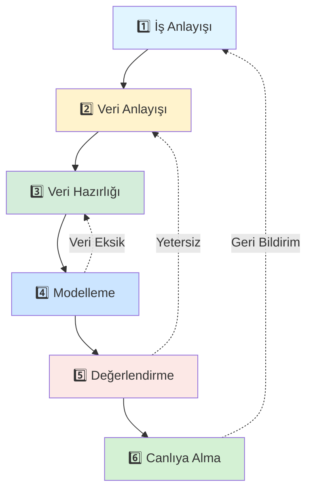

</div>

**Kritik Özellik:** Döngüseldir! Doğrusal değil, iteratiftir.

---

## 1️⃣ **İŞ ANLAYIŞI (Business Understanding)**

### 🎯 **Amaç**

İş problemini **net ve ölçülebilir** hale getirmek.

### 🔥 **YBS'cinin Doğal Alanı!**

> **"Bu aşama, YBS uzmanının parlama anıdır.**  
> **Veri bilimci burada desteğe ihtiyaç duyar,**  
> **ama YBS uzmanı liderlik eder."**

### 📋 **Sorulması Gereken 10 Kritik Soru**

<div align="center">

| # | Soru | Neden Önemli? |
|---|------|---------------|
| 1️⃣ | **İş problemi tam olarak nedir?** | Belirsiz problem = Başarısız proje |
| 2️⃣ | **Başarıyı nasıl ölçeceğiz?** | Ölçemediğini yönetemezsin |
| 3️⃣ | **Mevcut durum nedir?** | Baseline olmadan iyileştirme yok |
| 4️⃣ | **Hedef ne?** | "Daha iyi" yeterli değil, "%10 artış" lazım |
| 5️⃣ | **Kısıtlar neler?** | Bütçe, zaman, veri, etik sınırlar |
| 6️⃣ | **Paydaşlar kimler?** | Kim kullanacak, kim karar verecek? |
| 7️⃣ | **ROI beklentisi?** | Yatırım karşılığı hesabı |
| 8️⃣ | **Riskler neler?** | Yanlış tahmin bedeli nedir? |
| 9️⃣ | **Zaman çerçevesi?** | Ne zaman canlıya alınmalı? |
| 🔟 | **Alternatif yaklaşımlar?** | ML gerçekten gerekli mi? |

</div>

### 💼 **Örnek: E-ticaret Müşteri Terk Projesi**

**❌ Kötü İş Tanımı:**
> "Müşteri kaybını azaltmak istiyoruz."

**✅ İyi İş Tanımı:**

<div align="center">

```
╔═══════════════════════════════════════════════════╗
║                                                   ║
║  🎯 İŞ TANIMI                                     ║
║                                                   ║
║  Problem:                                         ║
║  Q3'te müşteri churn oranı %18'e yükseldi        ║
║  (hedef %12, sektör ortalaması %15)              ║
║                                                   ║
║  Hedef:                                           ║
║  6 ay içinde churn'ü %12'ye düşür                ║
║                                                   ║
║  Başarı Metriği:                                  ║
║  • Churn oranı (ana metrik)                      ║
║  • Müşteri yaşam boyu değeri (CLV)               ║
║  • Müdahale maliyeti / kurtarılan müşteri        ║
║                                                   ║
║  ROI Hedefi:                                      ║
║  Yatırım: $200k                                   ║
║  Beklenen kazanç: $800k (1 yılda)                ║
║  ROI: 4x                                          ║
║                                                   ║
╚═══════════════════════════════════════════════════╝
```

</div>

### 🎓 **Çıktılar**

- ✅ Proje charter'ı
- ✅ Başarı kriterleri
- ✅ Risk analizi
- ✅ Kaynak planı
- ✅ Paydaş haritası

---

## 2️⃣ **VERİ ANLAYIŞI (Data Understanding)**

### 🎯 **Amaç**

Hangi veriye **sahip** olduğumuzu ve hangi veriye **ihtiyaç** duyduğumuzu anlamak.

### 🔍 **4 Temel Aktivite**

<div align="center">

| Aktivite | Soru | Araç |
|----------|------|------|
| **Veri Toplama** | Hangi verilere erişebiliriz? | SQL, API, Excel |
| **Veri Tanımlama** | Veri ne anlama geliyor? | Data dictionary |
| **Veri Keşfi** | Verinin özellikleri neler? | EDA (Pandas, Seaborn) |
| **Veri Kalitesi** | Problemler var mı? | Null analizi, outlier |

</div>

### 📊 **Veri Envanteri Çıkarma**

**Örnek: Müşteri Terk Projesi**

<div align="center">

| Veri Kaynağı | Tablo/Dosya | Kayıt Sayısı | Zaman Aralığı | Kalite |
|--------------|-------------|--------------|---------------|--------|
| **CRM Sistemi** | customers | 120,000 | 2020-2024 | ⭐⭐⭐⭐⭐ |
| **İşlem DB** | transactions | 2.5M | 2020-2024 | ⭐⭐⭐⭐ |
| **Destek Sistemi** | tickets | 45,000 | 2021-2024 | ⭐⭐⭐ |
| **Web Logs** | clickstream | 50M | 2023-2024 | ⭐⭐ |
| **Email Sistemi** | campaigns | 500k | 2020-2024 | ⭐⭐⭐⭐ |

</div>

### 🔬 **Keşifsel Veri Analizi (EDA)**

**Temel Kontroller:**

<div align="center">

```
✅ VERİ SAĞLIK KONTROLÜ
═══════════════════════════════════════════════════

1. Boyut Kontrolü
   • Satır sayısı: 120,000 ✅
   • Sütun sayısı: 45 ✅
   
2. Eksik Veri
   • Email: %5 eksik ⚠️
   • Telefon: %15 eksik ⚠️
   • Yaş: %2 eksik ✅
   
3. Veri Tipleri
   • Sayısal: 25 sütun ✅
   • Kategorik: 15 sütun ✅
   • Tarih: 5 sütun ✅
   
4. Aykırı Değerler (Outliers)
   • Yaş: -5 yıl ❌ (hata)
   • Harcama: $1M ⚠️ (kontrol et)
   
5. Tutarlılık
   • Aynı müşteri için 3 farklı adres ⚠️
   • Kayıt tarihi > Son işlem ❌
```

</div>

### 💡 **YBS Perspektifi**

Bu aşamada YBS uzmanı şunu anlar:

<div align="center">

```
┌────────────────────────────────────────────────────┐
│                                                    │
│  Veri durumu ≠ Veri ihtiyacı                      │
│                                                    │
│  GAP analizi:                                     │
│  • Nelere sahibiz? ✅                             │
│  • Nelere ihtiyacımız var? 📋                     │
│  • Aradaki fark? ⚠️                               │
│  • Eksik veriyi nasıl toplarız? 🎯               │
│                                                    │
└────────────────────────────────────────────────────┘
```

</div>

### 🎓 **Çıktılar**

- ✅ Veri envanter raporu
- ✅ EDA raporu (grafikler, istatistikler)
- ✅ Veri kalite raporu
- ✅ Veri toplama planı (eksikler için)

---

## 3️⃣ **VERİ HAZIRLIĞI (Data Preparation)**

### 🎯 **Amaç**

Ham veriyi **model için uygun** hale getirmek.

### 🔥 **En Uzun ve Kritik Aşama**

> **"Veri bilimcilerin zamanının %80'i**  
> **bu aşamada harcanır!"**

### 🛠️ **5 Ana İşlem**

<div align="center">

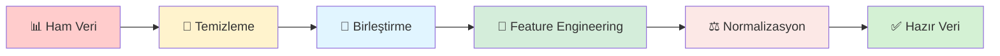

</div>

#### **A) Temizleme (Cleaning)**

<div align="center">

| Problem | Çözüm | Örnek |
|---------|-------|-------|
| **Eksik değer** | Doldur/Sil | Yaş null → Ortalama ile doldur |
| **Aykırı değer** | Cap/Sil | Yaş: 150 → 65 ile sınırla |
| **Tutarsızlık** | Düzelt | "Erkek", "E", "M" → "Erkek" |
| **Duplikasyon** | Sil | Aynı kayıt 3 kez → 1'e düşür |
| **Format** | Standartlaştır | "01/12/2024", "2024-12-01" → Tek format |

</div>

#### **B) Birleştirme (Integration)**

Farklı kaynaklardan verileri birleştirme:

```sql
-- Müşteri + İşlem + Destek verisi
SELECT 
    c.customer_id,
    c.age,
    COUNT(t.transaction_id) as transaction_count,
    COUNT(s.ticket_id) as support_tickets
FROM customers c
LEFT JOIN transactions t ON c.customer_id = t.customer_id
LEFT JOIN support_tickets s ON c.customer_id = s.customer_id
GROUP BY c.customer_id, c.age
```

#### **C) Feature Engineering (Özellik Mühendisliği)**

**Ham veri → Anlamlı özellikler**

<div align="center">

| Ham Veri | Feature Engineering | Yeni Özellik |
|----------|---------------------|--------------|
| İşlem tarihleri | Son işlem - Bugün | Gün olarak inaktivite |
| İşlem tutarları | Toplam / İşlem sayısı | Ortalama sepet değeri |
| Destek kayıtları | Son 3 ay şikayet / Toplam | Şikayet yoğunluğu |
| Web logları | Tıklama / Ziyaret | Engagement oranı |
| Demografik | Yaş grupları | Genç/Orta/Yaşlı |

</div>

**Örnek:**
```python
# Ham veri
last_purchase_date = "2024-01-15"
current_date = "2024-12-27"

# Feature engineering
days_since_last_purchase = (current_date - last_purchase_date).days
# Sonuç: 347 gün (risk sinyali!)
```

#### **D) Dönüştürme (Transformation)**

<div align="center">

| İşlem | Ne Zaman? | Örnek |
|-------|-----------|-------|
| **Normalizasyon** | Farklı ölçekler | Yaş (0-100), Gelir ($0-$1M) → [0-1] |
| **Encoding** | Kategorik → Sayısal | "Erkek" → 0, "Kadın" → 1 |
| **Binning** | Sürekli → Kategorik | Yaş → "18-25", "26-35", "36+" |
| **Log Transform** | Çarpık dağılım | Gelir → log(gelir) |

</div>

#### **E) Bölümleme (Splitting)**

<div align="center">

```
📊 Veri Bölümleme Stratejisi
═══════════════════════════════════════════════════

Toplam: 120,000 kayıt
   ↓
├─ Training Set (70%): 84,000 kayıt
│  Model bununla öğrenir
│
├─ Validation Set (15%): 18,000 kayıt  
│  Hiperparametre ayarı
│
└─ Test Set (15%): 18,000 kayıt
   Final performans testi
   (Model bunu hiç görmedi!)
```

</div>

### 💡 **YBS'cinin Rolü**

Bu aşamada YBS uzmanı:

1. ✅ **İş mantığını** teknik ekibe açıklar
2. ✅ **Feature seçimini** iş öncelikleriyle uyumlar
3. ✅ **Veri etik** kontrolleri yapar (KVKK, bias)
4. ✅ **Dokümante** eder (hangi dönüşüm neden yapıldı?)

### 🎓 **Çıktılar**

- ✅ Temiz veri seti
- ✅ Feature listesi ve açıklamaları
- ✅ Veri dönüşüm pipeline'ı
- ✅ Train/Validation/Test setleri

---

## 4️⃣ **MODELLEME (Modeling)**

### 🎯 **Amaç**

En uygun modeli seçip eğitmek.

### 🤖 **Model Seçim Süreci**

<div align="center">

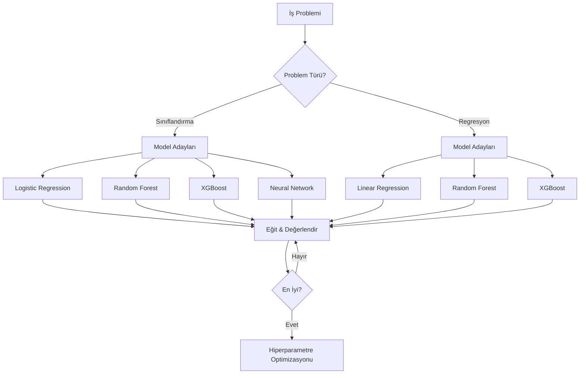

</div>

### 📊 **Model Karşılaştırma**

**Örnek: Müşteri Terk (Sınıflandırma)**

<div align="center">

| Model | Doğruluk | Precision | Recall | F1-Score | Eğitim Süresi |
|-------|----------|-----------|--------|----------|---------------|
| Logistic Regression | %82 | %78 | %80 | %79 | 2 sn |
| Random Forest | %87 | %85 | %84 | %84 | 45 sn |
| **XGBoost** | **%91** | **%89** | **%88** | **%88** | 120 sn |
| Neural Network | %90 | %87 | %86 | %86 | 300 sn |

</div>

**Seçim:** XGBoost (En yüksek performans + makul süre)

### ⚙️ **Hiperparametre Ayarlama**

<div align="center">

```python
# XGBoost hiperparametre grid
parametreler = {
    'max_depth': [3, 5, 7],
    'learning_rate': [0.01, 0.1, 0.3],
    'n_estimators': [100, 200, 300]
}

# Grid search ile en iyi kombinasyon
# Sonuç: max_depth=5, learning_rate=0.1, n_estimators=200
```

</div>

### 💡 **YBS Perspektifi**

YBS uzmanı sorar:

<div align="center">

| Teknik Soru | İş Sorusu |
|-------------|-----------|
| "Model %91 doğru" | "Yanlış tahminin bedeli ne?" |
| "F1-Score 0.88" | "Bu iş metriğine nasıl yansır?" |
| "Model eğitimi 2 saat" | "Operasyonel maliyet?" |
| "10 feature kullandık" | "Hangi faktörler önemli?" |

</div>

### 🎓 **Çıktılar**

- ✅ Eğitilmiş model(ler)
- ✅ Model karşılaştırma raporu
- ✅ En iyi hiperparametreler
- ✅ Feature importance analizi

---

## 5️⃣ **DEĞERLENDİRME (Evaluation)**

### 🎯 **Amaç**

Modelin **iş hedeflerini** karşıladığını doğrulamak.

### 🔍 **İki Katmanlı Değerlendirme**

<div align="center">

```
┌────────────────────────────────────────────────────┐
│                                                    │
│  Katman 1: TEKNİK PERFORMANS                       │
│  • Doğruluk, Precision, Recall                     │
│  • Confusion Matrix                                │
│  • ROC-AUC                                         │
│                                                    │
│  Katman 2: İŞ PERFORMANSI ⭐                       │
│  • ROI hesaplaması                                 │
│  • Operasyonel etki                                │
│  • Paydaş onayı                                    │
│                                                    │
└────────────────────────────────────────────────────┘
```

</div>

### 📊 **Teknik Değerlendirme: Confusion Matrix**

<div align="center">

```
                Gerçek Durum
              Terk Etti | Kalmaya Devam
           ┌──────────────┬──────────────┐
Tahmin     │              │              │
Terk Etti  │   TP: 880    │   FP: 120    │ PPV=88%
           │              │              │
           ├──────────────┼──────────────┤
Kalmaya    │   FN: 120    │   TN: 880    │ NPV=88%
Devam      │              │              │
           └──────────────┴──────────────┘
           Sensitivity    Specificity
              =88%          =88%

Toplam Doğruluk: 88%
```

</div>

### 💼 **İş Değerlendirmesi: ROI Analizi**

**Senaryo: 2,000 riskli müşteri tespit edildi**

<div align="center">

| Metrik | Değer | Hesaplama |
|--------|-------|-----------|
| **Tespit edilen risk** | 2,000 müşteri | Model çıktısı |
| **Gerçek terk (TP)** | 1,760 müşteri | %88 doğruluk |
| **Ortalama CLV** | $1,200 | İş verisi |
| **Kurtarma oranı** | %60 | Pazarlama |
| **Kurtarılan müşteri** | 1,056 müşteri | 1,760 × 0.6 |
| **Kurtarılan değer** | **$1,267,200** | 1,056 × $1,200 |
| **Kampanya maliyeti** | $240,000 | $120/müşteri |
| **Net kazanç** | **$1,027,200** | Değer - Maliyet |
| **ROI** | **428%** | 🔥 Başarılı! |

</div>

### ✅ **Go/No-Go Karar Kriterleri**

<div align="center">

| Kriter | Hedef | Gerçekleşen | Durum |
|--------|-------|-------------|-------|
| Model doğruluğu | >%85 | %88 | ✅ |
| ROI | >300% | 428% | ✅ |
| Yanıt süresi | <1 sn | 0.3 sn | ✅ |
| Paydaş onayı | CEO + CMO | ✅ | ✅ |
| Etik kontrol | Bias yok | ✅ | ✅ |

**Karar:CANLIYA AL 🚀**

</div>

### 🎓 **Çıktılar**

- ✅ Model performans raporu
- ✅ İş etkisi analizi
- ✅ ROI hesaplaması
- ✅ Canlıya alma onayı

---

## 6️⃣ **CANLIYA ALMA (Deployment)**

### 🎯 **Amaç**

Modeli **üretim ortamına** almak ve **operasyonelleştirmek**.

### 🚀 **Canlıya Alma Stratejileri**

<div align="center">

| Strateji | Ne Zaman? | Risk | Örnek |
|----------|-----------|------|-------|
| **Big Bang** | Basit sistemler | Yüksek | Hemen herkese |
| **Pilot (Beta)** | Orta risk | Orta | %10 müşteriye test |
| **Phased Rollout** | Kritik sistemler | Düşük | Haftalık %20 artış |
| **A/B Test** | Optimizasyon | Düşük | %50 eski, %50 yeni |

</div>

### 🏗️ **Canlıya Alma Mimarisi**

<div align="center">

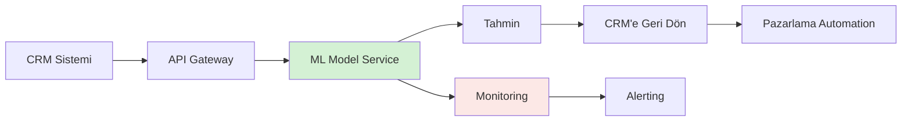

</div>

### 📊 **İzleme (Monitoring)**

**3 Katmanlı İzleme:**

<div align="center">

| Katman | Metrik | Uyarı Eşiği |
|--------|--------|-------------|
| **Teknik** | Yanıt süresi | >2 sn |
| **Model** | Tahmin dağılımı | %20 sapma |
| **İş** | Churn oranı | Haftalık kontrol |

</div>

### 🔄 **Model Yenileme Stratejisi**

<div align="center">

```
📅 YENİLEME PLANI
═══════════════════════════════════════════════════

Günlük:   Performans metrikleri
Haftalık: İş metrik kontrol
Aylık:    Model drift analizi
Çeyreklik: Model yeniden eğitimi
Yıllık:   Strateji revizyonu
```

</div>

### 💡 **YBS'cinin Sorumluluğu**

Canlıya almadan sonra:

1. ✅ **Operasyon ekibine eğitim**
2. ✅ **Dokümantasyon** (kullanım kılavuzu)
3. ✅ **İş süreci entegrasyonu**
4. ✅ **Başarı metrikleri dashboard**
5. ✅ **Sürekli iyileştirme** planı

### 🎓 **Çıktılar**

- ✅ Production model
- ✅ API dokümantasyonu
- ✅ Monitoring dashboard
- ✅ Operasyon el kitabı
- ✅ Bakım planı

---

### 🔥 **CRISP-DM'in Gücü: Iteratif Yaklaşım**

<div align="center">

```
❌ Yanlış Düşünce:
   "6 aşamayı bitirdik, proje tamamlandı!"
   
✅ Doğru Yaklaşım:
   "İlk iterasyon tamamlandı, öğrendik, iyileştiriyoruz!"
```

</div>

**Örnek İterasyon:**

<div align="center">

| Iterasyon | Keşif | Sonuç | Aksiyon |
|-----------|-------|-------|---------|
| **1. Tur** | Churn %88 doğruluk | İyi ama yeterli değil | Web davranış verisi ekle |
| **2. Tur** | Doğruluk %91'e çıktı | Daha iyi! | Feature engineering iyileştir |
| **3. Tur** | ROI %300 → %428 | 🔥 Hedef aşıldı | Canlıya al |

</div>

### 💼 **YBS Perspektifi: %70 Başarı İlk İki Aşamada**

<div align="center">

```
📊 Başarı Faktörleri Dağılımı
═══════════════════════════════════════════════════

🏆 %40 → İş Anlayışı (Doğru problem)
🏆 %30 → Veri Anlayışı (Doğru veri)
───────────────────────────────────────
     %70 = YBS'cinin doğal alanı! ⭐

🤖 %15 → Veri Hazırlığı
🤖 %10 → Modelleme  
🤖 %5  → Canlıya Alma
```

</div>

### 🎯 **Özet: CRISP-DM Şahane Formül**

<div align="center">

```
╔═══════════════════════════════════════════════════╗
║                                                   ║
║  CRISP-DM = İş Anlayışı × Veri × Model × Eylem   ║
║                                                   ║
║  YBS Uzmanı:                                      ║
║  ✓ İş anlayışında lider                          ║
║  ✓ Veri anlayışında ortak                        ║
║  ✓ Modellemede destekleyici                      ║
║  ✓ Canlıya almada köprü                          ║
║                                                   ║
╚═══════════════════════════════════════════════════╝
```

</div>

---

<br/>

## 📚 **14 Haftalık Kapsamlı Müfredat**

<div align="center">

### 🎓 **Başlangıçtan Ustalığa Sistematik Yolculuk**

*Her hafta hem teorik temeller hem pratik uygulamalar*

</div>

<br/>

> **Not**: Bu bölüm, tüm dönem boyunca işlenecek konuların genel bir özetini içermektedir. Her haftanın detaylı içeriği ilgili hafta klasöründe bulunmaktadır.

---

### **📅 Hafta 1: Veriden Değere - Makine Öğrenmesinin Kavramsal Mimarisi**

<table>
<tr>
<td width="70%">

**🎯 İçerik**

Makine öğrenmesini algoritmalar üzerinden değil, **problem çözme perspektifi** üzerinden ele alıyoruz. Bu hafta ML'nin büyük resmini görüyoruz.

**📖 Konular:**
- ✅ **CRISP-DM Metodolojisi**: İş probleminden model dağıtımına sistematik yaklaşım
- ✅ **Yapay Zeka vs Makine Öğrenmesi**: Kavramsal farklar ve ilişkiler
- ✅ **Öğrenme Paradigmaları**: Denetimli, Denetimsiz ve Pekiştirmeli öğrenme
- ✅ **ML Proje Yaşam Döngüsü**: Data collection → Model development → Deployment
- ✅ **İş Problemi Tanımlama**: Hangi problemler ML ile çözülebilir?

**💡 Çıktılar:**
- ML projelerinin genel yapısını anlama
- Problem-çözüm eşleştirmesi yapabilme
- Proje planı oluşturabilme

</td>
<td width="30%" align="center">

**🏷️ Etiketler**

<br/>

`CRISP-DM`

`Yapay Zeka`

`ML Paradigmaları`

`Problem Tanımlama`

`Proje Planlama`

<br/>

**📊 Seviye**

🟢 **Başlangıç**

</td>
</tr>
</table>

---

## � **End-to-End Projeler & Portfolyo**

<div align="center">

### 🚀 **Gerçek Dünya Projeleriyle Portföy Oluşturun**

</div>

<br/>

### **📌 Ara Proje (Hafta 6-7)**

<table>
<tr>
<td width="70%">

**🎯 Proje Kapsamı:**
- İlk 5 haftada öğrenilen konuların entegrasyonu
- Veri toplama, EDA, preprocessing ve regression modelleme
- Gerçek veya Kaggle veri seti kullanımı

**💡 Örnek Proje Konuları:**
- 📈 **Ev Fiyat Tahmini**: Regression ile emlak fiyat tahmini
- 💰 **Maaş Prediction**: İş deneyimi ve education level ile maaş tahmini
- 📊 **Satış Forecasting**: Time series regression ile satış tahminleme
- 🚗 **Araç Değer Tahmini**: Özellikleinden yola çıkarak araç fiyatı

**📝 Beklenen Çıktılar:**
- Jupyter Notebook ile detaylı analiz
- GitHub repository
- 10-15 dakikalık sunum
- Teknik dokümantasyon

</td>
<td width="30%" align="center">

**🎖️ Değerlendirme**

<br/>

`Veri Analizi`  
**%25**

`Preprocessing`  
**%20**

`Model Quality`  
**%30**

`Sunum`  
**%25**

<br/>

</td>
</tr>
</table>

<br/>

### **📌 Final Projesi (Hafta 13-14)**

<table>
<tr>
<td width="70%">

**🎯 Proje Kapsamı:**
- Tüm dönem boyunca öğrenilen konuların entegrasyonu
- Problem tanımından deployment'a end-to-end çözüm
- Production-ready kod ve sistem

**💡 Beklenen Bileşenler:**

**1. Problem Definition & Business Value**
- Çözülen gerçek dünya problemi
- İş değeri ve impact analizi
- Success metrics tanımı

**2. Data Pipeline**
- Veri toplama stratejisi
- Data cleaning ve preprocessing
- Feature engineering

**3. Model Development**
- Multiple model comparison
- Hyperparameter tuning
- Cross-validation strategy

**4. Deployment**
- FastAPI REST API veya
- Streamlit interactive dashboard
- User-friendly interface

**5. Documentation & Presentation**
- Technical documentation
- GitHub README
- 20 dakikalık profesyonel sunum

</td>
<td width="30%" align="center">

**🎖️ Değerlendirme**

<br/>

`Problem & Value`  
**%15**

`Data Pipeline`  
**%20**

`Model Quality`  
**%25**

`Deployment`  
**%20**

`Presentation`  
**%20**

<br/>

</td>
</tr>
</table>

<br/>

<div align="center">

### 🎯 **Örnek Final Proje Fikirleri**

</div>

| 🎨 Kategori | 💡 Proje Fikirleri | 🛠️ Teknikler |
|:-----------|:------------------|:-------------|
| **🏪 E-Ticaret** | • Customer churn prediction<br/>• Product recommendation<br/>• Sales forecasting | Classification, Clustering,<br/>Time Series |
| **💹 Finans** | • Kredi risk analizi<br/>• Hisse senedi tahmini<br/>• Fraud detection | Classification, Regression,<br/>Anomaly Detection |
| **🏥 Sağlık** | • Hastalık tahmini<br/>• Patient readmission<br/>• Medical analysis | Classification, Regression |
| **🏘️ Emlak** | • Ev fiyat tahmini<br/>• Rental optimization<br/>• Location analysis | Regression, Clustering |

---

## �📚 VERİ NEREDE? KAGGLE VE UCI

### 🎯 **Giriş: Veri Yoksa ML de Yok**

<div align="center">

```
🧠 Makine Öğrenmesinin Altın Kuralı
═══════════════════════════════════════════════════

Veri = ML'in Hammaddesi

🏭 Ham Madde Kalitesi → Ürün Kalitesi
📊 Veri Kalitesi → Model Kalitesi

En iyi algoritma bile kötü veriyle başarısız olur!
```

</div>

**Kritik Soru:**
> "Harika bir iş problemi tanımladınız, CRISP-DM'i biliyorsunuz.  
> Ama veriyi nereden bulacaksınız?"

### 🗺️ **Veri Kaynakları: Üç Kategori**

<div align="center">

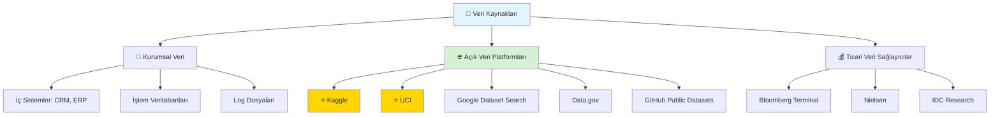

</div>

### 💡 **YBS Perspektifi**

<div align="center">

| Kaynak Türü | Kullanım Alanı | Maliyet | Güvenilirlik |
|-------------|----------------|---------|--------------|
| **Kurumsal** | Gerçek iş problemleri | Düşük (sahip) | ⭐⭐⭐⭐⭐ |
| **Açık Platform** | Öğrenme, prototip | Ücretsiz | ⭐⭐⭐⭐ |
| **Ticari** | Pazar araştırma | Çok yüksek | ⭐⭐⭐⭐⭐ |

</div>

**Bu derste odak:** Açık veri platformları (Öğrenme ve prototipler için ideal!)

---

## ⭐ **1. KAGGLE: Veri Bilimcilerin GitHub'ı**

### 🌐 **Genel Bakış**

<div align="center">

```
╔═══════════════════════════════════════════════════╗
║                                                   ║
║  🔗 URL: https://www.kaggle.com                   ║
║                                                   ║
║  📊 İstatistikler (2024):                         ║
║  • 15+ Milyon kullanıcı                          ║
║  • 50,000+ ücretsiz dataset                      ║
║  • 200,000+ notebook (kod örneği)                ║
║  • 400+ aktif yarışma                            ║
║                                                   ║
║  🏢 Sahip: Google LLC (2017'den beri)            ║
║                                                   ║
╚═══════════════════════════════════════════════════╝
```

</div>

### 🎯 **Kaggle Nedir?**

**Kaggle**, veri bilimi ve makine öğrenmesi topluluğunun merkezi platformudur.

<div align="center">

| Özellik | Açıklama |
|---------|----------|
| **Dataset Hub** | Hazır, temiz veri setleri |
| **Competitions** | Para ödüllü ML yarışmaları |
| **Notebooks** | Ücretsiz Jupyter ortamı (GPU dahil!) |
| **Courses** | Ücretsiz eğitimler |
| **Discussion** | Topluluk forumları |

</div>

### 🏆 **Neden Kaggle?**

<div align="center">

```
✅ KAGGLE'IN AVANTAJLARI
═══════════════════════════════════════════════════

1️⃣  Ücretsiz: Tüm veri setleri ve araçlar bedava
2️⃣  Hazır Veri: Temizlenmiş, dokümante edilmiş
3️⃣  Çeşitlilik: Her sektörden veri
4️⃣  Kod Örnekleri: Her dataset için yüzlerce notebook
5️⃣  GPU Erişimi: Ücretsiz GPU ile model eğitimi
6️⃣  Topluluk: Sorularınıza hızlı cevap
7️⃣  Güncel: Sürekli yeni veri ekleniyor
```

</div>

### 📊 **Popüler Kaggle Veri Setleri**

<div align="center">

| Veri Seti | Sektör | Kayıt Sayısı | Kullanım Alanı | ML Türü |
|-----------|--------|--------------|----------------|---------|
| **Titanic** | Ulaşım | 891 | Hayatta kalma tahmini | Sınıflandırma |
| **House Prices** | Emlak | 1,460 | Fiyat tahmini | Regresyon |
| **Credit Card Fraud** | Finans | 284,807 | Dolandırıcılık tespiti | Sınıflandırma |
| **Customer Churn** | Telekomünikasyon | 7,043 | Müşteri terk tahmini | Sınıflandırma |
| **Iris Dataset** | Botanik | 150 | Çiçek sınıflandırma | Sınıflandırma |
| **MNIST** | Görüntü | 70,000 | El yazısı rakam tanıma | DL/Sınıflandırma |
| **Netflix Prize** | Eğlence | 100M+ | Film önerisi | Öneri Sistemi |
| **Amazon Reviews** | E-ticaret | 3M+ | Duygu analizi | NLP/Sınıflandırma |

</div>

### 🛠️ **Kaggle'ı Nasıl Kullanırsınız?**

#### **Adım 1: Hesap Oluşturma**

<div align="center">

```
📝 Kayıt İşlemi
═══════════════════════════════════════════════════

1. https://www.kaggle.com → Sign Up
2. Google/Email ile kayıt
3. Profil tamamlama (isteğe bağlı)
4. Telefon doğrulama (API kullanımı için)

⏱️ Süre: 2 dakika
💰 Maliyet: Ücretsiz
```

</div>

#### **Adım 2: Veri Seti Arama**

**Örnek Senaryo:** Ev fiyat tahmini projesi için veri arıyorsunuz.

<div align="center">

```
🔍 Arama Stratejisi
═══════════════════════════════════════════════════

1️⃣  Ana sayfada: Datasets → Search
2️⃣  Arama: "house prices" veya "real estate"
3️⃣  Filtreler:
    • Usability Score: >8.0 (kaliteli veri)
    • Size: 1-100 MB (öğrenme için ideal)
    • File Type: CSV (kolay kullanım)
    • License: Open (ticari kullanım OK)
4️⃣  Sıralama: "Most Votes" (popüler olanlar)
```

</div>

#### **Adım 3: Veri Seti İncelemesi**

**Kontrol Listesi:**

<div align="center">

| Kontrol | Neden Önemli? | İyi Örnek |
|---------|---------------|-----------|
| **📊 Overview** | Veri ne hakkında? | Açık açıklama var |
| **📁 Data Tab** | Dosya yapısı? | CSV, kolay okunur |
| **📖 Metadata** | Sütun tanımları? | Her sütun açıklanmış |
| **⭐ Usability** | Kalite skoru? | >9.0 = Mükemmel |
| **💬 Discussion** | Topluluk aktif mi? | 50+ yorum |
| **📓 Notebooks** | Kod örneği var mı? | 100+ notebook |
| **📜 License** | Kullanım hakkı? | CC0 (kısıtsız) |

</div>

#### **Adım 4: Veri İndirme**

**3 Yöntem:**

<div align="center">

```python
# YÖNTEM 1: Web'den Manuel İndirme
# Dataset sayfasında "Download" butonu

# YÖNTEM 2: Kaggle API (Profesyonel Yöntem)
# Terminal'de:
pip install kaggle
kaggle datasets download -d username/dataset-name

# YÖNTEM 3: Notebook İçinde (En Hızlı)
import kagglehub
path = kagglehub.dataset_download("username/dataset-name")
```

</div>

### 💼 **YBS İçin Kaggle Stratejisi**

<div align="center">

| Aşama | Kaggle Kullanımı | YBS Değeri |
|-------|------------------|------------|
| **Öğrenme** | Dataset + Notebook ile pratik | Hızlı beceri kazanımı |
| **Prototip** | İş fikrinize yakın veri bul | Proof of concept |
| **Benchmark** | Yarışma sonuçları = Sektör standardı | Hedef belirleme |
| **Ekip Eğitimi** | Notebook'ları ekiple inceleyin | Bilgi paylaşımı |

</div>

### 🎓 **Kaggle Öğrenme Yolu**

**YBS Öğrencisi İçin 4 Haftalık Plan:**

<div align="center">

| Hafta | Dataset | Problem Türü | Öğrenilen Kavram |
|-------|---------|--------------|------------------|
| **1** | Titanic | Sınıflandırma | Veri keşfi, EDA |
| **2** | House Prices | Regresyon | Feature engineering |
| **3** | Credit Card Fraud | Dengesiz veri | Metrik seçimi |
| **4** | Customer Churn | İş problemi | CRISP-DM uygulama |

</div>

### 🏅 **Kaggle Yarışmaları: Neden Katılmalı?**

<div align="center">

```
🏆 YARIŞMA FAYDALARI
═══════════════════════════════════════════════════

💰 Para Ödülü:       $10k - $1M (toplam $15M+/yıl)
📚 Gerçek Problem:   Şirketlerin gerçek ihtiyaçları
🧠 Öğrenme:          En iyi çözümleri inceleme
📊 Benchmark:        Kendinizi test etme
🏢 Kariyer:          Top %1 = İş teklifi garanti
```

</div>

**Ünlü Örnek:**
- **Netflix Prize (2006-2009):** $1M ödül, öneri sistemlerini devrim yaptı

---

## 🎓 **2. UCI MACHINE LEARNING REPOSITORY: Akademik Standart**

### 🌐 **Genel Bakış**

<div align="center">

```
╔═══════════════════════════════════════════════════╗
║                                                   ║
║  🔗 URL: https://archive.ics.uci.edu/ml          ║
║                                                   ║
║  📊 İstatistikler (2024):                         ║
║  • 650+ veri seti                                ║
║  • 100+ Milyon indirme                           ║
║  • 1987'den beri hizmet                          ║
║  • 35,000+ akademik atıf                         ║
║                                                   ║
║  🏢 Sahip: UC Irvine, Computer Science Dept.     ║
║                                                   ║
╚═══════════════════════════════════════════════════╝
```

</div>

### 🎯 **UCI Nedir?**

**UCI Machine Learning Repository**, dünyanın en eski ve en saygın akademik veri seti arşividir.

<div align="center">

| Özellik | Açıklama |
|---------|----------|
| **Akademik Odaklı** | Bilimsel araştırma için tasarlanmış |
| **Kürate Edilmiş** | Her veri manuel olarak gözden geçirilmiş |
| **İyi Dokümante** | Detaylı açıklamalar, paper referansları |
| **Benchmark** | Algoritma karşılaştırma standardı |
| **Klasikler** | Iris, Wine, Breast Cancer gibi |

</div>

### 🏆 **Neden UCI?**

<div align="center">

```
✅ UCI'NIN AVANTAJLARI
═══════════════════════════════════════════════════

1️⃣  Güvenilirlik: 30+ yıllık akademik geçmiş
2️⃣  Kalite: Peer-reviewed veri setleri
3️⃣  Standardizasyon: Algoritma benchmark'ı için
4️⃣  Atıf: Tezlerde/makalelerde kullanılabilir
5️⃣  Basitlik: Öğrenme için ideal boyutlar
6️⃣  Çeşitlilik: Farklı problemler
7️⃣  Ücretsiz: Tam erişim
```

</div>

### 📊 **Popüler UCI Veri Setleri**

<div align="center">

| Veri Seti | Kayıt | Özellik | Alan | Kullanım | Atıf Sayısı |
|-----------|-------|---------|------|----------|-------------|
| **Iris** | 150 | 4 | Botanik | Sınıflandırma giriş | 15,000+ |
| **Wine Quality** | 4,898 | 11 | Gıda | Kalite tahmini | 5,000+ |
| **Breast Cancer** | 569 | 30 | Sağlık | Kanser teşhisi | 8,000+ |
| **Adult (Census)** | 48,842 | 14 | Sosyal | Gelir tahmini | 6,000+ |
| **Heart Disease** | 303 | 13 | Sağlık | Hastalık riski | 4,000+ |
| **Car Evaluation** | 1,728 | 6 | Otomotiv | Araç değerlendirme | 2,000+ |
| **Mushroom** | 8,124 | 22 | Botanik | Zehirli/Yenilebilir | 3,000+ |

</div>

### 🔍 **Kaggle vs. UCI: Hangisini Seçmeli?**

<div align="center">

| Kriter | Kaggle ⭐ | UCI 🎓 |
|--------|----------|--------|
| **Veri Sayısı** | 50,000+ | 650+ |
| **Güncellik** | Sürekli yeni | Yavaş güncelleme |
| **Veri Boyutu** | Küçük → Çok büyük | Genelde küçük/orta |
| **Kalite Kontrol** | Topluluk | Akademik inceleme |
| **Kullanım** | Prototip, yarışma | Öğrenme, benchmark |
| **Kod Örneği** | Binlerce notebook | Sınırlı |
| **GPU Erişimi** | ✅ Var | ❌ Yok |
| **Lisans** | Çeşitli | Genelde açık |
| **Hedef Kitle** | Endüstri + Akademi | Akademi |
| **Dokümantasyon** | Değişken | Mükemmel |

</div>

---

## 🌐 **3. DİĞER ÖNEMLİ VERİ KAYNAKLARI**

### 📊 **Genel Platformlar**

<div align="center">

| Platform | URL | Özellik | YBS Kullanımı |
|----------|-----|---------|---------------|
| **Google Dataset Search** | datasetsearch.research.google.com | 25M+ dataset arama motoru | Kapsamlı arama |
| **Data.gov** | data.gov | ABD devlet verileri | Kamu politikaları |
| **EU Open Data** | data.europa.eu | Avrupa verileri | Uluslararası projeler |
| **World Bank Data** | data.worldbank.org | Ekonomik/sosyal veri | Makro analiz |
| **IMF Data** | data.imf.org | Finansal veri | Ekonomik projeler |
| **Awesome Public Datasets** | github.com/awesomedata | Kürate edilmiş liste | Her konu |

</div>

### 🏢 **Sektörel Veri Kaynakları**

<div align="center">

| Sektör | Platform | Veri Türü | Maliyet |
|--------|----------|-----------|---------|
| **Finans** | Yahoo Finance, Alpha Vantage | Hisse fiyatları, forex | Ücretsiz API |
| **Sosyal Medya** | Twitter API, Reddit API | Kullanıcı davranışı | Freemium |
| **E-ticaret** | Amazon Product Data | Ürün/review | Ücretsiz |
| **Sağlık** | MIMIC-III, CMS.gov | Hasta kayıtları | Onaylı erişim |
| **Ulaşım** | OpenStreetMap, NYC Taxi | Konum, hareket | Ücretsiz |
| **Enerji** | EIA.gov | Elektrik, petrol | Ücretsiz |
| **İklim** | NOAA, NASA | Hava durumu, uydu | Ücretsiz |

</div>

### 🤖 **Yapay Zeka Odaklı Kaynaklar**

<div align="center">

| Platform | Odak | YBS Değeri |
|----------|------|-----------|
| **Hugging Face Datasets** | NLP, vision | Dil işleme projeleri |
| **Papers with Code** | SOTA modeller + veri | Cutting-edge öğrenme |
| **TensorFlow Datasets** | Hazır TF formatı | Hızlı prototipler |
| **OpenML** | ML benchmark | Model karşılaştırma |
| **Roboflow** | Görüntü veri | Bilgisayarlı görü |

</div>

### 🇹🇷 **Türkiye Özel Kaynaklar**

<div align="center">

| Kaynak | Veri Türü | Kullanım |
|--------|-----------|----------|
| **TÜİK** | İstatistik verileri | Demografik analizler |
| **TCMB EVDS** | Ekonomik göstergeler | Finans projeleri |
| **e-Devlet Açık Veri** | Kamu hizmetleri | Dijital dönüşüm |
| **Akıllı Şehirler Portalı** | IoT sensörleri | Şehir analitiği |

</div>

---

## 🎯 **VERİ SEÇİMİ: YBS YOL HARİTASI**

### 📋 **5 Adımlı Veri Seçim Süreci**

<div align="center">

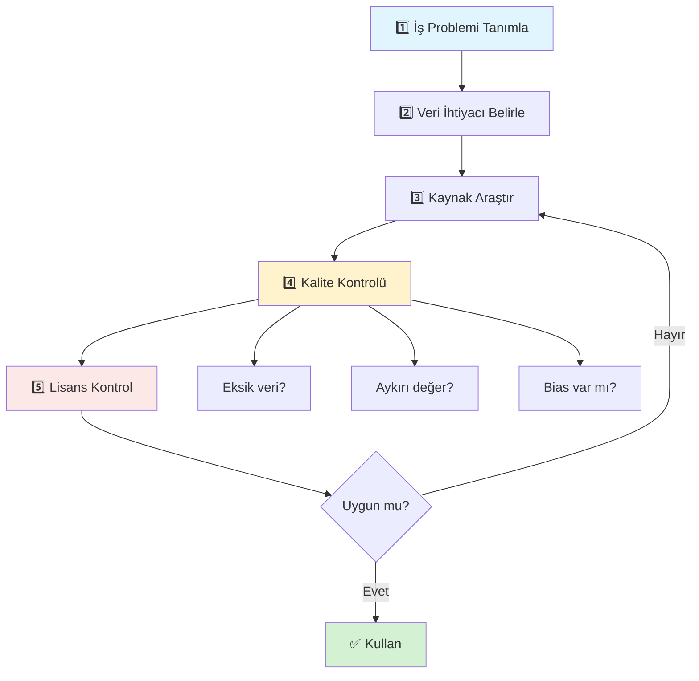

</div>

### 🔍 **Veri Kalite Kontrol Checklist**

<div align="center">

| Kontrol | Soru | İyi Örnek | Kötü Örnek |
|---------|------|-----------|------------|
| **Tamlık** | Eksik veri %kaç? | <%5 | >%30 |
| **Güncellik** | Ne zaman toplandı? | 2023-2024 | 2010 öncesi |
| **Boyut** | Model için yeterli mi? | 10,000+ kayıt | <100 kayıt |
| **Denge** | Sınıflar dengeli mi? | 60/40 | 99/1 |
| **Özellikler** | Yeterli değişken var mı? | 10+ özellik | 2-3 özellik |
| **Dokümantasyon** | İyi açıklanmış mı? | Her sütun detaylı | Belirsiz isimler |
| **Lisans** | Kullanabilir miyim? | CC0, MIT | Kısıtlı |

</div>

### 💼 **YBS'ci İçin Pratik Öneriler**

<div align="center">

```
💡 ALTINÖĞÜTLER
═══════════════════════════════════════════════════

1️⃣  "Küçükle Başla, Büyük Düşün"
    İlk proje: UCI'dan 1,000 kayıt
    Başarılı olunca: Kaggle'dan 1M kayıt
    
2️⃣  "Veri Kalitesi > Veri Miktarı"
    1,000 temiz kayıt > 10,000 kirli kayıt
    
3️⃣  "Lisansa Dikkat"
    Ticari projede: Lisans kontrol et!
    
4️⃣  "Topluluktan Öğren"
    Veri seçtikten sonra: Kaggle notebook'ları oku
    
5️⃣  "Gerçek Dünyayı Unutma"
    Pratik için: Kaggle/UCI
    İş için: Kendi verini topla
```

</div>

---

## 📚 **ÖNERİLEN ÖĞRENME YOLU**

### 🎓 **Başlangıç (1. Ay)**

<div align="center">

| Hafta | Platform | Dataset | Proje |
|-------|----------|---------|-------|
| **1** | UCI | Iris | Sınıflandırma temelleri |
| **2** | UCI | Wine Quality | EDA derinlemesine |
| **3** | Kaggle | Titanic | İlk yarışma |
| **4** | Kaggle | House Prices | Regresyon projesi |

</div>

### 🚀 **Orta Seviye (2-3. Ay)**

<div align="center">

| Ay | Platform | Challenge | Öğrenilen |
|----|----------|-----------|-----------|
| **2** | Kaggle | Credit Card Fraud | Dengesiz veri |
| **3** | Kaggle | Customer Churn | İş odaklı proje |

</div>

### 🏆 **İleri Seviye (4+. Ay)**

- Kaggle yarışmalarına katıl
- Kendi veri setini oluştur
- Kurumsal projede uygula

---

## 🎯 **ÖZET: VERİ KAYNAKLARI ANATOMİSİ**

<div align="center">

```
╔═══════════════════════════════════════════════════╗
║                                                   ║
║  VERİ KAYNAĞI SEÇİM MATRİSİ                       ║
║                                                   ║
║  Öğrenme → UCI                                    ║
║  Prototip → Kaggle                                ║
║  Akademik → UCI + Atıf                            ║
║  Endüstri → Kaggle + Kurumsal Veri                ║
║  Trend → Kaggle Competitions                      ║
║  Benchmark → UCI Klasikleri                       ║
║                                                   ║
║  YBS Mantığı:                                     ║
║  Veri olmadan ML yok!                             ║
║  Doğru veri = Projenin %50'si                     ║
║                                                   ║
╚═══════════════════════════════════════════════════╝
```

</div>

### 🔗 **Hızlı Erişim Linkleri**

<div align="center">

| Platform | Link |
|----------|------|
| 🏆 **Kaggle** | https://www.kaggle.com/datasets |
| 🎓 **UCI** | https://archive.ics.uci.edu/ml |
| 🔍 **Google Dataset Search** | https://datasetsearch.research.google.com |
| 🏛️ **Data.gov** | https://data.gov |
| 🇪🇺 **EU Open Data** | https://data.europa.eu |
| 🌍 **World Bank** | https://data.worldbank.org |
| 🤗 **Hugging Face** | https://huggingface.co/datasets |
| 📊 **TÜİK** | https://data.tuik.gov.tr |

</div>

---

<br/>

## 🛠️ **Kullanılan Teknolojiler ve Araçlar**

<div align="center">

### 💻 **Ders 01 İçin Temel Araçlar**

*Bu hafta kullanacağınız araçlar ve kavramlar*

</div>

<br/>

### **📋 Gerekli Araçlar**

<div align="center">

| 🛠️ Araç | 📝 Kullanım | 🎯 Bu Derste |
|:--------|:-----------|:-------------|
| **Zihinsel Çerçeve** | Kavramsal düşünme | AI, ML, DL anlayışı |
| **CRISP-DM** | Metodoloji | Proje yönetim çerçevesi |
| **İş Anlayışı** | YBS perspektifi | Problem tanımlama |
| **Not Alma** | Dokümantasyon | Kavramları kaydetme |

</div>

<br/>

### **🔮 İlerleyen Haftalarda**

<table>
<tr>
<td width="50%">

#### **Hafta 2+: Teknik Araçlar**

- Python 3.11+
- NumPy, Pandas
- Matplotlib, Seaborn
- Jupyter Notebook
- Git & GitHub

</td>
<td width="50%">

#### **Hafta 5+: ML Kütüphaneleri**

- Scikit-learn
- Model evaluation
- Cross-validation
- Hyperparameter tuning
- Pipeline oluşturma

</td>
</tr>
</table>

<br/>

<div align="center">

### 💡 **Bu Hafta Odak: Kavramsal Temel**

*Hafta 1'de kod yazmıyoruz, düşünme şeklimizi inşa ediyoruz.*

**Algoritma öğrenmek ≠ Makine öğrenmesi yapmak**

</div>

---

## 🎓 DERS BİLGİLERİ VE AKADEMİSYENLER

### 📚 **Ders Hakkında**

<div align="center">

```
╔═══════════════════════════════════════════════════╗
║                                                   ║
║  📖 DERS KODU: YBS 3259                           ║
║  📚 DERS ADI: Makine Öğrenmesi                    ║
║  🎯 SEVİYE: Lisans                                ║
║  ⏰ KREDİ: 3 Kredi                                ║
║  📅 DÖNEM: 2025-2026 Bahar                        ║
║  🏫 BÖLÜM: Yönetim Bilişim Sistemleri             ║
║                                                   ║
╚═══════════════════════════════════════════════════╝
```

</div>

### 📖 **Kaynaklar ve Okuma Listesi**

#### **📚 Temel Kaynaklar**

<div align="center">

| Kitap | Yazar | Neden Önemli? | Seviye |
|-------|-------|---------------|--------|
| **Hands-On Machine Learning** | Aurélien Géron | Pratik, kod odaklı | Başlangıç |
| **Introduction to Statistical Learning** | James, Witten, Hastie, Tibshirani | İstatistiksel temel | Orta |
| **Python Data Science Handbook** | Jake VanderPlas | Python araçları | Başlangıç |
| **Machine Learning Yearning** | Andrew Ng | Strateji, karar verme | Başlangıç |

</div>

#### **🌐 Online Kaynaklar**

<div align="center">

| Platform | İçerik | Link |
|----------|--------|------|
| **Kaggle Learn** | Ücretsiz mikro kurslar | kaggle.com/learn |
| **Fast.ai** | Pratik DL kursu | fast.ai |
| **Google ML Crash Course** | ML temelleri | developers.google.com/machine-learning/crash-course |
| **Coursera - Andrew Ng** | Klasik ML kursu | coursera.org/learn/machine-learning |

</div>

### 🛠️ **Gerekli Araçlar ve Teknolojiler**

<div align="center">

| Kategori | Araçlar | Kullanım |
|----------|---------|----------|
| **Programlama** | Python 3.8+ | Ana dil |
| **IDE** | Jupyter Notebook, VS Code, Google Colab | Kod geliştirme |
| **Kütüphaneler** | NumPy, Pandas, Scikit-learn, Matplotlib, Seaborn | Veri ve ML |
| **Platform** | Kaggle, GitHub | Projeler ve işbirliği |
| **Versiyon Kontrol** | Git | Kod yönetimi |

</div>

### 🎯 **Öğrenme Çıktıları**

Bu dersi başarıyla tamamlayan öğrenciler:

<div align="center">

| # | Öğrenme Çıktısı | Bloom Seviyesi |
|---|-----------------|----------------|
| 1️⃣ | ML kavramlarını **iş problemlerine** uyarlayabilir | Uygulama |
| 2️⃣ | Veri setlerini **keşfedebilir ve analiz edebilir** | Analiz |
| 3️⃣ | Uygun ML algoritmalarını **seçebilir ve uygulayabilir** | Değerlendirme |
| 4️⃣ | Model performansını **ölçebilir ve iyileştirebilir** | Sentez |
| 5️⃣ | ML projelerini **CRISP-DM ile yönetebilir** | Uygulama |
| 6️⃣ | Python ve ML kütüphanelerini **etkin kullanabilir** | Uygulama |
| 7️⃣ | Gerçek veri setleriyle **uçtan uca projeler geliştirebilir** | Yaratma |
| 8️⃣ | ML sonuçlarını **iş paydaşlarına sunabilir** | Değerlendirme |

</div>

#### **Örnek Proje Konuları**

<div align="center">

| Sektör | Proje Fikri | Veri Kaynağı |
|--------|-------------|--------------|
| **E-ticaret** | Müşteri terk tahmini | Kaggle Customer Churn |
| **Finans** | Kredi riski değerlendirme | Kaggle Credit Risk |
| **Sağlık** | Hastalık erken teşhis | UCI Medical datasets |
| **Perakende** | Satış tahmini | Kaggle Store Sales |
| **İnsan Kaynakları** | Çalışan memnuniyeti tahmini | IBM HR Analytics |
| **Emlak** | Ev fiyat tahmini | Kaggle House Prices |

</div>

---

### 🎊 **Son Söz**

<div align="center">

```
╔═══════════════════════════════════════════════════╗
║                                                   ║
║  "Makine öğrenmesi sadece bir araç.               ║
║   Asıl güç, onu doğru iş problemine               ║
║   uygulamayı bilmekte."                           ║
║                                                   ║
║  Bu derste, siz YBS uzmanları olarak,             ║
║  teknik ekiplerle iş dünyası arasında             ║
║  köprü olmayı öğreneceksiniz.                     ║
║                                                   ║
║  Hoş geldiniz! 🚀                                 ║
║                                                   ║
╚═══════════════════════════════════════════════════╝
```

</div>

---

## 🙏 **Teşekkür ve Kaynakça**

### 📚 **Bu Ders Notu Hazırlanırken Yararlanılan Kaynaklar**

<div align="center">

| Kaynak | Tür | Link |
|--------|-----|------|
| **CRISP-DM Guide** | Metodoloji | crisp-dm.org |
| **Kaggle Documentation** | Platform | kaggle.com |
| **UCI ML Repository** | Veri | archive.ics.uci.edu |
| **Scikit-learn Docs** | Kütüphane | scikit-learn.org |
| **Hands-On ML (Géron)** | Kitap | O'Reilly |
| **ISL (James et al.)** | Kitap | statlearning.com |

</div>

### 📄 **Lisans**

Bu ders materyali eğitim amaçlı hazırlanmıştır. Kaynak göstermek kaydıyla kullanılabilir.

---

<br/>

## 📜 **Akademik Referanslar ve Kaynaklar**

<div align="center">

### 📚 **Önerilen Kaynaklar ve İleri Öğrenim**

</div>

<br/>

### **📖 Temel Kitaplar**

| 📚 Kitap | ✍️ Yazar | 🎯 Seviye | 💡 Neden Okunmalı? |
|:---------|:---------|:----------|:-------------------|
| **Hands-On Machine Learning** | Aurélien Géron | 🟢 Başlangıç-Orta | Pratik odaklı, kod örnekleri bol, sektör standardı |
| **Introduction to Statistical Learning** | James, Witten, Hastie, Tibshirani | 🟡 Orta | İstatistiksel temeller, R ve Python kodları |
| **Python Data Science Handbook** | Jake VanderPlas | 🟢 Başlangıç | NumPy, Pandas, Matplotlib detaylı anlatım |
| **Machine Learning Yearning** | Andrew Ng | 🟢 Başlangıç | Strateji, karar verme, proje yönetimi |

### **🌐 Online Kaynaklar**

| 🌍 Platform | 📝 İçerik | 🔗 Link |
|:-----------|:----------|:--------|
| **Kaggle Learn** | Interactive ML tutorials | [kaggle.com/learn](https://www.kaggle.com/learn) |
| **Fast.ai** | Practical deep learning | [fast.ai](https://www.fast.ai/) |
| **Coursera - Andrew Ng** | ML Specialization | [coursera.org/ml](https://www.coursera.org/specializations/machine-learning-introduction) |
| **StatQuest** | İstatistik ve ML videoları | [YouTube](https://www.youtube.com/@statquest) |
| **Scikit-learn Docs** | Official documentation | [scikit-learn.org](https://scikit-learn.org/stable/) |

### **🎬 YouTube Kanalları**

- **StatQuest with Josh Starmer**: Karmaşık konuları basitleştiren harika anlatım
- **3Blue1Brown**: Matematiksel sezgi ve görselleştirme
- **Sentdex**: Python ve ML pratik uygulamalar
- **Data School**: Pandas ve scikit-learn tutorials

---

<div align="center">

### 🌟 **"Makine Öğrenmesi Sadece Algoritmalar Değil, Problemleri Çözme Sanatıdır"**

<br/>

**DERS 01 - Makine Öğrenmesine Giriş**  
*YBS3259 - 2025-2026 Bahar Dönemi*

<br/>

---

<br/>


<br/>

### **🚀 Başarılarınızın Devamını Dileriz!**

<br/>

<sub>⚡ **Pro Tip:** README'yi star'layın ⭐ ki daha sonra kolayca bulabilesiniz!</sub>

<br/>

<sup>Made with 💙 by YBS3259 Team | © 2026 Bandırma Onyedi Eylül Üniversitesi</sup>

</div>

---

<div align="center">

### 🌟 **İyi Öğrenmeler!** 🌟

[]()
[]()
[]()

```
╔══════════════════════════════════════════════════════════════════════════════╗
║                                                                              ║
║               🎓 MAKINE ÖĞRENMESI YOLCULUĞUNUZ BAŞLIYOR 🚀                   ║
║                                                                              ║
║                    "The best way to predict the future                       ║
║                         is to create it."                                    ║
║                         - Alan Kay                                           ║
║                                                                              ║
╚══════════════════════════════════════════════════════════════════════════════╝
```
</div>