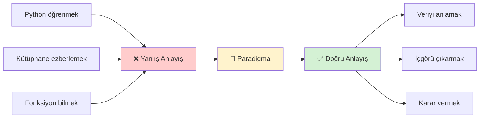
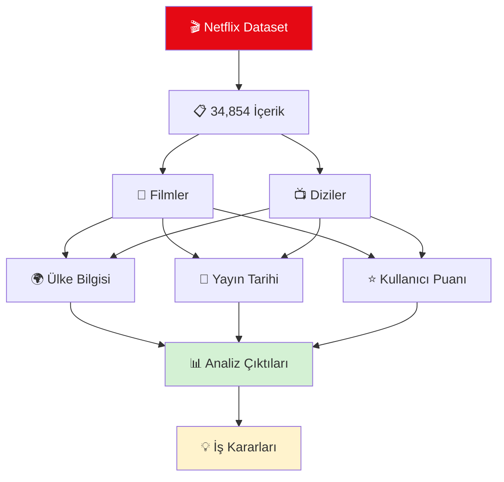
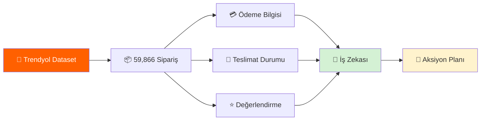
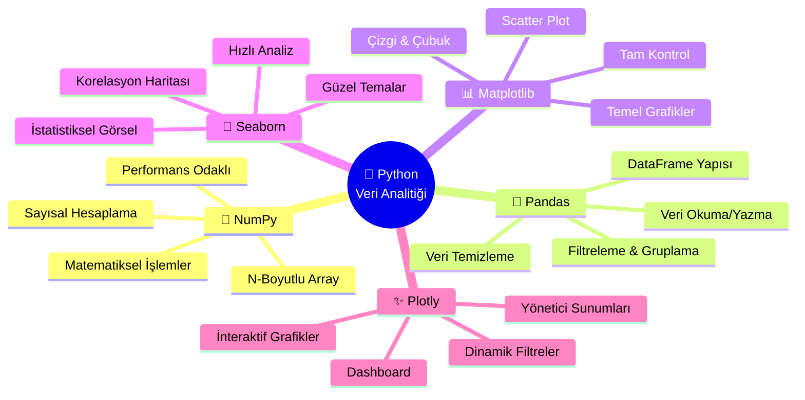
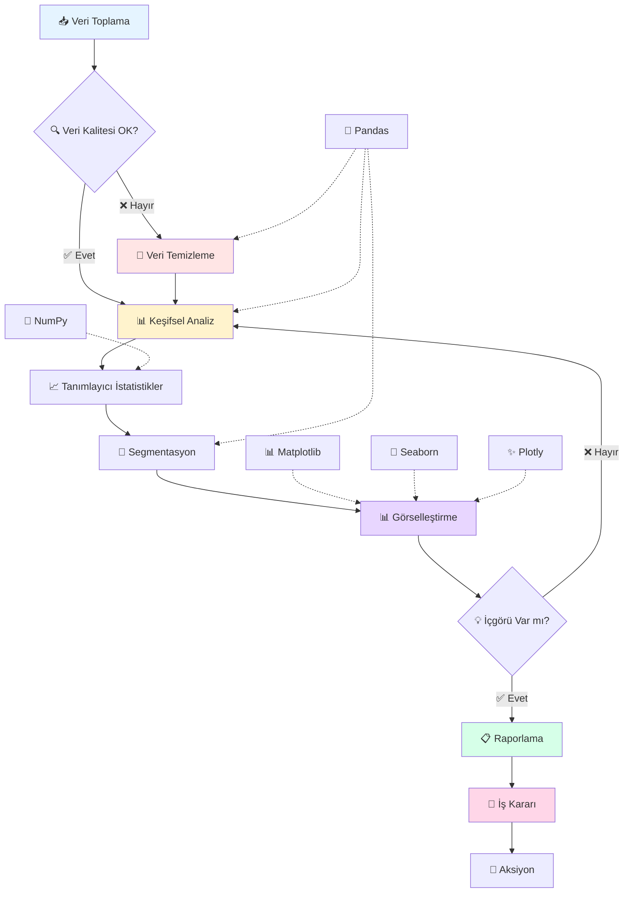
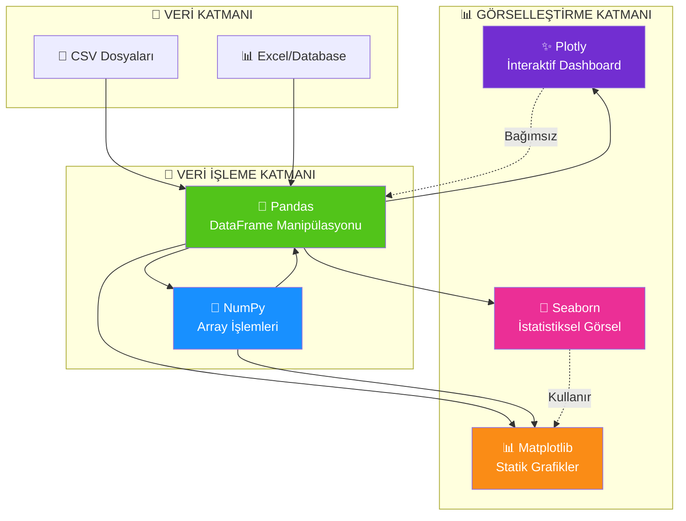
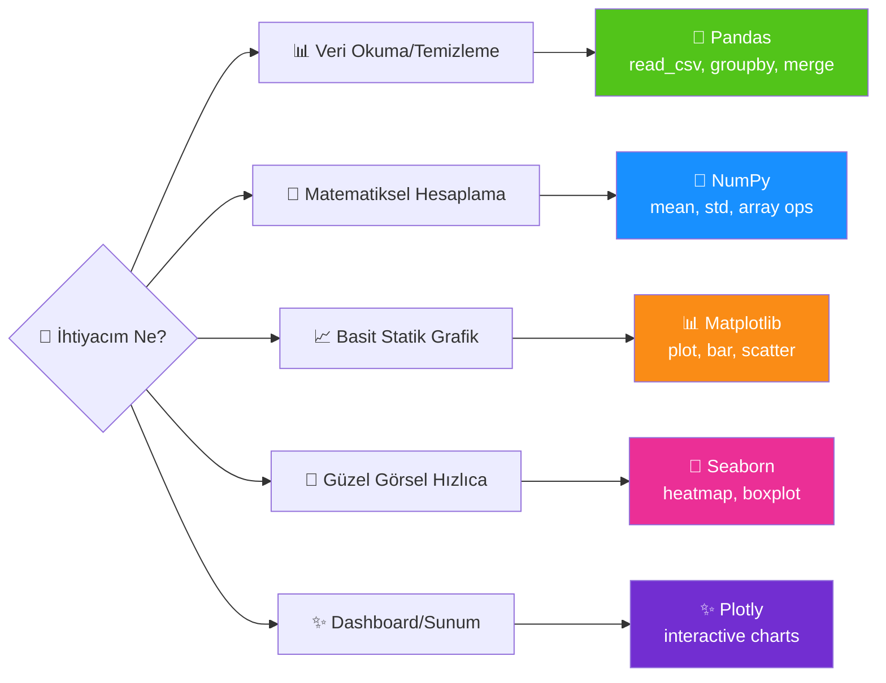
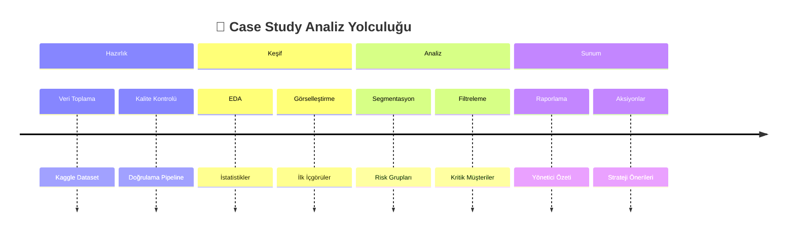
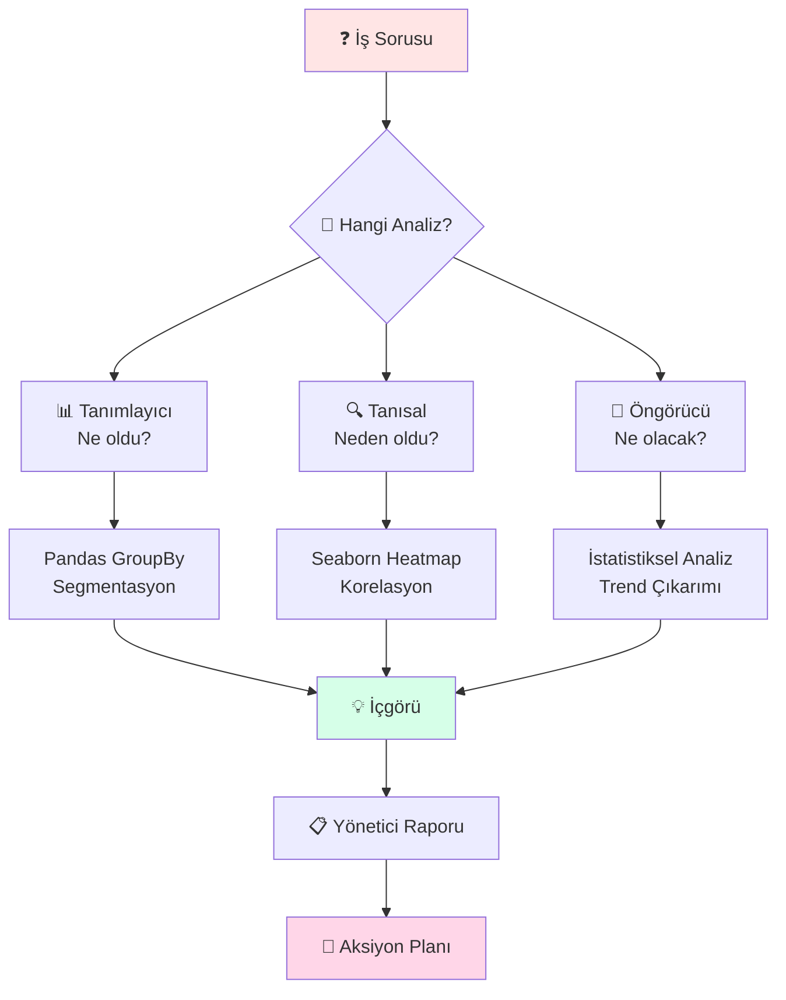

# 🎯 MAKİNE ÖĞRENMESİ - DERS 02

```
╔══════════════════════════════════════════════════════════════════════════════╗
║                                                                              ║
║   ██████╗ ███████╗██████╗ ███████╗     ██████╗ ██████╗                      ║
║   ██╔══██╗██╔════╝██╔══██╗██╔════╝    ██╔═████╗╚════██╗                     ║
║   ██║  ██║█████╗  ██████╔╝███████╗    ██║██╔██║ █████╔╝                     ║
║   ██║  ██║██╔══╝  ██╔══██╗╚════██║    ████╔╝██║██╔═══╝                      ║
║   ██████╔╝███████╗██║  ██║███████║    ╚██████╔╝███████╗                     ║
║   ╚═════╝ ╚══════╝╚═╝  ╚═╝╚══════╝     ╚═════╝ ╚══════╝                     ║
║                                                                              ║
║        VERİ ANALİTİĞİ HAZIRLIGI: PYTHON RECAP HAFTASI                       ║
║                                                                              ║
╚══════════════════════════════════════════════════════════════════════════════╝
```

<div align="center">

### 🐍 **Makine Öğrenmesi'ne Geçmeden Önce Veri Analitiği Temelleri**

[](https://www.python.org/)
[](https://pandas.pydata.org/)
[](https://numpy.org/)
[](https://matplotlib.org/)
[](https://seaborn.pydata.org/)
[](https://plotly.com/)

[]()
[]()
[]()
[]()

---

### 🌟 **Strateji: Teknik Değil, Analitik Düşünce**

*"Makine Öğrenmesi modelleri kurmadan önce, verinin dilini konuşmalısınız!"*

</div>

---

## 🎬 GİRİŞ: NEDEN BU HAFTA?

### 💡 **Anlayış Değişimi**

Bu hafta **kod yazmak** için değil, **veri ile konuşmak** için hazırlanıyoruz.

<div align="center">



</div>

### 🎯 **Bu Haftanın Misyonu**

**Makine Öğrenmesi'ne** geçmeden önce, **Veri Analitiği** için Python ekosistemini hatırlayacağız.

### 📊 **Gerçek Dünya Bağlamı**

<div align="center">

```
┌────────────────────────────────────────────────────────────────┐
│                                                                │
│   "Bir YBS uzmanı olarak,                                      │
│    Python ile veri analizi bana NE KAZANDIRIR?"               │
│                                                                │
│   Cevap:                                                       │
│   ✓ Excel'in 1 milyon satır sınırını aşma                    │
│   ✓ Tekrar edilebilir analiz süreçleri                       │
│   ✓ Otomatik raporlama sistemleri                            │
│   ✓ Büyük veri ile çalışma yetkinliği                        │
│   ✓ Görselleştirme ile hikaye anlatma                        │
│                                                                │
└────────────────────────────────────────────────────────────────┘
```

</div>

---

## 📊 KULLANILAN VERİ SETLERİ

### 🎬 **Netflix İçerik Katalogu**

Bu hafta **ana veri setimiz** olarak Netflix içerik kataloğunu kullandık. Sentetik ama gerçekçi bir veri seti ile içerik analizi yaptık.

<div align="center">



</div>

**Veri Yapısı:**

| Sütun | Açıklama | Örnek Değer | YBS Kullanımı |
|-------|----------|-------------|---------------|
| `title` | İçerik adı | "The Adventures" | Katalog yönetimi |
| `type` | Film veya Dizi | Movie / TV Show | İçerik stratejisi |
| `genre` | Tür kategorisi | Action, Drama, Comedy | Hedef kitle analizi |
| `release_year` | Çıkış yılı | 2008 | Trend analizi |
| `duration` | Süre bilgisi | 182 min / 5 Seasons | İçerik planlaması |
| `rating` | Kullanıcı puanı | 4.3 | Kalite metrikleri |
| `country` | Üretim ülkesi | USA, Turkey, Japan | Coğrafi segmentasyon |
| `date_added` | Eklenme tarihi | 2017-06-04 | Yayın takvimlendirme |

### 🛒 **Trendyol Sipariş Verileri**

Case Study için kullandığımız **e-ticaret veri seti**. Gerçek bir operasyon masası perspektifinden müşteri davranışı analizi.

<div align="center">



</div>

**Operasyonel Değişkenler:**

| Sütun | Açıklama | Analiz Amacı |
|-------|----------|--------------|
| `order_id` | Sipariş numarası | Takip sistemi |
| `user_id` | Müşteri kimliği | Davranış analizi |
| `product_category` | Ürün kategorisi | Envanter yönetimi |
| `product_price` | Ürün fiyatı | Gelir analizi |
| `discount_rate` | İndirim oranı | Karlılık hesabı |
| `payment_type` | Ödeme yöntemi | Risk değerlendirme |
| `delivery_time_days` | Teslimat süresi | Lojistik optimizasyon |
| `seller_rating` | Satıcı puanı | Tedarikçi yönetimi |
| `product_rating` | Ürün puanı | Müşteri memnuniyeti |
| `return_status` | İade durumu | Kayıp önleme |
| `city` | Şehir bilgisi | Bölgesel planlama |

### 💡 **Veri Setleri Neden Bu İkisi?**

<div align="center">

| Özellik | Netflix | Trendyol | YBS Öğrenim Hedefi |
|---------|---------|----------|-------------------|
| **Sektör** | 🎬 Medya/Eğlence | 🛒 E-Ticaret | Farklı iş modellerini anlama |
| **Veri Boyutu** | 34K+ satır | 59K+ satır | Büyük veriyle çalışma |
| **Karmaşıklık** | Orta | Yüksek | Eksik veri yönetimi |
| **Görselleştirme** | Kategorik analiz | Sayısal/Kategorik mix | Çoklu grafik teknikleri |
| **İş Sorusu** | "Hangi içerikler popüler?" | "Hangi müşteriler riskli?" | Karar verme süreçleri |

</div>

---

## 🔧 PYTHON VERİ ANALİZİ EKOSİSTEMİ

### 🌳 **Araç Kutusu Haritası**

Bu hafta **5 temel kütüphane** ile veri analizinin her aşamasını deneyimledik:

<div align="center">



</div>

### 📈 **Veri Analizi Akış Sürecimiz**

<div align="center">



</div>

---

## 🐼 ANA KÜTÜPHANELER

### 📚 **Kütüphane Karşılaştırması**

<div align="center">

| Kütüphane | 🎯 Ana Amaç | 💪 Süper Gücü | 🏢 YBS Kullanım Senaryosu | 📝 Notebookt'ta Ne Yaptık? |
|-----------|------------|---------------|---------------------------|----------------------------|
| **🔢 NumPy** | Sayısal hesaplama | Hızlı matematiksel işlemler | Finansal hesaplamalar, istatistiksel analizler | Array operasyonları, matematiksel fonksiyonlar |
| **🐼 Pandas** | Veri manipülasyonu | DataFrame ile Excel benzeri işlemler | Satış raporları, müşteri segmentasyonu | CSV okuma, filtreleme, gruplama, pivot tablo |
| **📊 Matplotlib** | Temel görselleştirme | Her detaya tam kontrol | Yıllık performans grafikleri | Bar chart, line plot, scatter plot |
| **🎨 Seaborn** | İstatistiksel görsel | Güzel ve hızlı grafikler | Trend analizi, dağılım grafikleri | Heatmap, box plot, distribution plot |
| **✨ Plotly** | İnteraktif görsel | Zoom, filter, hover özellikleri | Yönetim dashboardları, sunumlar | İnteraktif bar, scatter, sunburst charts |

</div>

### 🔄 **Kütüphaneler Arası İlişki**

<div align="center">



</div>

### 🎯 **Hangi Kütüphaneyi Ne Zaman Kullanırız?**

<div align="center">



</div>

### 💼 **YBS Perspektifi: İş Değeri Yaratma**

| Süreç Aşaması | Kullanılan Araç | İş Çıktısı | Karar Etkisi |
|---------------|-----------------|------------|--------------|
| 📥 **Veri Toplama** | Pandas | Farklı kaynaklardan birleşik veri | Veri siloları yıkılır |
| 🧹 **Veri Temizleme** | Pandas + NumPy | Tutarlı, güvenilir veri | Hatalı kararlar önlenir |
| 🔍 **Keşifsel Analiz** | Pandas | İlk içgörüler ve hipotezler | Strateji yönü belirlenir |
| 📊 **İstatistiksel Analiz** | NumPy + Pandas | Sayısal kanıtlar | Veriye dayalı argümanlar |
| 📈 **Görselleştirme** | Matplotlib/Seaborn/Plotly | Hikaye anlatımı | Paydaş ikna edilir |
| 📋 **Raporlama** | Tümü | Aksiyon önerileri | İş değeri gerçekleşir |

---

## 🎯 CASE STUDY: OPERASYON MASASI ANALİZİ

### 📋 **Gerçek Dünya Senaryosu**

Bu hafta **Telekomünikasyon Şirketi Müşteri Tutundurma ve Risk Analitiği** perspektifinden bir case study üzerinde çalıştık. Amaç: **Teknik modelleme yapmadan, yöneticiye karar aldırabilecek içgörüler üretmek**.

<div align="center">



</div>

### 🔍 **12 Adımlık Analitik Protokol**

Case Study boyunca **operasyon masası protokolü** ile ilerledik:

<div align="center">

| Adım | Başlık | Araç | Çıktı |
|------|--------|------|-------|
| 1️⃣ | Veri Kaynağı Doğrulama | Pandas | Kapı kontrolü ✓ |
| 2️⃣ | İlk Refleks Protokolü | Pandas | Veriyle tanışma |
| 3️⃣ | Karara Hizmet Eden Sütunlar | Pandas | Yönetici slaytı için seçim |
| 4️⃣ | Hedef Değişken Analizi | Pandas | Churn fotoğrafı |
| 5️⃣ | Riskli Segment Filtreleme | Pandas | Kritik müşteriler |
| 6️⃣ | GroupBy Analizi | Pandas | Tek satırlık cevaplar |
| 7️⃣ | Matplotlib Görsel 1 | Matplotlib | Tek bakışta içgörü |
| 8️⃣ | Matplotlib Görsel 2 | Matplotlib | Davranış eğrisi |
| 9️⃣ | Seaborn Görsel | Seaborn | İlişki haritası |
| 🔟 | Plotly İnteraktif 1 | Plotly | Etkileşimli keşif |
| 1️⃣1️⃣ | Plotly İnteraktif 2 | Plotly | Risk haritası |
| 1️⃣2️⃣ | Yönetici Özeti | Tümü | Operasyon masası çıktısı |

</div>

### 💼 **İş Soruları ve Cevaplar**

<div align="center">



</div>

### 🎓 **Öğrenim Çıktısı**

Bu case study ile öğrendiklerimiz:

- ✅ **Veri okuma ve kalite kontrolü** (Pandas)
- ✅ **Eksik veri yönetimi** stratejileri
- ✅ **Filtreleme ve segmentasyon** teknikleri
- ✅ **GroupBy ile özet istatistikler** üretme
- ✅ **Statik grafikler** (Matplotlib) ile raporlama
- ✅ **İstatistiksel görseller** (Seaborn) ile ilişki keşfi
- ✅ **İnteraktif dashboard** (Plotly) ile sunum
- ✅ **Yönetici özeti** hazırlama becerisi

## 🎓 KAPANIŞ

### 💭 **Yansıma: Nereden Nereye?**

<div align="center">

```
╔══════════════════════════════════════════════════════════════╗
║                                                              ║
║   "Excel'de 1000 satır veriyle uğraşırken,                  ║
║    Python ile 100.000 satırı saniyeler içinde analiz ettik" ║
║                                                              ║
║   "Manuel grafikler çizerken,                                ║
║    5 satır kod ile interaktif görseller yarattık"           ║
║                                                              ║
║   "Tahmin ve sezgiyle karar verirken,                        ║
║    Veriye dayalı stratejiler geliştirdik"                   ║
║                                                              ║
╚══════════════════════════════════════════════════════════════╝
```

</div>

### 🌟 **Son Söz**

Bu hafta **Python veri analizi araçlarını** öğrenmedik sadece; **veriyle konuşmayı**, **sayılardan hikaye çıkarmayı**, **grafiklerde anlam bulmayı** öğrendik.

**Unutmayın:**  
> 💡 *"En iyi veri analisti, en çok Python bilen değil; verinin dilini en iyi anlayan ve iş değerine dönüştürendir."*

### 🚀 **Motivasyon: Yolculuk Yeni Başlıyor**

<div align="center" style="background: linear-gradient(135deg, #667eea 0%, #764ba2 100%); padding: 30px; border-radius: 15px; color: white;">

### **✨ Siz Artık Veri Analisti Adayısınız! ✨**

Bu hafta attığınız adımlar, **Makine Öğrenmesi** yolculuğunuzun en sağlam temelleri.  

🎯 **NumPy** ile matematik işlemleri yaptınız  
📊 **Pandas** ile veri dansı yaptınız  
🎨 **Matplotlib, Seaborn, Plotly** ile hikaye anlattınız  

Şimdi sırada, bu araçlarla **bir verisetini derinlemesine keşfedip modelleme öncesi en iyi anlayacağımız nokta olan Keşifsel Veri Analizi (EDA)** var!

**Unutmayın:** Her büyük veri bilimci, bir gün sizin olduğunuz noktadan başladı.  
Fark yaratan, **devam etmek** ve **öğrenmeye aç kalmaktır**.

---

### 🔥 **"Veri, yeni petrol değil; veriden anlam çıkarmak yeni petrol!"**

**Gelecek hafta keşifsel veri analizi sürecini birlikte deneyimleyelim!** 🚀

</div>

---

<div align="center">

**📚 YBS 3259 - Makine Öğrenmesi | Ders 02**  
**🎓 2025-2026 Bahar Dönemi**  
**👨‍🏫 Hazırlayan: Dr. Öğr. Ü. Zeynep ÖZER & Arş. Gör. Cemal YÜKSEL**

**⭐ Başarılar Dileriz! ⭐**
