# 📊 YBS 3259 – MAKİNE ÖĞRENMESİ
## DERS 02 | CASE STUDY

<div align="center">

```
╔═══════════════════════════════════════════════════════════╗
║                                                           ║
║   ████████╗███████╗██╗      ██████╗ ██████╗              ║
║   ╚══██╔══╝██╔════╝██║     ██╔════╝██╔═══██╗             ║
║      ██║   █████╗  ██║     ██║     ██║   ██║             ║
║      ██║   ██╔══╝  ██║     ██║     ██║   ██║             ║
║      ██║   ███████╗███████╗╚██████╗╚██████╔╝             ║
║      ╚═╝   ╚══════╝╚══════╝ ╚═════╝ ╚═════╝              ║
║                                                           ║
║        OPERASYON MASASI | VERİDEN İÇGÖRÜYE KARAR         ║
║                                                           ║
╚═══════════════════════════════════════════════════════════╝
```

</div>

<div align="center">

### 🎯 **VERİDEN YÖNETİCİ İÇGÖRÜSÜNE KARAR DESTEK ANALİZİ**

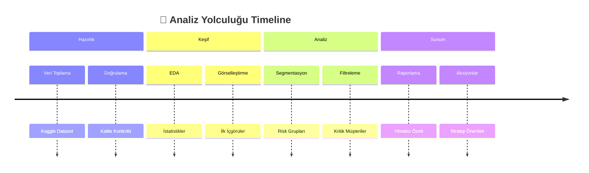

---

[](https://www.python.org/)
[](https://jupyter.org/)
[](https://pandas.pydata.org/)
[]()
[]()

</div>

---

## 📑 İÇİNDEKİLER

<details open>
<summary><b>Tıklayarak Genişlet/Daralt</b></summary>

1. [🎯 Çalışmanın Amacı ve Bağlamı](#-çalışmanın-amacı-ve-bağlamı)
2. [📋 Teslim ve Çalışma Standardı](#-teslim-ve-çalışma-standardı)
3. [📊 Veri Seti ve Değişkenler](#-veri-seti-ve-değişkenler)
4. [🔄 Analitik Akış ve Adımlar](#-analitik-akış-ve-adımlar)
   - [Adım 1: Veri Kaynağını Doğrulama](#adım-1-veri-kaynağını-doğrulama--kapı-kontrolü)
   - [Adım 2: İlk Refleks Protokolü](#adım-2-ilk-refleks-protokolü--veriyle-tanışma)
   - [Adım 3: Yönetici Slaytı İçin Sütun Seti](#adım-3-yönetici-slaytı-için-karara-hizmet-eden-sütun-seti)
   - [Adım 4: Hedef Değişkenin Netleştirilmesi](#adım-4-hedef-değişkenin-netleştirilmesi--churn-fotoğrafı)
   - [Adım 5: Riskli Segment Filtreleme](#adım-5-yönetici-talebine-göre-riskli-segment-filtreleme)
   - [Adım 6: GroupBy Analizi](#adım-6-groupby-analizi--yöneticiye-tek-satırlık-cevaplar)
   - [Adım 7: Matplotlib Görsel 1](#adım-7-matplotlib-görsel-1--tek-bakışta-içgörü)
   - [Adım 8: Matplotlib Görsel 2](#adım-8-matplotlib-görsel-2--davranış-eğrisi)
   - [Adım 9: Seaborn Görsel](#adım-9-seaborn-görsel--ilişki-haritası)
   - [Adım 10: Plotly Görsel 1](#adım-10-plotly-görsel--etkileşimli-segment-keşfi)
   - [Adım 11: Plotly Görsel 2](#adım-11-plotly-görsel--risk-haritası)
   - [Adım 12: Yönetici Özeti](#adım-12-yönetici-özeti--operasyon-masası-çıktısı)
5. [✅ Kalite ve Değerlendirme Çerçevesi](#-kalite-ve-değerlendirme-çerçevesi)
6. [📚 Kaynaklar ve Referanslar](#-kaynaklar-ve-referanslar)

</details>

---

## 🎯 ÇALIŞMANIN AMACI VE BAĞLAMI

### 📌 **Kurumsal Perspektif**

Bu Case Study, bir **telekomünikasyon şirketinin Müşteri Tutundurma ve Risk Analitiği Operasyon Masası** perspektifinden kurgulanmıştır. Katılımcılar, teknik modelleme detaylarına girmeden, gerçek bir kurumsal veri setini kullanarak **yöneticiye karar aldırabilecek içgörüler** üretmeyi hedefler.

<div align="center">

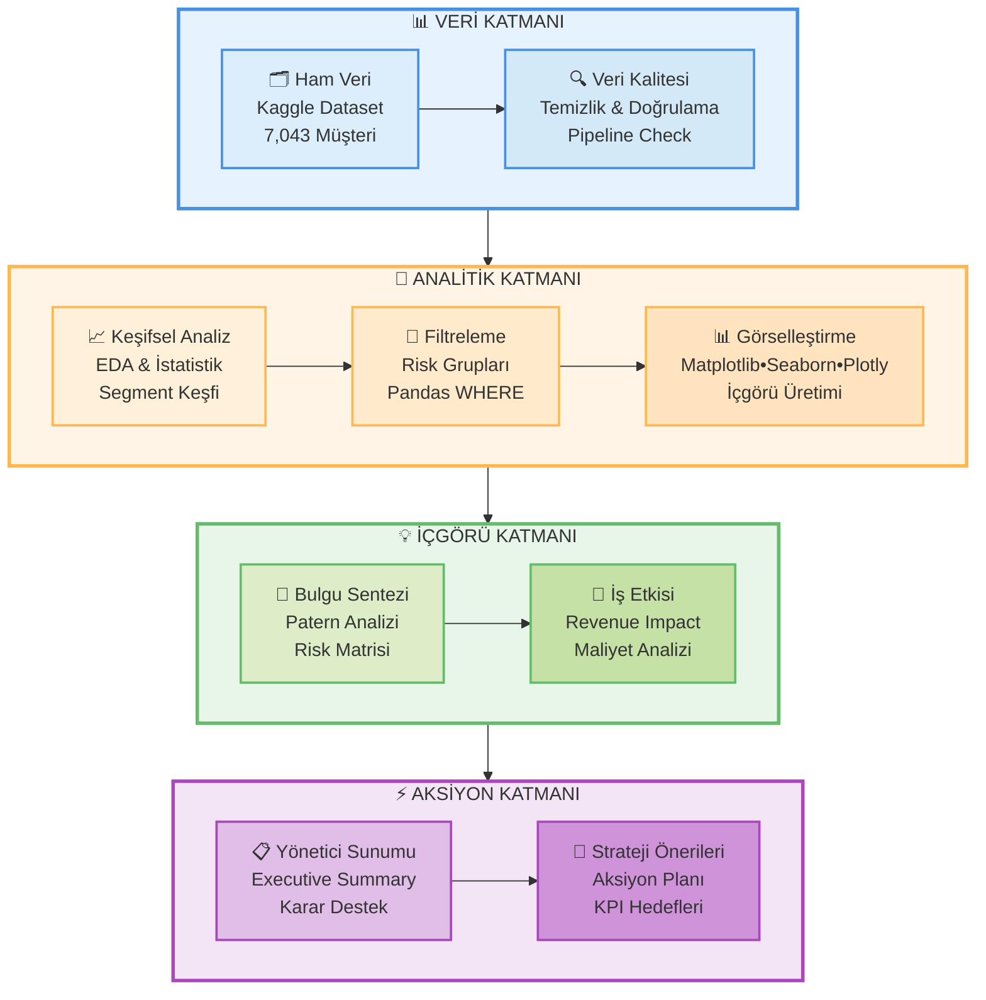

</div>

### 🎓 **Beklenen Yaklaşım**

<div align="center">

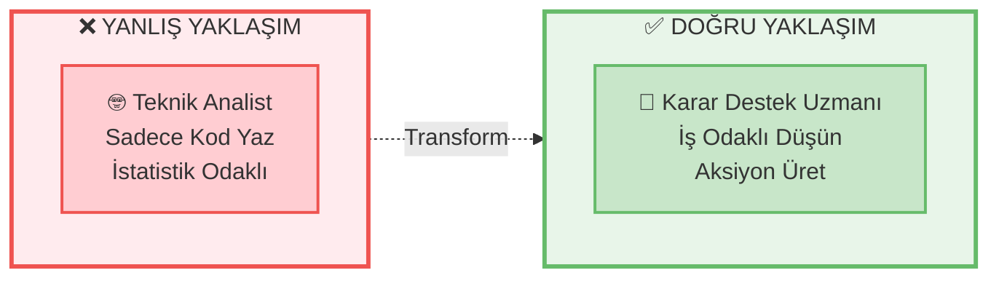

</div>

> **💼 Analist gibi değil, YBS mezunu bir karar destek uzmanı gibi düşünmek.**  
> Kod yazmak araçtır. Asıl değer, **veriyi yönetici diline çevirebilme becerisidir.**

### 🎤 **Üst Yönetimin Tek Sorusu**

<div align="center">

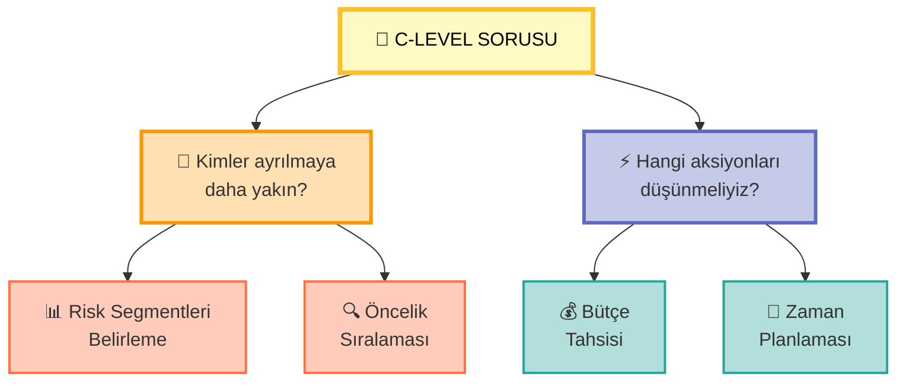

**"Kimler ayrılmaya daha yakın ve hangi aksiyonları düşünmeliyiz?"**

*— CFO, Müşteri Deneyimi Direktörü*

</div>

### 🎯 **Öğrenme Çıktıları**

<div align="center">

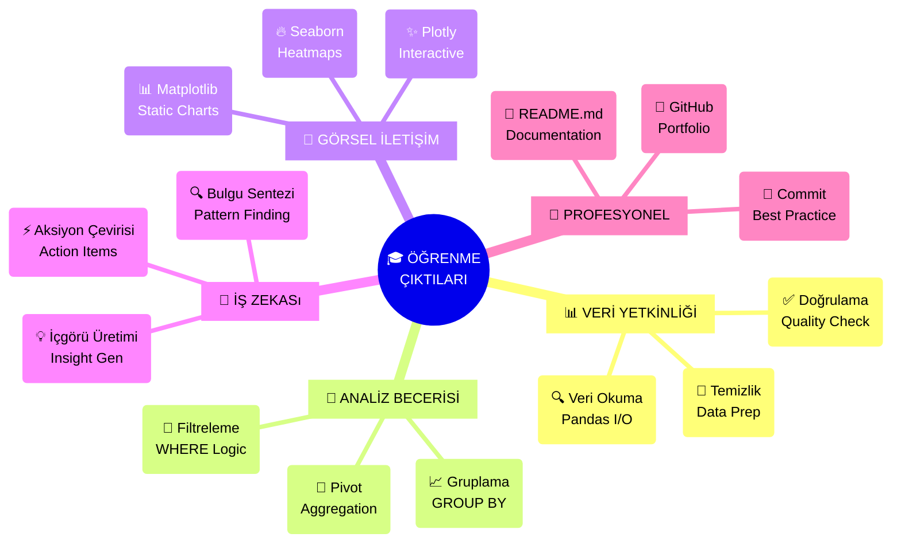

</div>

**Bu çalışmanın sonunda katılımcılar:**

<table align="center">
<tr>
<td align="center" width="20%">

**📊 VERİ**

Veri okuma ve doğrulama protokollerini uygulayabilecek

</td>
<td align="center" width="20%">

**🔬 ANALİZ**

Pandas ile filtreleme, gruplama ve pivot işlemlerini yapabilecek

</td>
<td align="center" width="20%">

**🎨 GÖRSEL**

Matplotlib, Seaborn ve Plotly ile profesyonel görselleştirmeler üretebilecek

</td>
<td align="center" width="20%">

**💼 İŞ**

Teknik bulgulardan yönetici aksiyonuna çeviri yapabilecek

</td>
<td align="center" width="20%">

**🐙 PROFESYONEL**

GitHub standardında proje dokümantasyonu oluşturabilecek

</td>
</tr>
</table>

---

## 📋 TESLİM VE ÇALIŞMA STANDARDI

### 📁 **Çalışma Formatı**

Tüm analiz **tek bir Jupyter Notebook (.ipynb)** dosyası içinde yürütülecektir.

```
📦 Proje Yapısı
 ├── 📓 telco_churn_analysis.ipynb    ← Ana çalışma dosyası
 ├── 📊 telcochurn.csv                    ← Veri dosyası
 ├── 📄 README.md                      ← Proje açıklaması
 └── 📁 images/                        ← (Opsiyonel) Çıktı görselleri
```

### 🔥 **ZORUNLU YAPI KURALI**

<div align="center">

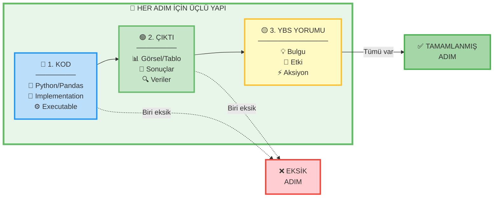

</div>

> ⚠️ **KRİTİK:** Bu üçlüden **herhangi biri eksik** olan adım, **yapılmamış kabul edilir**.

### 🎯 **YBS Yorumu Şablonu**

<div align="center">

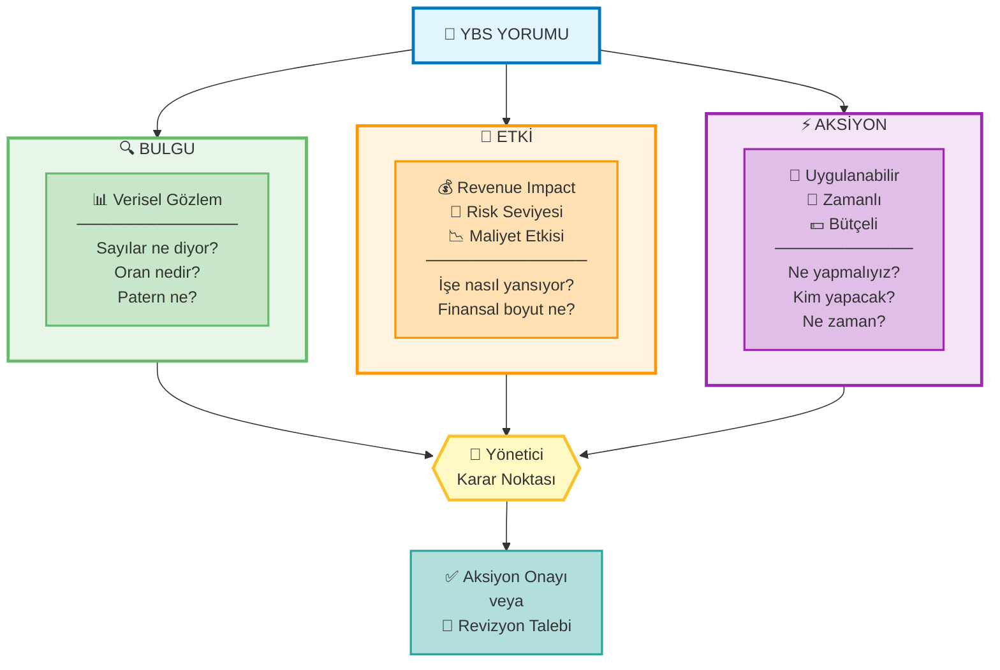

</div>

**📝 Kullanım Formatı:**

```python
"""
🔍 BULGU: [Verisel gözlem - Sayılar, oranlar, paternler]
💼 ETKİ: [İş etkisi - revenue, risk, maliyet]
⚡ AKSİYON: [Uygulanabilir öneri - Somut, zamanlı, bütçeli]
"""
```

**✨ Örnek:**
```python
"""
🔍 BULGU: Fiber optic kullanan müşterilerde churn oranı %41.9
💼 ETKİ: Bu segmentteki her 100 müşteriden 42'si yıl içinde ayrılıyor. 
          Yıllık revenue etkisi ~$2.1M olarak öngörülüyor.
⚡ AKSİYON: Fiber müşterilere ilk 6 ayda proaktif teknik destek ve 
          sadakat programı uygulanması öneriliyor.
"""
```

**📊 GitHub Gereksinimler:**

<table align="center">
<tr>
<th width="20%">🐙 Öğe</th>
<th width="35%">🎯 Gereksinim</th>
<th width="45%">✨ Örnek</th>
</tr>
<tr>
<td align="center"><b>📁 Repo İsmi</b></td>
<td>Açıklayıcı ve case odaklı olmalı</td>
<td><code>telco-churn-analysis</code><br/><code>customer-retention-study</code></td>
</tr>
<tr>
<td align="center"><b>📝 README.md</b></td>
<td>5-6 cümleyle vaka özeti</td>
<td>✅ Zorunlu<br/>📄 Proje tanıtımı<br/>📊 Ana bulgular</td>
</tr>
<tr>
<td align="center"><b>💬 Commit Mesajları</b></td>
<td>Anlamlı ve süreci yansıtan</td>
<td><code>feat: add churn visualization</code><br/><code>fix: correct groupby calculation</code><br/><code>docs: update README</code></td>
</tr>
<tr>
<td align="center"><b>🏷️ Tags</b></td>
<td>İlgili etiketler</td>
<td><code>machine-learning</code><br/><code>data-analysis</code><br/><code>churn-prediction</code></td>
</tr>
<tr>
<td align="center"><b>🔒 Erişim</b></td>
<td>Public repo</td>
<td>✅ Herkes görebilmeli<br/>🔗 Link çalışmalı</td>
</tr>
</table>

**📄 README.md Şablonu:**

```markdown
# 📊 Telco Customer Churn Analysis

## 🎯 Proje Özeti
Bu çalışma, telekomünikasyon müşteri kayıp (churn) verilerini 
analiz ederek yönetici kararlarına destek olmayı amaçlamaktadır.

## 📊 Veri Seti
- **Kaynak:** Kaggle Telco Customer Churn
- **Müşteri Sayısı:** 7,043
- **Hedef:** Churn (Yes/No)

## 🔍 Temel Bulgular
1. Fiber optic kullanıcılarında yüksek churn riski
2. İlk 6 ay kritik dönem
3. Online security eksikliği risk faktörü

## 🛠️ Teknolojiler
Python, Pandas, Matplotlib, Seaborn, Plotly
```

---

## 📊 VERİ SETİ VE DEĞİŞKENLER

### 📍 **Veri Kaynağı**

<div align="center">

[](https://www.kaggle.com/datasets/blastchar/telco-customer-churn)

**[Telco Customer Churn Dataset](https://www.kaggle.com/datasets/blastchar/telco-customer-churn)**

</div>

### 🎯 **Hedef Değişken**

<div align="center">

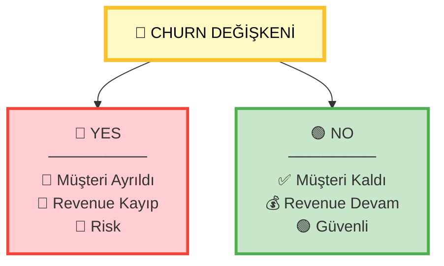

</div>

</div>

<table align="center">
<tr>
<th>Değişken</th>
<th>Tip</th>
<th>Açıklama</th>
<th>Değerler</th>
</tr>
<tr>
<td align="center"><b>Churn</b></td>
<td align="center">Kategorik</td>
<td align="center">Müşteri ayrılma durumu</td>
<td align="center"><code>Yes</code> / <code>No</code></td>
</tr>
</table>

### 📋 **Bu Case Study'de Kullanılacak Sütunlar**

<div align="center">

```mermaid
graph TB
    ROOT["📊 VERİ MODELİ<br/>10 Kritik Değişken"]
    
    ROOT --> DEMO["👥 DEMOGRAFİK<br/>BİLGİLER"]
    ROOT --> SERVICE["📦 HİZMET<br/>BİLGİLERİ"]
    ROOT --> INTERNET["🌐 İNTERNET<br/>HİZMETLERİ"]
    ROOT --> TARGET["🎯 HEDEF<br/>DEĞİŞKEN"]
    
    DEMO --> D1["🏷️ customerID<br/>Unique ID"]
    DEMO --> D2["⚧️ gender<br/>Male/Female"]
    DEMO --> D3["👴 SeniorCitizen<br/>0/1"]
    DEMO --> D4["💑 Partner<br/>Yes/No"]
    DEMO --> D5["👨‍👩‍👧 Dependents<br/>Yes/No"]
    
    SERVICE --> S1["📅 tenure<br/>Müşteri Yaşı (ay)"]
    SERVICE --> S2["📞 PhoneService<br/>Yes/No"]
    SERVICE --> S3["📱 MultipleLines<br/>Yes/No/No service"]
    
    INTERNET --> I1["🌐 InternetService<br/>DSL/Fiber/No"]
    INTERNET --> I2["🔒 OnlineSecurity<br/>Yes/No/No service"]
    
    TARGET --> T1["🎯 Churn<br/>Yes/No"]
    
    style ROOT fill:#E1F5FE,stroke:#0277BD,stroke-width:4px,color:#000
    style DEMO fill:#F3E5F5,stroke:#9C27B0,stroke-width:3px
    style SERVICE fill:#E8F5E9,stroke:#66BB6A,stroke-width:3px
    style INTERNET fill:#FFF3E0,stroke:#FF9800,stroke-width:3px
    style TARGET fill:#FFEBEE,stroke:#F44336,stroke-width:3px
    
    style D1 fill:#E1BEE7,stroke:#9C27B0,stroke-width:1px
    style D2 fill:#E1BEE7,stroke:#9C27B0,stroke-width:1px
    style D3 fill:#E1BEE7,stroke:#9C27B0,stroke-width:1px
    style D4 fill:#E1BEE7,stroke:#9C27B0,stroke-width:1px
    style D5 fill:#E1BEE7,stroke:#9C27B0,stroke-width:1px
    
    style S1 fill:#C8E6C9,stroke:#66BB6A,stroke-width:1px
    style S2 fill:#C8E6C9,stroke:#66BB6A,stroke-width:1px
    style S3 fill:#C8E6C9,stroke:#66BB6A,stroke-width:1px
    
    style I1 fill:#FFE0B2,stroke:#FF9800,stroke-width:1px
    style I2 fill:#FFE0B2,stroke:#FF9800,stroke-width:1px
    
    style T1 fill:#FFCDD2,stroke:#F44336,stroke-width:2px
```

</div>

### 🔍 **Değişken Detayları**

<details>
<summary><b>📊 Değişken Açıklamaları (Genişletmek için tıklayın)</b></summary>

| Değişken | Veri Tipi | İş Anlamı | Örnek Değerler |
|----------|-----------|-----------|----------------|
| `customerID` | String | Müşteri benzersiz kimliği | "7590-VHVEG" |
| `gender` | Kategorik | Cinsiyet | Male, Female |
| `SeniorCitizen` | Binary | 65+ yaş mı? | 0 (Hayır), 1 (Evet) |
| `Partner` | Kategorik | Eşi var mı? | Yes, No |
| `Dependents` | Kategorik | Bakmakla yükümlü kişi var mı? | Yes, No |
| `tenure` | Numerik | Müşterilikte kaç ay? | 0-72 ay arası |
| `PhoneService` | Kategorik | Telefon hizmeti var mı? | Yes, No |
| `MultipleLines` | Kategorik | Birden fazla hat var mı? | Yes, No, No phone service |
| `InternetService` | Kategorik | İnternet tipi | DSL, Fiber optic, No |
| `OnlineSecurity` | Kategorik | Online güvenlik paketi var mı? | Yes, No, No internet service |
| `Churn` | Kategorik | **Müşteri ayrıldı mı?** | **Yes, No** |

</details>

### 📈 **Veri Seti İstatistikleri**

<div align="center">

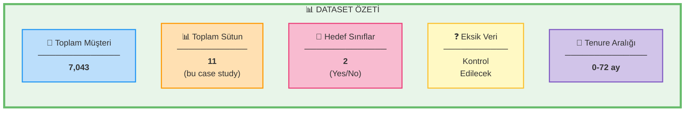

</div>

---

## 🔄 ANALİTİK AKIŞ VE ADIMLAR

<div align="center">

### 📍 **6 ADIMLIK BASİTLEŞTİRİLMİŞ ANALİZ YOL HARİTASI**

> **🎓 Not:** Bu case study, python-recap.ipynb'de öğrendiğiniz temel konuları pekiştirmek için tasarlanmıştır.

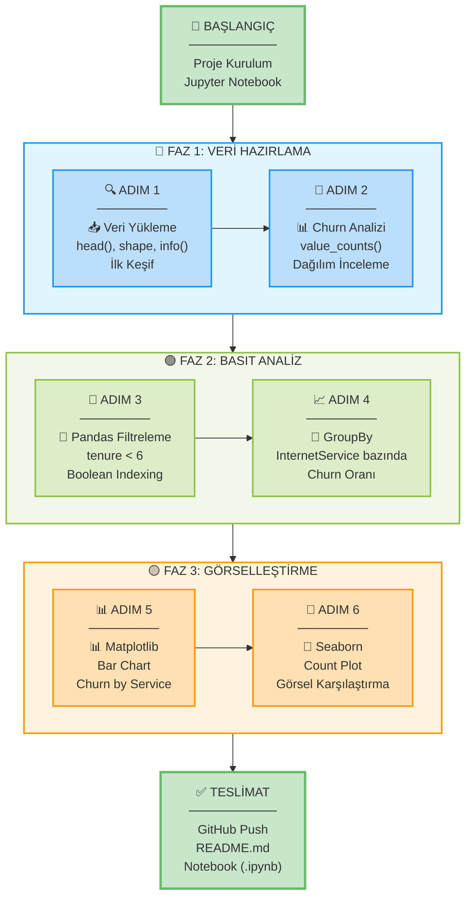

</div>

---

## 🔍 ADIM 1: VERİ KAYNAĞINI DOĞRULAMA – KAPI KONTROLÜ

### 🎯 **Adımın Amacı**

Veri dosyasının sisteme başarıyla yüklenip yüklenmediğini doğrulamak ve ilk 5 satırı inceleyerek veri yapısına aşina olmak.

> **💡 İş Mantığı:** "Veri okunamıyorsa analiz başlamaz" – Kurumsal dünyada veri pipeline hatası, tüm operasyonel süreçleri durdurabilir.

<div align="center">

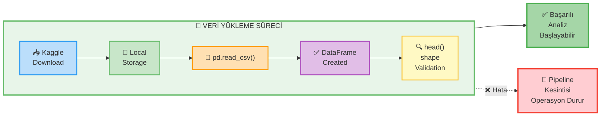

</div>

### 📝 **Ne Yapacaksınız?**

<div align="center">

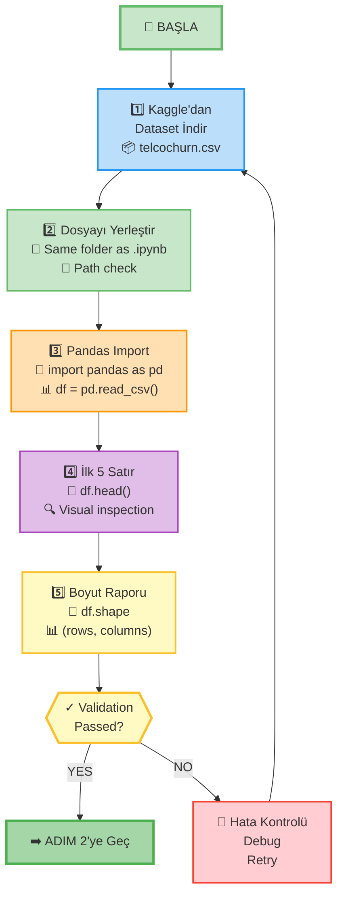

</div>

### 💼 **ZORUNLU YBS YORUMU Formatı**

Veri yükleme başarısını yorumlarken şu soruları cevaplayın:

```
🔍 BULGU: 
   - Kaç satır ve sütun yüklendi?
   - Dosya başarıyla okundu mu?
   - İhtiyaç duyulan temel sütunlar (Churn, tenure, InternetService) mevcut mu?

💼 ETKİ: 
   - Eğer veri yüklenemeseydi operasyonel süreçlere ne olurdu?
   - 24 saatlik veri kesintisi stratejik kararlara nasıl etki eder?
   - Veri pipeline güvenilirliği neden kritik?

⚡ AKSİYON: 
   - Veri kaynağı güvenilirliği için hangi önlemler alınmalı?
   - Automated health check gerekli mi?
   - Backup stratejisi ne olmalı?
```

### 🎯 **Kontrol Listesi**

- [ ] Veri dosyası indirildi ve doğru klasöre yerleştirildi
- [ ] DataFrame oluşturuldu
- [ ] İlk satırlar görüntülendi
- [ ] Boyut bilgisi (shape) raporlandı
- [ ] YBS yorumu Bulgu-Etki-Aksiyon formatında yazıldı

---

## 📊 ADIM 2: İLK REFLEKS PROTOKOLÜ – VERİYLE TANIŞMA

### 🎯 **Adımın Amacı**

Veri setinin yapısını, değişken tiplerini, eksik değerleri ve temel istatistikleri anlamak.

> **💡 İş Mantığı:** "Tanımadığınız veriyi analiz edemezsiniz" – İlk 10 dakikanın refleksi, sonraki 10 saatin kalitesini belirler.

<div align="center">

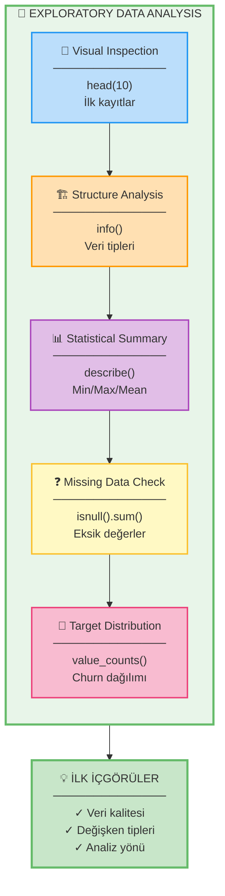

</div>

### 📝 **Ne Yapacaksınız?**

<table align="center">
<tr>
<th width="5%">#</th>
<th width="25%">🛠️ İşlem</th>
<th width="25%">🐍 Kod</th>
<th width="45%">🎯 Amaç</th>
</tr>
<tr>
<td align="center"><b>1</b></td>
<td><b>İlk 10 Kayıt</b></td>
<td><code>df.head(10)</code></td>
<td>Veri yapısını görsel olarak anlamak, değerlerin formatını görmek</td>
</tr>
<tr>
<td align="center"><b>2</b></td>
<td><b>Yapı Analizi</b></td>
<td><code>df.info()</code></td>
<td>Veri tipleri, null değerler, memory kullanımı kontrolü</td>
</tr>
<tr>
<td align="center"><b>3</b></td>
<td><b>Sayısal Özet</b></td>
<td><code>df.describe()</code></td>
<td>Min, Max, Mean, Std, Quartile değerleri</td>
</tr>
<tr>
<td align="center"><b>4</b></td>
<td><b>Tüm Değişkenler</b></td>
<td><code>df.describe(include='all')</code></td>
<td>Kategorik değişkenlerin de özetini görmek</td>
</tr>
<tr>
<td align="center"><b>5</b></td>
<td><b>Eksik Veri</b></td>
<td><code>df.isnull().sum()</code></td>
<td>Hangi sütunda kaç eksik değer var?</td>
</tr>
</table>

### 💼 **ZORUNLU YBS YORUMU Formatı**

```
🔍 BULGU: 
   - Hangi değişkenler kategorik, hangileri sayısal?
   - Eksik veri var mı? Varsa hangi sütunlarda, kaç adet?
   - tenure değişkeni: Min, Max, Ortalama değerleri ne?
   - SeniorCitizen dağılımı nasıl?

💼 ETKİ: 
   - tenure=0 olan müşteriler "ilk gün riski" taşıyor mu?
   - SeniorCitizen segmenti farklı yaklaşım gerektirir mi?
   - Eksik veriler analizi nasıl etkiler?
   - Veri kalitesi sorunları ne tür operasyonel risklere işaret ediyor?

⚡ AKSİYON:
   - Yeni müşterilere (tenure<6 ay) hangi özel program uygulanmalı?
   - SeniorCitizen segmenti için hangi kanal stratejisi önerilir?
   - Eksik veriler nasıl ele alınmalı?
```

### 🎯 **Kontrol Listesi**

- [ ] `head(10)` çalıştırıldı
- [ ] `info()` ile veri tipleri kontrol edildi
- [ ] Eksik veri analizi yapıldı
- [ ] `describe()` istatistikleri yorumlandı
- [ ] **tenure ve SeniorCitizen değişkenleri özellikle 2-3 cümleyle değerlendirildi**
- [ ] YBS yorumu Bulgu-Etki-Aksiyon formatında yazıldı

---

## ✂️ ADIM 3: YÖNETİCİ SLAYTI İÇİN KARARA HİZMET EDEN SÜTUN SETİ

### 🎯 **Adımın Amacı**

Tüm 21 sütun yerine, yönetici kararına doğrudan etki eden **10 kritik değişken** ile yeni bir DataFrame oluşturmak.

> **💡 İş Mantığı:** "Her sütun veri değildir. Karara hizmet eden sütun veridir."  
> Yönetici 3 dakikada karar vermek ister. 21 sütunluk tablo değil, 10 sütunluk aksiyon matrisi sunarız.

<div align="center">

```mermaid
graph LR
    subgraph BEFORE["📊 ÖNCE: 21 SÜTUN"]
        B1["💰 Finansal<br/>MonthlyCharges<br/>TotalCharges<br/>Contract"]
        B2["👥 Demografik<br/>gender<br/>SeniorCitizen<br/>Partner<br/>Dependents"]
        B3["📞 Hizmetler<br/>PhoneService<br/>MultipleLines<br/>InternetService<br/>OnlineSecurity<br/>...11 more"]
        B4["🎯 Hedef<br/>Churn"]
    end
    
    FILTER["🔍 FİLTRELEME<br/>──────────<br/>Karar Odaklı<br/>Seçim"]
    
    subgraph AFTER["🎯 SONRA: 10 SÜTUN"]
        A1["🎯 Churn"]
        A2["📅 tenure"]
        A3["🌐 InternetService"]
        A4["🔒 OnlineSecurity"]
        A5["👴 SeniorCitizen"]
        A6["📞 PhoneService"]
        A7["📱 MultipleLines"]
        A8["💑 Partner"]
        A9["👨‍👩‍👧 Dependents"]
        A10["⚧️ gender"]
    end
    
    BEFORE --> FILTER
    FILTER --> AFTER
    
    AFTER --> RESULT["✅ df2 DataFrame<br/>──────────<br/>Optimized<br/>Action-Ready<br/>Manager-Friendly"]
    
    style BEFORE fill:#FFEBEE,stroke:#F44336,stroke-width:2px
    style FILTER fill:#FFF9C4,stroke:#FBC02D,stroke-width:3px
    style AFTER fill:#E8F5E9,stroke:#66BB6A,stroke-width:2px
    style RESULT fill:#C8E6C9,stroke:#66BB6A,stroke-width:3px
    
    style B1 fill:#FFCDD2,stroke:#F44336,stroke-width:1px
    style B2 fill:#FFCDD2,stroke:#F44336,stroke-width:1px
    style B3 fill:#FFCDD2,stroke:#F44336,stroke-width:1px
    style B4 fill:#FFCDD2,stroke:#F44336,stroke-width:1px
    
    style A1 fill:#DCEDC8,stroke:#66BB6A,stroke-width:1px
    style A2 fill:#DCEDC8,stroke:#66BB6A,stroke-width:1px
    style A3 fill:#DCEDC8,stroke:#66BB6A,stroke-width:1px
    style A4 fill:#DCEDC8,stroke:#66BB6A,stroke-width:1px
    style A5 fill:#DCEDC8,stroke:#66BB6A,stroke-width:1px
    style A6 fill:#DCEDC8,stroke:#66BB6A,stroke-width:1px
    style A7 fill:#DCEDC8,stroke:#66BB6A,stroke-width:1px
    style A8 fill:#DCEDC8,stroke:#66BB6A,stroke-width:1px
    style A9 fill:#DCEDC8,stroke:#66BB6A,stroke-width:1px
    style A10 fill:#DCEDC8,stroke:#66BB6A,stroke-width:1px
```

</div>

### 📝 **Ne Yapacaksınız?**

Aşağıdaki **10 sütunu** içeren yeni bir DataFrame (`df2`) oluşturun:

<table align="center">
<tr>
<th width="5%">#</th>
<th width="25%">📋 Değişken</th>
<th width="25%">🏷️ Kategori</th>
<th width="45%">💼 İş Değeri</th>
</tr>
<tr>
<td align="center"><b>1</b></td>
<td><b>Churn</b></td>
<td>🎯 Hedef</td>
<td>Ayrılma durumu - Tüm analizin merkezi</td>
</tr>
<tr>
<td align="center"><b>2</b></td>
<td><b>tenure</b></td>
<td>📊 Davranışsal</td>
<td>Müşteri yaşı - Sadakat göstergesi</td>
</tr>
<tr>
<td align="center"><b>3</b></td>
<td><b>InternetService</b></td>
<td>📦 Hizmet</td>
<td>Servis tipi - Churn'ün temel drivers'ı</td>
</tr>
<tr>
<td align="center"><b>4</b></td>
<td><b>OnlineSecurity</b></td>
<td>📦 Hizmet</td>
<td>Ek hizmet - Upsell fırsatı</td>
</tr>
<tr>
<td align="center"><b>5</b></td>
<td><b>SeniorCitizen</b></td>
<td>👥 Demografik</td>
<td>Yaş segmenti - Farklı yaklaşım gerektirir</td>
</tr>
<tr>
<td align="center"><b>6</b></td>
<td><b>PhoneService</b></td>
<td>📦 Hizmet</td>
<td>Temel hizmet - Paket stratejisi</td>
</tr>
<tr>
<td align="center"><b>7</b></td>
<td><b>MultipleLines</b></td>
<td>📦 Hizmet</td>
<td>Upsell göstergesi - Revenue potansiyeli</td>
</tr>
<tr>
<td align="center"><b>8</b></td>
<td><b>Partner</b></td>
<td>👥 Demografik</td>
<td>Yaşam durumu - Paket tercih pattern'i</td>
</tr>
<tr>
<td align="center"><b>9</b></td>
<td><b>Dependents</b></td>
<td>👥 Demografik</td>
<td>Aile yapısı - Aile paketleri için segment</td>
</tr>
<tr>
<td align="center"><b>10</b></td>
<td><b>gender</b></td>
<td>👥 Demografik</td>
<td>Cinsiyet - Segmentasyon değişkeni</td>
</tr>
</table>

**Not:** Bundan sonraki tüm analizler `df2` üzerinde yapılacak!

### 💼 **ZORUNLU YBS YORUMU Formatı**

```
🔍 BULGU: 
   - Kaç sütundan kaç sütuna indirgendi?
   - Hangi sütunlar çıkarıldı ve neden?
   - df2'nin memory ve performans avantajı ne?

💼 ETKİ: 
   - 21 sütunlu tablo yönetici sunumunda neden problem yaratır?
   - Sütun azaltmanın analiz hızına etkisi ne?
   - "Her sütun veri değildir" ilkesi Telco bağlamında ne anlama geliyor?
   - Örnek senaryo: CFO fiber müşteri churn'ü sorduğunda nasıl 5 saniyede cevap verebilirsiniz?

⚡ AKSİYON:
   - Bundan sonra hangi DataFrame kullanılacak?
   - Çıkarılan finansal değişkenler için ayrı analiz mi yapılmalı?
   - Bu 10 değişken standardizasyon için sabit kalmalı mı?
```

### 🎯 **Kontrol Listesi**

- [ ] 10 sütunlu `df2` DataFrame'i oluşturuldu
- [ ] `df2.shape` ve `df2.head()` kontrol edildi
- [ ] Sütun seçim mantığı açıklandı
- [ ] **"Her sütun veri değildir" ilkesi Telco bağlamında yorumlandı**
- [ ] YBS yorumu Bulgu-Etki-Aksiyon formatında yazıldı

---

## 🎯 ADIM 4: HEDEF DEĞİŞKENİN NETLEŞTİRİLMESİ – CHURN FOTOĞRAFI

### 🎯 **Adımın Amacı**

Churn (Yes/No) dağılımını hem adet hem oran olarak göstererek, problemin büyüklüğünü netleştirmek.

> **💡 İş Mantığı:** Hedef değişkeni bilmeden model kurulamaz. CFO'nun ilk sorusu: "Kaç müşterimiz ayrılıyor?"

<div align="center">

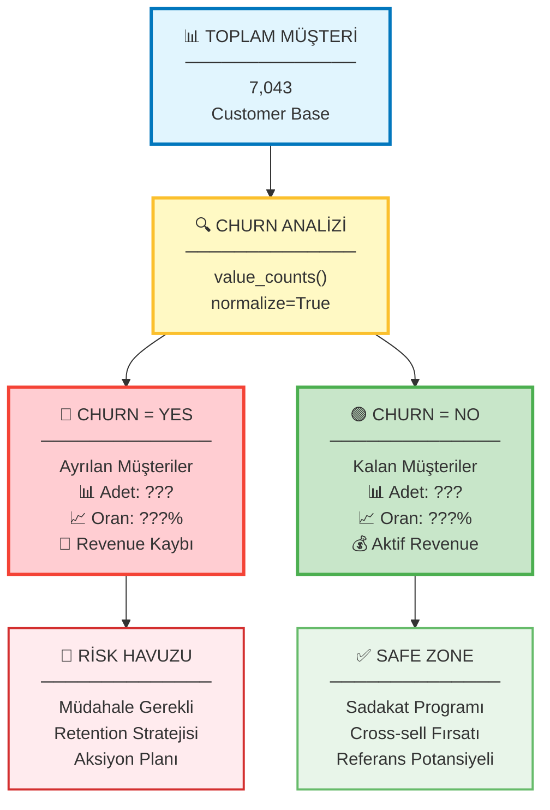

</div>

### 📝 **Ne Yapacaksınız?**

<table align="center">
<tr>
<th width="5%">#</th>
<th width="30%">🛠️ İşlem</th>
<th width="30%">🐍 Kod</th>
<th width="35%">📊 Çıktı</th>
</tr>
<tr>
<td align="center"><b>1</b></td>
<td><b>Churn Dağılımı (Adet)</b></td>
<td><code>df2['Churn'].value_counts()</code></td>
<td>Yes: ??? | No: ???</td>
</tr>
<tr>
<td align="center"><b>2</b></td>
<td><b>Churn Dağılımı (Oran)</b></td>
<td><code>df2['Churn'].value_counts(normalize=True)</code></td>
<td>Yes: ???% | No: ???%</td>
</tr>
<tr>
<td align="center"><b>3</b></td>
<td><b>Kombine Rapor</b></td>
<td><code>pd.crosstab(..., normalize='columns')</code></td>
<td>Hem adet hem yüzde</td>
</tr>
</table>

### 💼 **ZORUNLU YBS YORUMU Formatı**

```
🔍 BULGU: 
   - Kaç müşteri ayrılmış (Churn=Yes)?
   - Kaç müşteri kalmış (Churn=No)?
   - Churn oranı yüzde kaç?

💼 ETKİ: 
   - Bu oran CFO açısından ne anlama geliyor?
   - Gelir kaybı perspektifiyle nasıl yorumlanır?
   - Risk havuzu büyüklüğü nedir?
   - Bu churn oranı sektör ortalamasıyla karşılaştırıldığında nasıl?
   - Operasyonel maliyet etkisi ne?

⚡ AKSİYON:
   - Bu oran için aksiyon hedefi ne olmalı? (örn: %20'ye düşürme)
   - Hangi segmentler öncelikli?
```

### 🎯 **Kontrol Listesi**

- [ ] Churn dağılımı (adet) görüntülendi
- [ ] Churn dağılımı (oran/normalize) hesaplandı
- [ ] **Gelir kaybı, risk havuzu ve operasyonel maliyet dili kullanıldı**
- [ ] YBS yorumu Bulgu-Etki-Aksiyon formatında yazıldı

---

## 🔎 ADIM 5: YÖNETİCİ TALEBİNE GÖRE RİSKLİ SEGMENT FİLTRELEME

### 🎯 **Adımın Amacı**

Yönetici tarafından talep edilen spesifik risk segmentlerini Pandas filtreleme ile çıkarmak ve her birinde churn oranını hesaplamak.

> **💡 İş Mantığı:** Pandas filtreleme = SQL'deki WHERE clause. Yönetici sorar, siz 30 saniyede filtreleyip cevap verirsiniz.

<div align="center">

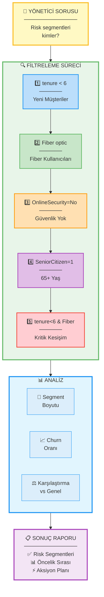

</div>

### 📝 **Ne Yapacaksınız?**

<table align="center">
<tr>
<th width="5%">#</th>
<th width="35%">🎯 Filtre</th>
<th width="30%">🐍 Pandas Kodu</th>
<th width="30%">📊 Çıktı</th>
</tr>
<tr>
<td align="center"><b>1</b></td>
<td>İlk 6 aydaki yeni müşteriler</td>
<td><code>df2[df2['tenure'] < 6]</code></td>
<td>Segment sayısı<br/>Churn oranı (%)</td>
</tr>
<tr>
<td align="center"><b>2</b></td>
<td>Fiber optic kullananlar</td>
<td><code>df2[df2['InternetService']=='Fiber optic']</code></td>
<td>Segment sayısı<br/>Churn oranı (%)</td>
</tr>
<tr>
<td align="center"><b>3</b></td>
<td>Güvenlik paketi olmayanlar</td>
<td><code>df2[df2['OnlineSecurity']=='No']</code></td>
<td>Segment sayısı<br/>Churn oranı (%)</td>
</tr>
<tr>
<td align="center"><b>4</b></td>
<td>65+ yaş grubu</td>
<td><code>df2[df2['SeniorCitizen']==1]</code></td>
<td>Segment sayısı<br/>Churn oranı (%)</td>
</tr>
<tr>
<td align="center"><b>5</b></td>
<td>Yeni Fiber müşterileri (Kritik!)</td>
<td><code>df2[(df2['tenure']<6) & (df2['InternetService']=='Fiber optic')]</code></td>
<td>Segment sayısı<br/>Churn oranı (%)</td>
</tr>
</table>

<div align="center">

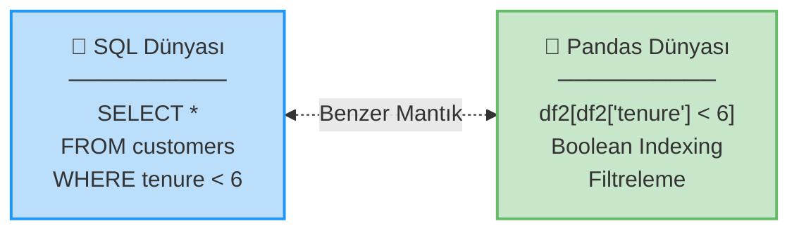

</div>

### 💼 **ZORUNLU YBS YORUMU Formatı**

**Her segment için ayrı ayrı:**

```
🔍 BULGU: 
   - Bu segmentte kaç müşteri var?
   - Churn oranı ne? (Genel oranla karşılaştır)
   - En riskli segment hangisi?

💼 ETKİ: 
   - Pandas filtreleme SQL WHERE ile nasıl benzeşiyor?
   - Yönetici bu filtreleri neden talep ediyor?
   - Hangi segment öncelikli müdahale gerektiriyor?

⚡ AKSİYON:
   - Her segment için somut 2 aksiyon önerisi
```

### 🎯 **Kontrol Listesi**

- [ ] 6 filtre ayrı ayrı uygulandı
- [ ] Her segmentte churn oranı hesaplandı
- [ ] **"No internet service" özel olarak yorumlandı**
- [ ] **Pandas-SQL WHERE benzerliği açıklandı**
- [ ] **Yönetici perspektifinden filtre mantığı yorumlandı**
- [ ] Her segment için YBS yorumu yazıldı

---

## 📈 ADIM 6: GROUPBY ANALİZİ – YÖNETİCİYE TEK SATIRLIK CEVAPLAR

### 🎯 **Adımın Amacı**

Kategorik değişkenlere göre gruplama yaparak, her grupta churn oranı ve müşteri sayısını hesaplamak.

> **💡 İş Mantığı:** GroupBy = SQL'deki GROUP BY. "Hangi internet tipinde churn yüksek?" sorusuna tek tabloda cevap.

<div align="center">

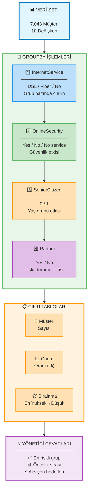

</div>

### 📝 **Ne Yapacaksınız?**

<table align="center">
<tr>
<th width="5%">#</th>
<th width="25%">🎯 Gruplama Değişkeni</th>
<th width="35%">🐍 Kod Örneği</th>
<th width="35%">📊 Beklenen Çıktı</th>
</tr>
<tr>
<td align="center"><b>1</b></td>
<td><b>InternetService</b></td>
<td><code>df2.groupby('InternetService')['Churn']<br/>.apply(lambda x: (x=='Yes').mean())<br/>.sort_values(ascending=False)</code></td>
<td>Fiber optic: ???%<br/>DSL: ???%<br/>No: ???%</td>
</tr>
<tr>
<td align="center"><b>2</b></td>
<td><b>OnlineSecurity</b></td>
<td><code>df2.groupby('OnlineSecurity')['Churn']<br/>.apply(lambda x: (x=='Yes').mean())<br/>.sort_values(ascending=False)</code></td>
<td>No: ???%<br/>Yes: ???%<br/>No internet service: ???%</td>
</tr>
<tr>
<td align="center"><b>3</b></td>
<td><b>SeniorCitizen</b></td>
<td><code>df2.groupby('SeniorCitizen')['Churn']<br/>.apply(lambda x: (x=='Yes').mean())<br/>.sort_values(ascending=False)</code></td>
<td>1 (Senior): ???%<br/>0 (Non-senior): ???%</td>
</tr>
<tr>
<td align="center"><b>4</b></td>
<td><b>Partner</b></td>
<td><code>df2.groupby('Partner')['Churn']<br/>.apply(lambda x: (x=='Yes').mean())<br/>.sort_values(ascending=False)</code></td>
<td>No: ???%<br/>Yes: ???%</td>
</tr>
</table>

<div align="center">

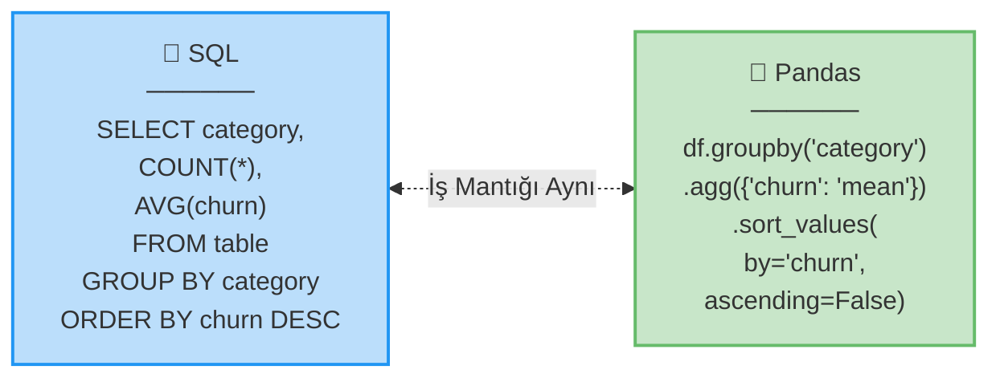

</div>
2️⃣ OnlineSecurity bazında
3️⃣ SeniorCitizen bazında
4️⃣ Partner bazında
```

**Her tablo için:**
- Grup bazında müşteri sayısı
- Grup bazında churn oranı (%)
- Churn oranına göre azalan sıralama

### 💼 **ZORUNLU YBS YORUMU Formatı**

**Her tablo için:**

```
🔍 BULGU: Hangi grup en yüksek churn'e sahip?

💼 ETKİ: Bu bulgu iş açısından ne anlama geliyor?

⚡ AKSİYON: Bu gruba yönelik 2 somut, uygulanabilir aksiyon önerisi
```

### 🎯 **Kontrol Listesi**

- [ ] 4 groupby analizi yapıldı
- [ ] Tablolar churn oranına göre sıralandı
- [ ] **Her tablo altında Bulgu-Etki-Aksiyon formatında yorum yazıldı**
- [ ] **En az 2 somut aksiyon önerisi üretildi**

---

## 📊 ADIM 7: MATPLOTLIB GÖRSEL 1 – TEK BAKIŞTA İÇGÖRÜ

### 🎯 **Adımın Amacı**

InternetService türlerine göre churn oranını **bar chart** ile görselleştirerek yöneticiye tek bakışta içgörü sunmak.

> **💡 İş Mantığı:** Yönetici tabloya bakmaz, görsele bakar. 3 saniyede anlaşılmalı.

<div align="center">

```mermaid
graph TB
    DATA["📊 VERİ<br/>──────────<br/>InternetService<br/>+ Churn"] --> GROUPBY["🔄 GROUPBY<br/>──────────<br/>Grup bazında<br/>churn oranı"]
    
    GROUPBY --> VIZ
    
    subgraph VIZ["🎨 GÖRSELLEŞTİRME"]
        direction TB
        V1["📊 Matplotlib<br/>plt.bar()"]
        V2["🎨 Styling<br/>Renkler/Grid"]
        V3["🏷️ Labels<br/>Başlık/Eksenler"]
        V4["💯 Annotations<br/>Yüzde değerleri"]
        
        V1 --> V2 --> V3 --> V4
    end
    
    VIZ --> OUTPUT["✅ ÇIKTI<br/>──────────<br/>Static Bar Chart<br/>Profesyonel<br/>Anlaşılır"]
    
    OUTPUT --> INSIGHT["💡 İÇGÖRÜ<br/>──────────<br/>3 saniyede<br/>Risk segmenti<br/>net görülür"]
    
    style DATA fill:#E1F5FE,stroke:#2196F3,stroke-width:2px
    style GROUPBY fill:#FFF9C4,stroke:#FBC02D,stroke-width:2px
    style VIZ fill:#E8F5E9,stroke:#66BB6A,stroke-width:3px
    style OUTPUT fill:#FFE0B2,stroke:#FF9800,stroke-width:2px
    style INSIGHT fill:#F3E5F5,stroke:#AB47BC,stroke-width:3px
    
    style V1 fill:#DCEDC8,stroke:#66BB6A,stroke-width:1px
    style V2 fill:#DCEDC8,stroke:#66BB6A,stroke-width:1px
    style V3 fill:#DCEDC8,stroke:#66BB6A,stroke-width:1px
    style V4 fill:#DCEDC8,stroke:#66BB6A,stroke-width:1px
```

</div>

### 📝 **Ne Yapacaksınız?**

<table align="center">
<tr>
<th width="5%">#</th>
<th width="30%">🛠️ İşlem</th>
<th width="40%">🐍 Kod Snippet</th>
<th width="25%">🎯 Amaç</th>
</tr>
<tr>
<td align="center"><b>1</b></td>
<td>Veri Hazırlama</td>
<td><code>churn_by_service = df2.groupby('InternetService')['Churn'].apply(lambda x: (x=='Yes').mean()*100)</code></td>
<td>Grup bazında % hesaplama</td>
</tr>
<tr>
<td align="center"><b>2</b></td>
<td>Bar Chart Çizme</td>
<td><code>plt.figure(figsize=(10,6))<br/>plt.bar(x, y, color=['#2196F3','#66BB6A','#FF9800'])</code></td>
<td>Görsel oluşturma</td>
</tr>
<tr>
<td align="center"><b>3</b></td>
<td>Etiketleme</td>
<td><code>plt.title('Churn Rate by Internet Service')<br/>plt.xlabel('Service Type')<br/>plt.ylabel('Churn Rate (%)')</code></td>
<td>Profesyonel sunum</td>
</tr>
<tr>
<td align="center"><b>4</b></td>
<td>Değer Gösterimi</td>
<td><code>for i, v in enumerate(y):<br/>    plt.text(i, v+1, f'{v:.1f}%', ha='center')</code></td>
<td>Bar üstü yüzdeler</td>
</tr>
</table>

### 💼 **ZORUNLU BULGU YORUMU (3 cümle)**

```
🔍 En yüksek churn nerede?
💼 Neden kritik?
⚡ Önerilen aksiyon?
```

### 🎯 **Kontrol Listesi**

- [ ] Bar chart oluşturuldu
- [ ] Başlık, eksen isimleri eklendi
- [ ] Yüzde etiketleri bar üstünde gösterildi
- [ ] **3 cümlelik bulgu yorumu yazıldı**

---

## 📉 ADIM 8: MATPLOTLIB GÖRSEL 2 – DAVRANIŞ EĞRİSİ

### 🎯 **Adımın Amacı**

tenure (müşteri yaşı) değişkenini kohortlara ayırıp churn oranlarını **line chart** ile göstererek yaşam döngüsü riskini anlamak.

> **💡 İş Mantığı:** Müşteri ilk 6 ayda mı ayrılıyor, 2. yılda mı? Yaşam döngüsü stratejisi için kritik.

<div align="center">

```mermaid
graph LR
    subgraph TENURE["📅 TENURE DEĞİŞKENİ"]
        T1["0-6 ay<br/>🔴 İlk Dönem<br/>En Riskli"]
        T2["7-12 ay<br/>🟡 1. Yıl<br/>Orta Risk"]
        T3["13-24 ay<br/>🟢 2. Yıl<br/>Stabilize"]
        T4["25-48 ay<br/>🔵 3-4. Yıl<br/>Güvenli"]
        T5["49+ ay<br/>💎 Sadık<br/>Düşük Risk"]
    end
    
    TENURE --> CHART["📈 LINE CHART<br/>──────────────<br/>Yaşam Döngüsü<br/>Risk Eğrisi<br/>Trend Analizi"]
    
    CHART --> STRATEGY["⚡ STRATEJİ<br/>──────────────<br/>İlk 6 ay odak<br/>Retention program<br/>Lifecycle marketing"]
    
    style TENURE fill:#E8F5E9,stroke:#66BB6A,stroke-width:3px
    style T1 fill:#FFCDD2,stroke:#F44336,stroke-width:2px
    style T2 fill:#FFF9C4,stroke:#FBC02D,stroke-width:2px
    style T3 fill:#C8E6C9,stroke:#66BB6A,stroke-width:2px
    style T4 fill:#BBDEFB,stroke:#2196F3,stroke-width:2px
    style T5 fill:#E1BEE7,stroke:#AB47BC,stroke-width:2px
    style CHART fill:#FFE0B2,stroke:#FF9800,stroke-width:3px
    style STRATEGY fill:#F3E5F5,stroke:#AB47BC,stroke-width:3px
```

</div>

### 📝 **Ne Yapacaksınız?**

<table align="center">
<tr>
<th width="5%">#</th>
<th width="25%">📅 Kohort</th>
<th width="20%">🔢 Aralık</th>
<th width="25%">🏷️ Etiket</th>
<th width="25%">🎯 İş Anlamı</th>
</tr>
<tr>
<td align="center"><b>1</b></td>
<td><b>İlk Dönem</b></td>
<td>0-6 ay</td>
<td>"New Customers"</td>
<td>En kritik risk penceresi</td>
</tr>
<tr>
<td align="center"><b>2</b></td>
<td><b>1. Yıl</b></td>
<td>7-12 ay</td>
<td>"First Year"</td>
<td>Onboarding etkisi</td>
</tr>
<tr>
<td align="center"><b>3</b></td>
<td><b>2. Yıl</b></td>
<td>13-24 ay</td>
<td>"Second Year"</td>
<td>Stabilizasyon dönemi</td>
</tr>
<tr>
<td align="center"><b>4</b></td>
<td><b>3-4. Yıl</b></td>
<td>25-48 ay</td>
<td>"Mature"</td>
<td>Sadakat göstergesi</td>
</tr>
<tr>
<td align="center"><b>5</b></td>
<td><b>Sadık Müşteri</b></td>
<td>49+ ay</td>
<td>"Loyal"</td>
<td>Referans potansiyeli</td>
</tr>
</table>

**🐍 Kod Örneği:**
```python
# Kohort oluşturma
df2['tenure_cohort'] = pd.cut(df2['tenure'], 
                              bins=[0,6,12,24,48,100],
                              labels=['0-6','7-12','13-24','25-48','49+'])

# Churn oranları
churn_by_cohort = df2.groupby('tenure_cohort')['Churn'].apply(
    lambda x: (x=='Yes').mean()*100
)

# Line chart
plt.figure(figsize=(12,6))
plt.plot(churn_by_cohort.index, churn_by_cohort.values, 
         marker='o', linewidth=2, markersize=8, color='#F44336')
```

### 💼 **ZORUNLU BULGU YORUMU (3 cümle)**

```
🔍 Hangi dönem en riskli?
💼 Yaşam döngüsü riski perspektifiyle ne anlama geliyor?
⚡ Önerilen aksiyon?
```

### 🎯 **Kontrol Listesi**

- [ ] tenure kohortları oluşturuldu
- [ ] Line chart çizildi
- [ ] **Yaşam döngüsü riski perspektifiyle 3 cümlelik yorum yazıldı**

---

## 🔥 ADIM 9: SEABORN GÖRSEL – İLİŞKİ HARİTASI

### 🎯 **Adımın Amacı**

Kategorik değişkenler ile Churn arasındaki ilişkiyi **çapraz tablo (crosstab) ve heatmap** ile görselleştirmek.

> **💡 İş Mantığı:** Hangi kombinasyon en riskli? InternetService + OnlineSecurity birlikte nasıl etki ediyor?

<div align="center">

```mermaid
graph TB
    VAR1["🌐 InternetService<br/>──────────────<br/>DSL<br/>Fiber optic<br/>No"]
    VAR2["🔒 OnlineSecurity<br/>──────────────<br/>Yes<br/>No<br/>No internet service"]
    
    VAR1 --> CROSS
    VAR2 --> CROSS
    
    CROSS["✖️ CROSSTAB<br/>──────────────<br/>3x3 Matrix<br/>9 Kombinasyon<br/>Churn oranları"]
    
    CROSS --> HEATMAP
    
    subgraph HEATMAP["🔥 HEATMAP"]
        direction TB
        H1["🎨 Color Gradient<br/>Düşük→Yüksek Risk"]
        H2["💯 Annotations<br/>Değerler gösterilir"]
        H3["🔍 Pattern Detection<br/>Risk hot-spots"]
        
        H1 --> H2 --> H3
    end
    
    HEATMAP --> INSIGHT["💡 İÇGÖRÜ<br/>──────────────<br/>🔴 Fiber + No Security<br/>→ En yüksek risk<br/>⚡ Aksiyon önceliği net"]
    
    style VAR1 fill:#E1F5FE,stroke:#2196F3,stroke-width:2px
    style VAR2 fill:#E8F5E9,stroke:#66BB6A,stroke-width:2px
    style CROSS fill:#FFF9C4,stroke:#FBC02D,stroke-width:3px
    style HEATMAP fill:#FFE0B2,stroke:#FF9800,stroke-width:3px
    style H1 fill:#FFCCBC,stroke:#FF9800,stroke-width:1px
    style H2 fill:#FFCCBC,stroke:#FF9800,stroke-width:1px
    style H3 fill:#FFCCBC,stroke:#FF9800,stroke-width:1px
    style INSIGHT fill:#F3E5F5,stroke:#AB47BC,stroke-width:3px
```

</div>

### 📝 **Ne Yapacaksınız?**

<table align="center">
<tr>
<th width="5%">#</th>
<th width="30%">🛠️ İşlem</th>
<th width="40%">🐍 Kod</th>
<th width="25%">🎯 Amaç</th>
</tr>
<tr>
<td align="center"><b>1</b></td>
<td>Crosstab Oluşturma</td>
<td><code>pd.crosstab(df2['InternetService'],<br/>            df2['OnlineSecurity'],<br/>            values=df2['Churn']=='Yes',<br/>            aggfunc='mean')*100</code></td>
<td>Kombinasyon analizi</td>
</tr>
<tr>
<td align="center"><b>2</b></td>
<td>Heatmap Çizme</td>
<td><code>import seaborn as sns<br/>sns.heatmap(crosstab, annot=True,<br/>           fmt='.1f', cmap='RdYlGn_r')</code></td>
<td>Görsel risk haritası</td>
</tr>
<tr>
<td align="center"><b>3</b></td>
<td>Styling</td>
<td><code>plt.title('Churn Heatmap')<br/>cbar_kws={'label': 'Churn Rate (%)'}</code></td>
<td>Profesyonel sunum</td>
</tr>
</table>

### 💼 **ZORUNLU BULGU YORUMU (3 cümle)**

```
🔍 En riskli kombinasyon hangisi?
💼 İş açıklaması: Bu neden kritik?
⚡ Aksiyon önerisi?
```

### 🎯 **Kontrol Listesi**

- [ ] Crosstab oluşturuldu
- [ ] Seaborn heatmap çizildi
- [ ] **En riskli kombinasyon belirlendi**
- [ ] **3 cümlelik iş odaklı yorum yazıldı**

---

## 🎨 ADIM 10: PLOTLY GÖRSEL – ETKİLEŞİMLİ SEGMENT KEŞFİ

### 🎯 **Adımın Amacı**

InternetService bazında churn dağılımını **Plotly etkileşimli bar grafikle** göstererek yönetici sunumuna dinamizm katmak.

> **💡 İş Mantığı:** Plotly = PowerPoint'te etkileşimli grafik. Yönetici mouse ile hover yapınca detay görür.

<div align="center">

```mermaid
graph LR
    subgraph STATIC["📊 STATİK GRAFİK"]
        S1["🗄️ Matplotlib<br/>──────────<br/>PNG/JPG<br/>Sabit<br/>Görüntü"]
    end
    
    subgraph INTERACTIVE["✨ ETKİLEŞİMLİ"]
        I1["🖌️ Plotly<br/>──────────<br/>HTML<br/>Hover👆<br/>Zoom🔍<br/>Pan👉"]
    end
    
    STATIC -."Upgrade".-> INTERACTIVE
    
    INTERACTIVE --> FEATURES
    
    subgraph FEATURES["🌟 ÖZELLİKLER"]
        F1["👁️ Hover<br/>Detay Bilgi"]
        F2["🔍 Zoom<br/>Odaklanma"]
        F3["💾 Export<br/>PNG/SVG"]
        F4["🎨 Customizable<br/>Tam kontrol"]
    end
    
    FEATURES --> MANAGER["💼 YÖNETİCİ SUNUMU<br/>──────────────────<br/>✅ Dinamik<br/>📊 Profesyonel<br/>🚀 Etkileyici"]
    
    style STATIC fill:#FFEBEE,stroke:#F44336,stroke-width:2px
    style INTERACTIVE fill:#E8F5E9,stroke:#66BB6A,stroke-width:3px
    style S1 fill:#FFCDD2,stroke:#F44336,stroke-width:1px
    style I1 fill:#C8E6C9,stroke:#66BB6A,stroke-width:2px
    style FEATURES fill:#E1F5FE,stroke:#2196F3,stroke-width:2px
    style F1 fill:#BBDEFB,stroke:#2196F3,stroke-width:1px
    style F2 fill:#BBDEFB,stroke:#2196F3,stroke-width:1px
    style F3 fill:#BBDEFB,stroke:#2196F3,stroke-width:1px
    style F4 fill:#BBDEFB,stroke:#2196F3,stroke-width:1px
    style MANAGER fill:#F3E5F5,stroke:#AB47BC,stroke-width:3px
```

</div>

### 📝 **Ne Yapacaksınız?**

<table align="center">
<tr>
<th width="5%">#</th>
<th width="25%">🛠️ İşlem</th>
<th width="45%">🐍 Plotly Kodu</th>
<th width="25%">🎯 Sonuç</th>
</tr>
<tr>
<td align="center"><b>1</b></td>
<td>Import & Veri</td>
<td><code>import plotly.express as px<br/>churn_data = df2.groupby(['InternetService','Churn']).size().reset_index(name='Count')</code></td>
<td>Veri hazırlama</td>
</tr>
<tr>
<td align="center"><b>2</b></td>
<td>Bar Chart</td>
<td><code>fig = px.bar(churn_data, x='InternetService', y='Count',<br/>             color='Churn', barmode='group',<br/>             title='Interactive Churn Analysis')</code></td>
<td>Etkileşimli grafik</td>
</tr>
<tr>
<td align="center"><b>3</b></td>
<td>Hover Template</td>
<td><code>fig.update_traces(hovertemplate='<b>%{x}</b><br>Count: %{y}<br>Churn: %{fullData.name}')</code></td>
<td>Detaylı bilgi</td>
</tr>
<tr>
<td align="center"><b>4</b></td>
<td>Göster</td>
<td><code>fig.show()</code></td>
<td>Notebook'ta render</td>
</tr>
</table>

**✨ Plotly Avantajları:**

<div align="center">

| 🌟 Özellik | 📊 Matplotlib | ✨ Plotly |
|---------|---------------|----------|
| **Etkileşim** | ❌ Yok | ✅ Var (hover, zoom, pan) |
| **Dosya Tipi** | PNG/JPG | HTML (embed edilebilir) |
| **Hover Bilgi** | ❌ Yok | ✅ Otomatik detay |
| **Sunum** | Statik | Dinamik & İzlenilebilir |
| **Export** | ✅ Kolay | ✅ Çoklu format |

</div>

### 💼 **ZORUNLU BULGU YORUMU**

```
🔍 Bu görselin yönetici sunumunda hangi soruları hızlı cevapladığını açıklayın.
💼 Plotly'ın statik grafikten farkı ne?
⚡ Hangi karar noktasında kullanılır?
```

### 🎯 **Kontrol Listesi**

- [ ] Plotly bar chart oluşturuldu
- [ ] Hover detayları eklendi
- [ ] **Yönetici sunumunda kullanım senaryosu açıklandı**

---

## 🗺️ ADIM 11: PLOTLY GÖRSEL – RİSK HARİTASI

### 🎯 **Adımın Amacı**

Churn=Yes müşterilerini **hiyerarşik yapıda** görselleştirerek risk önceliklendirme yapmak.

> **💡 İş Mantığı:** En büyük kare = en büyük risk. Yönetici ilk ona aksiyonu oraya yönlendirir.

### 📝 **Ne Yapacaksınız?**

1. **Sadece Churn=Yes** müşterileri filtreleyin
2. **Plotly sunburst veya treemap** kullanarak hiyerarşik gösterin:
   ```
   Seviye 1: InternetService
   Seviye 2: OnlineSecurity
   Seviye 3: SeniorCitizen
   ```

### 💼 **ZORUNLU BULGU YORUMU**

```
🔍 En büyük risk havuzu hangi kombinasyon?
💼 Bu görselin aksiyon önceliklendirme açısından nasıl kullanıldığını yorumlayın.
⚡ İlk 3 aksiyon hangi segmentlere yönlendirilmeli?
```

### 🎯 **Kontrol Listesi**

- [ ] Churn=Yes filtresi uygulandı
- [ ] Plotly sunburst/treemap oluşturuldu
- [ ] **Aksiyon önceliklendirme mantığı açıklandı**

---

## 📋 ADIM 12: YÖNETİCİ ÖZETİ – OPERASYON MASASI ÇIKTISI

### 🎯 **Adımın Amacı**

Tüm analizi yönetici diline çevirerek, **kod içermeyen** bir özet sunmak.

> **💡 İş Mantığı:** CFO kod görmek istemez. 1 sayfalık executive summary ister.

<div align="center">

```mermaid
graph TB
    subgraph ANALYSIS["🔬 11 ADIMLIK ANALİZ"]
        direction LR
        A1["📊 Veri<br/>Hazırlama"]
        A2["🔍 Filtreleme<br/>Segmentasyon"]
        A3["📊 Görseller<br/>5 Chart"]
        
        A1 --> A2 --> A3
    end
    
    ANALYSIS --> SYNTHESIS["🧠 SENTEZ<br/>──────────<br/>Bulgu toplama<br/>Patern analizi<br/>Önceliklendirme"]
    
    SYNTHESIS --> SUMMARY
    
    subgraph SUMMARY["📋 YÖNETİCİ ÖZETİ"]
        direction TB
        
        S1["🔍 Kısa Durum<br/>──────────<br/>2-3 cümle<br/>Genel durum<br/>Risk havuzu"]
        
        S2["🎯 Top 3 Bulgular<br/>──────────<br/>Her biri 2 cümle<br/>Veri destekli<br/>Etki odaklı"]
        
        S3["⚡ Top 3 Aksiyon<br/>──────────<br/>Uygulanabilir<br/>Bütçeli<br/>Zamanlı"]
        
        S4["🎯 Risk Profili<br/>──────────<br/>Demografik<br/>Davranışsal<br/>Persona"]
        
        S1 --> S2 --> S3 --> S4
    end
    
    SUMMARY --> DECISION["💼 KARAR NOKTALARI<br/>──────────────────<br/>💰 Bütçe tahsisi<br/>📅 Timeline oluşturma<br/>👥 Ekip ataması<br/>📊 KPI hedefleri"]
    
    style ANALYSIS fill:#E1F5FE,stroke:#2196F3,stroke-width:2px
    style A1 fill:#BBDEFB,stroke:#2196F3,stroke-width:1px
    style A2 fill:#BBDEFB,stroke:#2196F3,stroke-width:1px
    style A3 fill:#BBDEFB,stroke:#2196F3,stroke-width:1px
    
    style SYNTHESIS fill:#FFF9C4,stroke:#FBC02D,stroke-width:3px
    
    style SUMMARY fill:#E8F5E9,stroke:#66BB6A,stroke-width:3px
    style S1 fill:#DCEDC8,stroke:#66BB6A,stroke-width:2px
    style S2 fill:#DCEDC8,stroke:#66BB6A,stroke-width:2px
    style S3 fill:#DCEDC8,stroke:#66BB6A,stroke-width:2px
    style S4 fill:#DCEDC8,stroke:#66BB6A,stroke-width:2px
    
    style DECISION fill:#F3E5F5,stroke:#AB47BC,stroke-width:3px
```

</div>

### 📝 **Ne Yapacaksınız?**

Notebook'un sonunda **Markdown hücresi** olarak aşağıdaki yapıyı oluşturun:

<div align="center">

**📊 YÖNETİCİ ÖZETİ ŞABLONU**

</div>

```markdown
# 📋 YÖNETİCİ ÖZETİ | TELCO CHURN ANALİZİ
━━━━━━━━━━━━━━━━━━━━━━━━━━━━━━━━━━━━━━━━━━━━━━━

## 🔍 KISA DURUM

[2-3 cümle ile genel durumu özetleyin]
- Toplam müşteri sayısı: ???
- Churn oranı: ???%
- Risk havuzu büyüklüğü: ??? kişi
- Yıllık revenue etkisi: ~$???M (tahmin)

---

## 🎯 TOP 3 KRİTİK BULGU

### 1️⃣ [En Kritik Bulgu Başlığı]
**Veri:** [Sayısal destek - oran, sayı, karşılaştırma]
**Etki:** [Revenue / müşteri kaybı / operasyonel maliyet etkisi]

### 2️⃣ [İkinci Kritik Bulgu Başlığı]
**Veri:** [Sayısal destek]
**Etki:** [İş etkisi]

### 3️⃣ [Üçüncü Kritik Bulgu Başlığı]
**Veri:** [Sayısal destek]
**Etki:** [İş etkisi]

---

## ⚡ TOP 3 AKSİYON ÖNERİSİ

### 🎯 Aksiyon 1: [Öncelikli Aksiyon]
- **Hedef Segment:** [Kim?]
- **Strateji:** [Ne yapmalı?]
- **Zaman Çerçevesi:** [Ne zaman?]
- **Beklenen Etki:** [Ne kadar?]
- **Bütçe İhtiyacı:** [$??? - ???]

### 🎯 Aksiyon 2: [İkinci Öncelikli]
- **Hedef Segment:** 
- **Strateji:** 
- **Zaman Çerçevesi:** 
- **Beklenen Etki:** 

### 🎯 Aksiyon 3: [Üçüncü Öncelikli]
- **Hedef Segment:** 
- **Strateji:** 
- **Zaman Çerçevesi:** 
- **Beklenen Etki:** 

---

## 🔴 YÜKSEK RİSKLİ SEGMENT PROFILİ

**En riskli müşteri profili:**

👤 **Demografik Kimlik:**
- Yaş: [Senior / Non-senior]
- Aile Durumu: [Partner / Dependents bilgisi]
- Cinsiyet: [Eğer anlamlı fark varsa]

📊 **Davranışsal Kimlik:**
- Müşteri Yaşı: [0-6 ay / 7-12 ay vb.]
- Servis Tipi: [DSL / Fiber / No]
- Ek Hizmetler: [OnlineSecurity durumu]

💸 **Revenue Profili:**
- Ortalama aylık değer: ~$???
- Yıllık LTV kaybı: ~$???

⚡ **Aksiyon Önceliği:** 
Bu profile uyan ??? müşteri ilk 90 gün içinde proaktif retention programına alınmalı.

---

📅 **Rapor Tarihi:** [Tarih]
👥 **Hazırlayan:** [İsim - Pozisyon]
📧 **İletişim:** [Email]
```

### 🎯 **Kontrol Listesi**

- [ ] Yönetici özeti markdown hücresinde oluşturuldu
- [ ] **Hiç kod yok, sadece iş dili**
- [ ] Kısa durum 2-3 cümle
- [ ] Top 3 bulgular net
- [ ] Top 3 aksiyon uygulanabilir
- [ ] Riskli segment profili tanımlandı

---

## ✅ KALİTE VE DEĞERLENDİRME ÇERÇEVESİ

### 📊 **Değerlendirme Rubriği**

Çalışmanız aşağıdaki sorulara **"EVET"** yanıtı vermelidir:

<div align="center">

| # | Değerlendirme Kriteri | ✅ Durum |
|---|---------------------|---------|
| 1️⃣ | **Notebook akışkan mı?** Adımlar sıralı, başlıklar net | [ ] |
| 2️⃣ | **Her adımda KOD-ÇIKTI-YBS YORUMU var mı?** Üçlü yapı eksiksiz | [ ] |
| 3️⃣ | **2 Matplotlib + 1 Seaborn + 2 Plotly** görsel mevcut mu? | [ ] |
| 4️⃣ | **Her görsel altında bulgu yorumu** yazılmış mı? | [ ] |
| 5️⃣ | **Aksiyon önerileri** net, uygulanabilir ve yönetici diliyle mi? | [ ] |
| 6️⃣ | **GitHub reposu** düzenli ve okunabilir mi? | [ ] |
| 7️⃣ | **README.md** 5-6 cümleyle vaka özetini içeriyor mu? | [ ] |
| 8️⃣ | **Commit mesajları** anlamlı mı? | [ ] |

</div>

---


## 📚 KAYNAKLAR VE REFERANSLAR

### 🌐 **Veri Kaynağı**

- **Kaggle Dataset:** [Telco Customer Churn](https://www.kaggle.com/datasets/blastchar/telco-customer-churn)

### 📖 **Öğrenme Kaynakları**

#### Python & Pandas
- [Pandas Documentation](https://pandas.pydata.org/docs/)
- [Pandas Cheat Sheet](https://pandas.pydata.org/Pandas_Cheat_Sheet.pdf)

#### Görselleştirme
- [Matplotlib Gallery](https://matplotlib.org/stable/gallery/index.html)
- [Seaborn Tutorial](https://seaborn.pydata.org/tutorial.html)
- [Plotly Documentation](https://plotly.com/python/)

#### GitHub
- [GitHub Markdown Guide](https://guides.github.com/features/mastering-markdown/)
- [Git Commit Message Best Practices](https://chris.beams.io/posts/git-commit/)

### 🎥 **Video Kaynakları**

- Pandas GroupBy İşlemleri
- Matplotlib & Seaborn Görselleştirme
- Plotly Interactive Charts
- GitHub for Data Science

---

## 💡 SIKÇA SORULAN SORULAR (FAQ)

<details>
<summary><b>❓ Veri setini nereden indireceğim?</b></summary>

Kaggle'dan indirin: [Telco Customer Churn](https://www.kaggle.com/datasets/blastchar/telco-customer-churn)

Kaggle hesabı gereklidir (ücretsiz).
</details>

<details>
<summary><b>❓ Hangi Python sürümünü kullanmalıyım?</b></summary>

Python 3.8 veya üzeri önerilir. Gerekli kütüphaneler:
```
pandas
numpy
matplotlib
seaborn
plotly
```
</details>

<details>
<summary><b>❓ YBS yorumu ne kadar detaylı olmalı?</b></summary>

Her yorum:
- 🔍 Bulgu: 2-3 cümle
- 💼 Etki: 2-3 cümle
- ⚡ Aksiyon: 2-3 madde

Toplam 1 paragraf yeterli.
</details>

<details>
<summary><b>❓ Görseller notebook içinde mi kalacak?</b></summary>

Evet, görseller notebook içinde online olarak görüntülenmeli. Ayrıca dışarı kaydetmenize gerek yok.
</details>

<details>
<summary><b>❓ README ne kadar uzun olmalı?</b></summary>

README dosyası, sizin yaptığınız case study'in en iyi temsilidir. Bundan dolayı belirli bir sınır ya da asgari bir oran söz konusu değildir. Ancak haftalık case study'nin vitrini olacağı için detay vermekten çekinmeyin.
</details>

<details>
<summary><b>❓ Commit mesajları Türkçe mi İngilizce mi?</b></summary>

İngilizce önerilir, ancak Türkçe de kabul edilir. Önemli olan anlamlı olması.

Örnekler:
- ✅ `feat: add churn rate visualization`
- ✅ `fix: correct groupby calculation`
- ❌ `update`, `change`, `fix`
</details>

---

<div align="center">

## 🎓 **BAŞARILAR DİLERİZ!**

```
╔═══════════════════════════════════════════════════════════╗
║                                                           ║
║  Bu çalışma sizin YBS yetkinliklerinizi gösterme         ║
║  fırsatınızdır. Kod yazmak değil, veriyi yönetici        ║
║  diline çevirmek asıl beceridir.                          ║
║                                                           ║
║  "Veriden içgörüye, içgörüden aksiyona"                   ║
║                                                           ║
╚═══════════════════════════════════════════════════════════╝
```

---

**YBS 3259 – Makine Öğrenmesi | 2025-2026 Bahar Dönemi**

</div>
