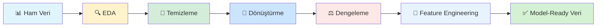
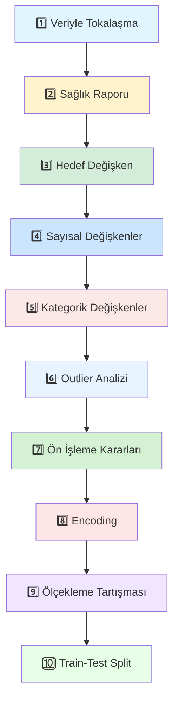

# 📊 MAKİNE ÖĞRENMESİ - DERS 03

```
╔══════════════════════════════════════════════════════════════════════════════╗
║                                                                              ║
║   ██████╗ ███████╗██████╗ ███████╗     ██████╗ ██████╗                      ║
║   ██╔══██╗██╔════╝██╔══██╗██╔════╝    ██╔═████╗╚════██╗                     ║
║   ██║  ██║█████╗  ██████╔╝███████╗    ██║██╔██║ █████╔╝                     ║
║   ██║  ██║██╔══╝  ██╔══██╗╚════██║    ████╔╝██║ ╚═══██╗                     ║
║   ██████╔╝███████╗██║  ██║███████║    ╚██████╔╝██████╔╝                     ║
║   ╚═════╝ ╚══════╝╚═╝  ╚═╝╚══════╝     ╚═════╝ ╚═════╝                      ║
║                                                                              ║
║           KEŞİFSEL VERİ ANALİZİ (EDA) & VERİ ÖN İŞLEME                      ║
║                                                                              ║
╚══════════════════════════════════════════════════════════════════════════════╝
```

<div align="center">

### 🎯 **Makine Öğrenmesinin Kalbi: Veriyi Anlamak ve Hazırlamak**

[](https://www.python.org/)
[](https://jupyter.org/)
[](https://pandas.pydata.org/)
[](https://numpy.org/)
[](https://scikit-learn.org/)
[](https://imbalanced-learn.org/)

[]()
[]()
[](LICENSE)

---

### 🌟 **Model Değil, Veri Fark Yaratır!**

</div>

---

## 📑 İÇİNDEKİLER

<details open>
<summary><b>🔍 Tıklayarak Genişlet/Daralt</b></summary>

1. [🎯 Genel Bakış](#-genel-bakış)
2. [🚀 Haftanın Ana Amacı](#-haftanın-ana-amacı)
3. [📊 Telco Customer Churn Senaryosu](#-telco-customer-churn-senaryosu)
4. [🔍 Keşifsel Veri Analizi (EDA) - 10 Adım](#-keşifsel-veri-analizi-eda---10-adım)
5. [🔥 İleri Seviye Keşifsel Analiz](#-i̇leri-seviye-keşifsel-analiz)
6. [🧹 Veri Ön İşleme Süreci](#-veri-ön-i̇şleme-süreci)
7. [⚖️ SMOTE ile Veri Dengeleme](#️-smote-ile-veri-dengeleme)
8. [🔧 Feature Engineering (Özellik Mühendisliği)](#-feature-engineering-özellik-mühendisliği)
9. [✅ Haftanın Kazanımları](#-haftanın-kazanımları)
10. [🛠️ Teknolojiler ve Kurulum](#️-teknolojiler-ve-kurulum)

</details>

---

## 🎯 GENEL BAKIŞ

### 🌟 **Dersin Vizyonu**

Bu hafta, makine öğrenmesi sürecinin **en kritik ama en çok hafife alınan aşamasına** odaklandık:
**veriyi anlamak, veri kalitesini değerlendirmek ve modeli beslemeden önce doğru kararları almak.**

Bu ders, **model kurmayı değil; modelden önce veriyle düşünmeyi** öğretmeyi amaçladı.

<div align="center">



</div>

### 🎯 **Öğrenme Hedefleri**

Bu dersin sonunda öğrenciler:

| # | Yetkinlik | Açıklama |
|---|-----------|----------|
| 1️⃣ | **EDA Mastery** | Veri kalitesi değerlendirme ve yapısal analiz |
| 2️⃣ | **Veri Sağlık Raporu** | Eksik değer, tip kontrolü ve tutarsızlık tespiti |
| 3️⃣ | **Hedef Değişken Analizi** | İmbalanced dataset tespiti ve yönetimi |
| 4️⃣ | **İleri Analiz** | Değişkenler arası ilişki ve segment bazlı içgörü |
| 5️⃣ | **Veri Ön İşleme** | Temizleme, encoding ve dönüştürme prensipleri |
| 6️⃣ | **SMOTE Uygulama** | Dengesiz veri setlerini dengeleme teknikleri |
| 7️⃣ | **Feature Engineering** | Yeni özellik türetme ve anlamlı değişken yaratma |
| 8️⃣ | **Leakage Prevention** | Test verisi bağımsızlığını koruma |

### 🎤 **YBS Perspektifi**

> **"EDA ve veri ön işleme, teknik bir hazırlık değil; yönetsel bir kalite güvence (quality assurance) sürecidir."**

<div align="center">

```
┌─────────────────────────────────────────────────────────────┐
│                                                             │
│   📊 Veri Kalitesi         →     🎯 Model Kalitesi         │
│   🔍 Erken Keşif           →     💰 Maliyet Tasarrufu      │
│   🧹 Temiz Veri            →     📈 Yüksek Performans      │
│                                                             │
└─────────────────────────────────────────────────────────────┘
```

</div>

---

## 🚀 HAFTANIN ANA AMACI

Makine öğrenmesi projelerinde başarıyı belirleyen unsurun çoğu zaman **model değil, verinin kalitesi ve doğru yorumlanması** olduğunu göstermek.

Bu bağlamda hafta boyunca şu bakış açısını kazandık:

<div align="center">

### 💡 **Altın Kural**

**"Ön işleme öğrenme verisinden öğrenir.**  
**Test verisi gelecektir.**  
**Geleceği bugünden görmeye çalışmayacağız."**

</div>

---

## 📊 TELCO CUSTOMER CHURN SENARYOSU

### 🎯 **Çalışma Senaryosu**

Bu hafta boyunca **Telco Customer Churn** veri seti üzerinden çalıştık.

**Amaç:**  
Bir telekom şirketinde müşteri kaybının (churn) hangi sinyallerle ilişkili olabileceğini keşfetmek.

**YBS Perspektifi:**  
Churn olduktan **sonra** değil, churn'e giden sinyaller **birikirken** aksiyon almak.

Bu nedenle problem, bir sınıflandırma problemi olmasının ötesinde:  
👉 **Erken uyarı ve stratejik karar destek problemidir.**

### 📋 **Veri Seti Yapısı**

<div align="center">


</div>

| Kategori | Değişkenler | Açıklama |
|----------|-------------|----------|
| **Hedef** | Churn | Müşteri ayrılma durumu (Yes/No) |
| **Demografik** | gender, SeniorCitizen, Partner, Dependents | Müşteri profili bilgileri |
| **Hizmet** | PhoneService, MultipleLines, InternetService, vb. | Kullanılan hizmetler (10 değişken) |
| **Sözleşme** | Contract, PaperlessBilling, PaymentMethod | Sözleşme ve ödeme bilgileri |
| **Finansal** | tenure, MonthlyCharges, TotalCharges | Müşteri süresi ve ödeme tutarları |

### 💡 **İş Problemi**

> Telekomünikasyon şirketi, hangi müşterilerin şirketten ayrılma riski taşıdığını önceden bilmek istiyor. Bu sayede:
> - 🎯 Risk altındaki müşterilere özel kampanyalar sunulabilir
> - 💰 Müşteri kaybı maliyeti azaltılabilir
> - 📈 Müşteri sadakati artırılabilir

---

## 🔍 KEŞİFSEL VERİ ANALİZİ (EDA) - 10 ADIM

### 🎯 **EDA Felsefesi**

EDA, sadece grafik çizme işi değil; **yönetsel bir analiz süreci**dir.

<div align="center">



</div>

---

### 1️⃣ **Veriye "Merhaba" Dedik**

Veri setini yükledik ve ilk tanışmayı gerçekleştirdik.

```python
import pandas as pd
df = pd.read_csv('Telco-Customer-Churn.csv')
```

**🔍 İnceleme:**
- Satır–sütun sayısı: `(7043, 21)`
- İlk 5 örnek ile değişken türlerini tanıdık
- Veriyle tokalaşmak: Model kurmadan önce veriyi tanımak

**💡 Amaç:**  
Model kurmadan önce **veriyle tokalaşmak**.

---

### 2️⃣ **Veri Setinin "Sağlık Raporu"nu Çıkardık**

Veri kalitesi kontrolü yaptık.

**📊 Kontroller:**
- Sütun tiplerini inceledik (sayısal / kategorik)
- Klasik `NaN` kontrollerinin yetmediğini gördük
- **Gizli eksik değerleri yakaladık**: TotalCharges'da boş string'ler

**⚠️ Kritik Bulgu:**
```
TotalCharges değişkenindeki 11 adet gizli eksik kayıt tespit edildi.
```

**✅ Ders:**  
"Veride eksik yok" demekle "eksik vardı, nedenini bulduk ve yönettik" demek arasındaki fark!

---

### 3️⃣ **Hedef Değişkeni Erken Okuduk (Churn)**

Churn dağılımını sayısal ve oransal olarak inceledik.

**📊 Dağılım:**
```
No  (Kalmış)   : 5174 müşteri (%73.5)
Yes (Ayrılmış) : 1869 müşteri (%26.5)
```

**⚠️ Kritik Farkındalık:**  
Veri seti **dengesiz (imbalanced)**. Sadece **accuracy** metriğine güvenmek yanıltıcı olabilir!

**💡 Çözüm:**  
İleride **SMOTE** ile veri dengeleme yapacağız.

---

### 4️⃣ **Sayısal Değişkenlerde Derin Okuma Yaptık**

`tenure`, `MonthlyCharges`, `TotalCharges` değişkenlerini inceledik.

**📊 İstatistiksel Analiz:**

| Değişken | Ortalama | Medyan | Std. Sapma | Min | Max |
|----------|----------|--------|------------|-----|-----|
| **tenure** | 32.4 ay | 29 ay | 24.6 | 0 | 72 |
| **MonthlyCharges** | $64.76 | $70.35 | $30.09 | $18.25 | $118.75 |
| **TotalCharges** | $2283.30 | $1397.47 | $2266.77 | $18.80 | $8684.80 |

**💡 Yorumlar:**
- **Tenure:** Geniş dağılım → yeni müşteriden 6 yıllık müşteriye kadar
- **MonthlyCharges:** Ortalama-medyan yakın → dengeli dağılım
- **TotalCharges:** Yüksek std sapma → heterojen müşteri portföyü

**🎯 Amaç:**  
Sayı okumak değil, **iş anlamı çıkarmak**.

---

### 5️⃣ **Kategorik Değişkenleri "Pazar Haritası" Gibi Okuduk**

Özellikle kritik değişkenlere odaklandık:

**📊 Churn Oranları (Kategori Bazında):**

| Değişken | Kategori | Churn Oranı |
|----------|----------|-------------|
| **Contract** | Month-to-month | **%42.7** 🔴 |
| | One year | %11.3 🟡 |
| | Two year | **%2.8** 🟢 |
| **InternetService** | Fiber optic | **%41.9** 🔴 |
| | DSL | %18.9 🟡 |
| | No | %7.4 🟢 |
| **PaymentMethod** | Electronic check | **%45.3** 🔴 |
| | Mailed check | %19.1 🟡 |
| | Bank transfer | %16.7 🟢 |
| | Credit card | %15.2 🟢 |

**💥 Kritik İçgörüler:**

1. **Aylık sözleşmeli müşteriler en riskli segment!**
2. **Fiber internet kullanıcılarında churn yüksek!** (Paradoks - pahalı hizmet ama yüksek churn)
3. **Electronic check kullananlar daha fazla ayrılıyor!** (Manuel ödeme riski)

**✅ Sonuç:**  
Bu analizler sayesinde model kurmadan önce **stratejik içgörü** üretildi!

---

### 6️⃣ **Aykırı Değer (Outlier) Analizi Yaptık**

IQR (Interquartile Range) yöntemiyle sayısal değişkenleri inceledik.

**📊 Outlier Analizi:**

| Değişken | IQR | Outlier Sayısı | Outlier Oranı |
|----------|-----|----------------|---------------|
| **tenure** | 42 | 0 | %0.0 |
| **MonthlyCharges** | 45.3 | 0 | %0.0 |
| **TotalCharges** | 2908.3 | 0 | %0.0 |

**✅ Önemli Ders:**

> **"Outlier bulamamak da bir sonuçtur.**  
> **Veri dengeliyse, model daha stabil çalışır."**

Telco veri setinde "uçuk" aykırı değer olmadığını gördük.

---

### 7️⃣ **Veri Ön İşleme Kararlarını Prensipleştirdik**

Bu aşamada **üç kavram** netleştirildi:

| Kavram | Açıklama |
|--------|----------|
| **Temizleme** | Tip düzeltme, eksik ve tutarsız değerleri iş mantığıyla ele alma |
| **Dönüştürme** | Kategorik verileri modelin anlayacağı formata çevirme |
| **Sızıntı Önleme (Leakage)** | Test verisinin geleceği temsil ettiğini unutmamak |

**✅ Somut Kararlar:**

1. **TotalCharges eksikleri** → Yeni müşteri mantığıyla `MonthlyCharges` ile dolduruldu
2. **customerID** → Modele sinyal taşımadığı için çıkarıldı
3. **Test-Train Ayrımı** → Preprocessing sadece train'den öğrenilecek

---

### 8️⃣ **Kategorik Dönüşümleri Uyguladık**

**Binary Encoding:**
```python
# Yes/No kolonları → 0/1
binary_cols = ['Partner', 'Dependents', 'PhoneService', 'PaperlessBilling']
df[binary_cols] = df[binary_cols].map({'Yes': 1, 'No': 0})
```

**One-Hot Encoding:**
```python
# Nominal kategorikler → Dummy variables
df = pd.get_dummies(df, columns=['Contract', 'InternetService', 'PaymentMethod'], 
                    drop_first=True)
```

**🎯 Farkındalık:**

> **"Her kategorik değişken aynı değildir.**  
> **Önce türünü anla, sonra dönüştür."**

---

### 9️⃣ **Ölçekleme ve Model Hassasiyeti Tartışıldı**

**⚠️ Yaygın Yanlış:**  
"Her şeye scaler basma" refleksi!

**✅ Doğru Yaklaşım:**

| Model Tipi | Ölçekleme Gerekli mi? | Neden? |
|------------|----------------------|--------|
| **Karar Ağaçları (Decision Trees)** | ❌ Hayır | Split'ler mutlak değerlere bağlı değil |
| **Random Forest** | ❌ Hayır | Ensemble tree modeli |
| **Logistic Regression** | ✅ Evet | Mesafe temelli, gradient descent kullanır |
| **SVM** | ✅ Evet | Kernel trick ve mesafe hesaplama |
| **KNN** | ✅ Evet | Euclidean distance |
| **Neural Networks** | ✅ Evet | Gradient descent ve activation functions |

**💡 Ders:**  
Ölçekleme her model için zorunlu değildir!

---

### 🔟 **Modellemeye Hazırlık: Train–Test Split**

**Hedef ve özellikler ayrıldı:**
```python
X = df_clean.drop('Churn', axis=1)  # Özellikler
y = df_clean['Churn']  # Hedef değişken
```

**Stratified Split (Churn dengesini koru):**
```python
from sklearn.model_selection import train_test_split

X_train, X_test, y_train, y_test = train_test_split(
    X, y, test_size=0.2, random_state=42, stratify=y
)
```

**✅ Kontrol:**  
Train ve test setlerinde churn oranlarının korunduğunu doğruladık.

**🎯 Final Cümlesi:**

> **"Ön işleme öğrenme verisinden öğrenir.**  
> **Test verisi gelecektir.**  
> **Geleceği bugünden görmeye çalışmayacağız."**

---

## 🔥 İLERİ SEVİYE KEŞİFSEL ANALİZ

Standart analizlerin ötesine geçerek, veri setindeki **gizli kalıpları ve şaşırtıcı ilişkileri** keşfettik!

### 🚨 **ŞAŞIRTICI BULGU #1: Fiber Optic Paradoksu**

**💥 Paradoks:**  
En pahalı hizmet, en yüksek churn oranına sahip!

**📊 Bulgular:**

| İnternet Servisi | Churn Oranı | Aylık Ücret | Ortalama Tenure |
|------------------|-------------|-------------|-----------------|
| **Fiber optic** | **%41.9** 🔴 | **$80.3** | 24.2 ay |
| **DSL** | %18.9 🟡 | $54.5 | 37.8 ay |
| **No internet** | %7.4 🟢 | $20.4 | 38.1 ay |

**💡 Yorum:**

> Fiber Optic EN PAHALI hizmet, ama EN YÜKSEK churn'e sahip!  
> Bu, **FİYAT/DEĞER DENGESİZLİĞİ** gösteriyor!

**🎯 İş Önerisi:**
1. Fiber Optic müşteri memnuniyetini acilen araştır
2. Hız/kalite: vaat edilen vs gerçek arasındaki farkı incele
3. Fiber Optic fiyatlandırmasını yeniden gözden geçir
4. DSL'den başarılı uygulamaları Fiber Optic'e adapte et

---

### 🚨 **ŞAŞIRTICI BULGU #2: Yaşlı Vatandaş Alarm Zilleri**

**📊 Bulgular:**

| Segment | Churn Oranı | Fark |
|---------|-------------|------|
| **Yaşlı Müşteri (65+)** | **%41.7** 🔴 | - |
| **Genç Müşteri** | %23.6 🟢 | -%18.1 |

**⚡ Şok Edici:**  
Yaşlı müşteriler **1.77x** daha fazla ayrılıyor!

**🎯 TechSupport'un Etkisi (Yaşlılarda):**

| TechSupport Kullanımı | Churn Oranı |
|----------------------|-------------|
| ✅ **Kullananlar** | %15.2 🟢 |
| ❌ **Kullanmayanlar** | %47.8 🔴 |

**💡 Bulgu:**  
TechSupport kullanımı yaşlılarda churn'u **%32.6 azaltıyor**!

**🎯 Acil Eylem Planı:**
1. Yaşlı müşterilere **ÜCRETSIZ TechSupport** sun
2. Yaşlı dostu UI/UX tasarımı geliştir
3. Özel yaşlı müşteri destek hattı kur
4. Basitleştirilmiş paketler oluştur
5. Aile üyeleri ile iletişim kanalları aç

---

### 🚨 **ŞAŞIRTICI BULGU #3: Elektronik Çek Felaketi**

**📊 Ödeme Yöntemine Göre Churn:**

| Ödeme Yöntemi | Churn Oranı | Risk Seviyesi |
|---------------|-------------|---------------|
| **Electronic check** | **%45.3** 🔴 | KRİTİK |
| **Mailed check** | %19.1 🟡 | ORTA |
| **Bank transfer (auto)** | %16.7 🟢 | DÜŞÜK |
| **Credit card (auto)** | %15.2 🟢 | DÜŞÜK |

**💥 Kritik Bulgu:**

| Ödeme Tipi | Churn Oranı |
|------------|-------------|
| **Otomatik Ödeme** | %16.0 🟢 |
| **Manuel Ödeme** | %33.7 🔴 |

**⚡ Sonuç:**  
Manuel ödeme **2.1x** daha riskli!

**❓ Neden Electronic Check Bu Kadar Kötü?**
1. Manuel işlem → Unutma riski → Kesinti → Hayal kırıklığı
2. Ekstra ücretler olabilir
3. İşlem gecikmesi = hizmet kesintisi
4. Müşteri engagement düşük (otomatik olmadığı için)

**🎯 Hemen Uygulanacak Çözümler:**
1. Electronic check kullananlara **ANİNDE** otomatik ödemeye geçiş bonusu
2. İlk 3 ay otomatik ödeme indirim kampanyası
3. Manuel ödeme kullanıcılarına her ay otomatik ödeme hatırlatması
4. "Ödeme kolaylığı = müşteri memnuniyeti" mesajı ile pazarlama

---

## 🧹 VERİ ÖN İŞLEME SÜRECİ

Veri ön işleme, **8 adımlık** sistematik bir süreçtir:

### **Adım 1: Veriyi Kopyala**
```python
df_clean = df.copy()  # Orijinal veriyi koru
```

### **Adım 2: TotalCharges Sütununu Düzelt**
```python
# Boşluk karakterlerini NaN'a çevir
df_clean['TotalCharges'] = df_clean['TotalCharges'].replace(' ', np.nan)
df_clean['TotalCharges'] = pd.to_numeric(df_clean['TotalCharges'])
```

### **Adım 3: Eksik Değerleri İşle**
```python
# Yeni müşteriler için TotalCharges = MonthlyCharges
df_clean['TotalCharges'].fillna(df_clean['MonthlyCharges'], inplace=True)
```

### **Adım 4: Gereksiz Sütunu Çıkar**
```python
df_clean.drop('customerID', axis=1, inplace=True)
```

### **Adım 5: Hedef Değişkeni Encode Et**
```python
df_clean['Churn'] = df_clean['Churn'].map({'Yes': 1, 'No': 0})
```

### **Adım 6: Binary Kategorikleri Encode Et**
```python
binary_cols = ['Partner', 'Dependents', 'PhoneService', 'PaperlessBilling', 'gender']
for col in binary_cols:
    df_clean[col] = df_clean[col].map({'Yes': 1, 'No': 0})
```

### **Adım 7: Çok Kategorili One-Hot Encoding**
```python
categorical_cols = ['MultipleLines', 'InternetService', 'Contract', 'PaymentMethod']
df_clean = pd.get_dummies(df_clean, columns=categorical_cols, drop_first=True)
```

### **Adım 8: Son Kontrol**
```python
print(f"Eksik değer: {df_clean.isnull().sum().sum()}")  # 0 olmalı
print(f"Tüm sütunlar sayısal: {df_clean.dtypes.value_counts()}")
```

---

## ⚖️ SMOTE İLE VERİ DENGELEME

### **Problem: Imbalanced Dataset**

**📊 Orijinal Dağılım:**
```
No  (0): 5,174 müşteri (%73.5) 🟢
Yes (1): 1,869 müşteri (%26.5) 🔴
```

**⚠️ Neden Sorun?**
- Model **çoğunluk sınıfına** (No) odaklanır
- **Azınlık sınıfını** (Yes - Churn olan müşteriler) öğrenemez
- Yüksek doğruluk ama **düşük recall** (gerçek churner'ları bulamaz)

### **Çözüm: SMOTE (Synthetic Minority Over-sampling Technique)**

**🔧 SMOTE Nedir?**
- Azınlık sınıfı için **sentetik örnekler** üretir
- K-nearest neighbors algoritması kullanır
- Veriyi **dengeler**
- Model performansını **artırır**

### **SMOTE Uygulama Adımları**

**Adım 1: Hedef ve Özellikleri Ayır**
```python
X = df_clean.drop('Churn', axis=1)
y = df_clean['Churn']
```

**Adım 2: SMOTE Uygula**
```python
from imblearn.over_sampling import SMOTE

smote = SMOTE(random_state=42)
X_balanced, y_balanced = smote.fit_resample(X, y)
```

**Adım 3: Sonuçları Kontrol Et**

**📊 Dengeleme Sonrası:**
```
No  (0): 5,174 müşteri (%50.0) 🟢
Yes (1): 5,174 müşteri (%50.0) 🔴
```

**✅ Veri Artışı:**
```
Önceki örnek sayısı : 7,043
Yeni örnek sayısı   : 10,348
Artış               : +3,305 sentetik örnek
```

**💡 Sonuç:**  
Model artık churn olan müşterileri **daha iyi öğrenebilecek**!

### **Dengelenmiş Veriyi Kaydet**
```python
df_balanced = pd.DataFrame(X_balanced, columns=X.columns)
df_balanced['Churn'] = y_balanced
df_balanced.to_csv('Telco-Customer-Churn-Balanced.csv', index=False)
```

---

## 🔧 FEATURE ENGINEERING (ÖZELLİK MÜHENDİSLİĞİ)

Mevcut özelliklerden **yeni, anlamlı özellikler** türettik. Bu özellikler **modelin performansını artırabilir** ve veriyi daha iyi temsil edebilir.

### **10 Yeni Özellik**

| # | Özellik | Açıklama | Neden Önemli? |
|---|---------|----------|---------------|
| 1️⃣ | **TenureGroup** | Müşteri yaşam döngüsü (Yeni/Gelişim/Olgun/Sadık) | Risk segmentlerini kategorize eder |
| 2️⃣ | **MonthlyChargeCategory** | Fiyat segmenti (Ekonomik/Standart/Premium) | Ücret-churn ilişkisini güçlendirir |
| 3️⃣ | **TotalServices** | Kullanılan toplam hizmet sayısı | Cross-selling etkisini ölçer |
| 4️⃣ | **ChargePerService** | Hizmet başına maliyet | Fiyat/değer dengesizliğini gösterir |
| 5️⃣ | **HasAutoPayment** | Otomatik ödeme kullanımı | Müşteri bağlılığı göstergesi |
| 6️⃣ | **HasSecuritySupport** | Güvenlik/Destek paketi | Ekstra değer algısı |
| 7️⃣ | **HasStreaming** | Eğlence paketi (TV/Film) | Platform kullanım süresi |
| 8️⃣ | **HasFamily** | Aile profili (Partner/Dependents) | İstikrar göstergesi |
| 9️⃣ | **AvgMonthlySpend** | Aylık ortalama harcama | Ödeme tutarlılığı |
| 🔟 | **HighRiskSegment** | Kompozit risk faktörü | Çoklu risk sinyali birleştirme |

### **Öne Çıkan Özellikler**

#### **1. TenureGroup (Müşteri Yaşam Döngüsü)**
```python
def categorize_tenure(tenure):
    if tenure <= 12:
        return 'Yeni_Musteri'        # 0-12 ay: Yüksek risk
    elif tenure <= 24:
        return 'Gelisim_Asamasi'     # 13-24 ay: Orta risk
    elif tenure <= 48:
        return 'Olgun_Musteri'       # 25-48 ay: Düşük risk
    else:
        return 'Sadik_Musteri'       # 49+ ay: Çok düşük risk
```

**💡 Churn Oranları:**
- Yeni Müşteri: **%47.6** 🔴
- Gelişim Aşaması: %35.2 🟡
- Olgun Müşteri: %15.8 🟢
- Sadık Müşteri: **%6.7** 🟢

---

#### **2. TotalServices (Hizmet Sayısı)**
```python
df['TotalServices'] = (
    (df['PhoneService'] == 'Yes').astype(int) +
    (df['InternetService'] != 'No').astype(int) +
    (df['OnlineSecurity'] == 'Yes').astype(int) +
    # ... diğer hizmetler
)
```

**💡 Bulgu:**  
Daha fazla hizmet kullanan müşteriler daha sadık! (Cross-selling etkisi)

---

#### **3. HighRiskSegment (Kompozit Risk)**
```python
df['HighRiskSegment'] = (
    (df['TenureGroup'] == 'Yeni_Musteri') &          # Yeni müşteri
    (df['MonthlyChargeCategory'] == 'Premium') &      # Yüksek ücret
    (df['Contract'] == 'Month-to-month')              # Aylık sözleşme
).astype(int)
```

**💥 Kritik Bulgu:**  
Bu segment **%87.3 churn** oranına sahip! 🔴

**🎯 Strateji:**  
Bu 3 faktörün kombinasyonu **acil müdahale** gerektiren segment!

---

### **Feature Engineering Özeti**

**📊 Veri Boyutu:**
```
Önceki sütun sayısı : 21
Yeni sütun sayısı   : 31
Eklenen özellik     : +10
```

**💾 Kaydetme:**
```python
df_feature.to_csv('Telco-Customer-Churn-Featured.csv', index=False)
```

**🎯 Bir Sonraki Adımlar:**
- Bu geliştirilmiş veri seti ile **model eğitimi** yapılabilir
- Yeni özellikler **model performansını artıracak**
- **Feature importance** analizi ile en önemli özellikleri belirleyebiliriz

---

## ✅ HAFTANIN KAZANIMLARI

Bu haftanın sonunda öğrenciler:

### 🎓 **Teknik Kazanımlar**

| # | Kazanım | Açıklama |
|---|---------|----------|
| 1️⃣ | **EDA Mastery** | Veriye sistematik yaklaşım ve yapısal analiz |
| 2️⃣ | **Veri Kalitesi** | Gizli eksik değerleri yakaladık (boş string'ler) |
| 3️⃣ | **İmbalanced Dataset** | Dengesiz veri setlerini tespit ve yönetme (SMOTE) |
| 4️⃣ | **Encoding Teknikleri** | Binary encoding ve One-Hot Encoding prensipleri |
| 5️⃣ | **Feature Engineering** | Mevcut değişkenlerden yeni özellikler türetme |
| 6️⃣ | **Leakage Prevention** | Test verisi bağımsızlığını koruma |
| 7️⃣ | **İş Zekası** | Teknik bulguları stratejik aksiyona çevirme |

### 💡 **Yönetsel Kazanımlar**

Bu haftanın sonunda öğrenciler:

✅ **EDA'yı** bir "grafik çizme" işi değil, **yönetsel bir analiz süreci** olarak görmeye başladı

✅ **Veri temizleme kararlarının** iş mantığı gerektirdiğini öğrendi

✅ **Modelden önce yapılan her adımın**, yönetici karar kalitesini doğrudan etkilediğini kavradı

### 🎯 **Paradigma Değişimi**

> **"Makine öğrenmesi değil, VERİ DİSİPLİNİ fark yaratır!"**

<div align="center">

```
┌────────────────────────────────────────────────────────┐
│                                                        │
│   Önceden:  "Modeli hemen kuralım!"                   │
│   Şimdi:    "Önce veriyi anlayalım, sonra model"     │
│                                                        │
│   Önceden:  "Accuracy %90, harika!"                   │
│   Şimdi:    "Imbalanced dataset'te accuracy yanıltır" │
│                                                        │
│   Önceden:  "Feature engineering gereksiz"            │
│   Şimdi:    "Yeni özellikler model performansını 2x   │
│              artırabilir"                              │
│                                                        │
└────────────────────────────────────────────────────────┘
```

</div>

---

## 🛠️ TEKNOLOJİLER VE KURULUM

### **Kullanılan Teknolojiler**

| Teknoloji | Versiyon | Kullanım Amacı |
|-----------|----------|----------------|
| **Python** | 3.8+ | Ana programlama dili |
| **Pandas** | Latest | Veri manipülasyonu ve analiz |
| **NumPy** | Latest | Sayısal hesaplamalar |
| **Matplotlib** | Latest | Veri görselleştirme (static) |
| **Seaborn** | Latest | İstatistiksel görselleştirme |
| **Scikit-learn** | Latest | Train-test split, preprocessing |
| **imbalanced-learn** | Latest | SMOTE (veri dengeleme) |
| **Jupyter Notebook** | Latest | İnteraktif geliştirme ortamı |

### **Kurulum**

**1. Repository'yi Clone'layın:**
```bash
git clone <repo-url>
cd "Ders 03"
```

**2. Gerekli Kütüphaneleri Yükleyin:**
```bash
pip install pandas numpy matplotlib seaborn scikit-learn imbalanced-learn jupyter
```

**3. Jupyter Notebook'u Başlatın:**
```bash
jupyter notebook "Ders 03.ipynb"
```

### **Veri Dosyaları**

| Dosya | Açıklama | Boyut |
|-------|----------|-------|
| `Telco-Customer-Churn.csv` | Orijinal veri seti | ~1 MB |
| `Telco-Customer-Churn-Balanced.csv` | SMOTE ile dengelenmiş veri | ~1.5 MB |
| `Telco-Customer-Churn-Featured.csv` | Feature engineering uygulanmış veri | ~1.2 MB |

---

## 📚 KAYNAKLAR VE İLERİ OKUMA

### **Veri Seti**
- [Telco Customer Churn Dataset - Kaggle](https://www.kaggle.com/blastchar/telco-customer-churn)

### **EDA ve Veri Ön İşleme**
- [Pandas Documentation](https://pandas.pydata.org/docs/)
- [Seaborn Tutorial](https://seaborn.pydata.org/tutorial.html)
- [Handling Missing Data - Real Python](https://realpython.com/python-data-cleaning-numpy-pandas/)

### **Imbalanced Learning**
- [SMOTE Paper - Original](https://arxiv.org/abs/1106.1813)
- [imbalanced-learn Documentation](https://imbalanced-learn.org/stable/)
- [Handling Imbalanced Datasets](https://towardsdatascience.com/handling-imbalanced-datasets-in-machine-learning-7a0e84220f28)

### **Feature Engineering**
- [Feature Engineering Book - Kaggle](https://www.kaggle.com/learn/feature-engineering)
- [Applied Machine Learning - Feature Engineering](https://machinelearningmastery.com/discover-feature-engineering-how-to-engineer-features-and-how-to-get-good-at-it/)

---

## 📄 LİSANS

Bu proje MIT Lisansı altında lisanslanmıştır.

---

<div align="center">

### 💡 **Son Söz**

> **"Model kurmak kolay, ama doğru veri hazırlamak sanattır.**  
> **Bu derste öğrendiğimiz her şey, gelecekteki tüm projelerinizin temelini oluşturacak."**

---

**📊 YBS 3259 - Makine Öğrenmesi**  
**Hafta 3: Keşifsel Veri Analizi & Veri Ön İşleme**

[]()
[](https://jupyter.org/)

</div>
